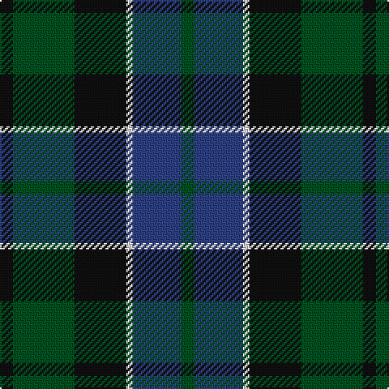

**Bands:** [KGKWBG](/stripes/kgkwbg/) · **Stripes:** [K DG K W DB DG](/stripes/stripes6/) K DG K W DB DG

This was sourced from register-of-tartans.  It is a [6 band tartan](/bands/bands6/).

Original link https://www.tartanregister.gov.uk/tartanDetails.aspx?ref=1484

## Register references

External register numbers recorded for this tartan.

- Scottish Register of Tartans: [1484](https://www.tartanregister.gov.uk/tartanDetails.aspx?ref=1484)
- Scottish Tartans World Register: 746

## Thread count
K/8 G38 K32 LN4 B30 G/8

## Palette
Each colour and its ΔE from the base-6 reference it is a variant of.

| Colour | Shade | Base | ΔE (OKLab) |
|---|---|---|---|
| B | <code style="background-color:#2C4084;">#2C4084</code> `#2C4084` | B <code style="background-color:#2A418A;">#2A418A</code> | 0.01 |
| G | <code style="background-color:#005020;">#005020</code> `#005020` | G <code style="background-color:#006100;">#006100</code> | 0.07 |
| K | <code style="background-color:#101010;">#101010</code> `#101010` | K <code style="background-color:#000000;">#000000</code> | 0.17 |
| LN | <code style="background-color:#E0E0E0;">#E0E0E0</code> `#E0E0E0` | W <code style="background-color:#F7F7F7;">#F7F7F7</code> | 0.07 |

# Sample pattern

## Nearest tartans

The nearest existing variants by ΔTartan distance.

1. [Ferguson of Balquhidder #2](/setts/s6/k4g25k24r3db24g4~x2/) — ΔT 0.56
1. [Graham of Menteith (Clan)](/setts/s6/g8t1g1k6db6k1~x4/) — ΔT 0.56
1. [Wilson's Folio 131](/setts/s5/db12k17dg19w2k5~x2/) — ΔT 0.57
1. [Blaylock Annandale (Name)](/setts/s7/g24db6t3k6db12k15g4~x2/) — ΔT 0.60
1. [Graham of Menteith](/setts/s6/g8b1g1k6db6k1~x4/) — ΔT 0.61
1. [Gallamore](/setts/s6/k3db14r2k14g14k3~x2/) — ΔT 0.68
1. [Coburg](/setts/s6/g18t2g4k14dp12k3~x2/) — ΔT 0.74
1. [Renfrew](/setts/s7/db6k2db18k18g18k3r2~x2/) — ΔT 0.74
1. [Reid and Taylor](/setts/s7/k2g10k9db9r1k1db2~x2/) — ΔT 0.74
1. [Gunn](/setts/s6/r2g12k12g1db12g2~x2/) — ΔT 0.78

## Neighbour map

Every grey dot is one of 14299 variants placed by the first two principal components of the ΔTartan feature space (44% of its variance). Red is this tartan; blue dots are its nearest — click one to open its page.

<svg viewBox="0 0 640 380" role="img" style="max-width:100%;height:auto;border:1px solid #e0e0e0;border-radius:4px;display:block" xmlns="http://www.w3.org/2000/svg"><image href="/nn/cloud.v1.png" width="640" height="380"/><a href="/setts/s6/k4g25k24r3db24g4~x2/"><circle cx="204.4" cy="248.3" r="4" fill="#3465a4"><title>Ferguson of Balquhidder #2</title></circle></a><a href="/setts/s6/g8t1g1k6db6k1~x4/"><circle cx="218.0" cy="248.8" r="4" fill="#3465a4"><title>Graham of Menteith (Clan)</title></circle></a><a href="/setts/s5/db12k17dg19w2k5~x2/"><circle cx="222.6" cy="268.2" r="4" fill="#3465a4"><title>Wilson's Folio 131</title></circle></a><a href="/setts/s7/g24db6t3k6db12k15g4~x2/"><circle cx="212.8" cy="248.1" r="4" fill="#3465a4"><title>Blaylock Annandale (Name)</title></circle></a><a href="/setts/s6/g8b1g1k6db6k1~x4/"><circle cx="220.4" cy="250.2" r="4" fill="#3465a4"><title>Graham of Menteith</title></circle></a><a href="/setts/s6/k3db14r2k14g14k3~x2/"><circle cx="214.2" cy="260.7" r="4" fill="#3465a4"><title>Gallamore</title></circle></a><a href="/setts/s6/g18t2g4k14dp12k3~x2/"><circle cx="229.5" cy="248.4" r="4" fill="#3465a4"><title>Coburg</title></circle></a><a href="/setts/s7/db6k2db18k18g18k3r2~x2/"><circle cx="219.3" cy="238.9" r="4" fill="#3465a4"><title>Renfrew</title></circle></a><a href="/setts/s7/k2g10k9db9r1k1db2~x2/"><circle cx="221.3" cy="231.7" r="4" fill="#3465a4"><title>Reid and Taylor</title></circle></a><a href="/setts/s6/r2g12k12g1db12g2~x2/"><circle cx="216.6" cy="230.6" r="4" fill="#3465a4"><title>Gunn</title></circle></a><circle cx="222.9" cy="254.1" r="5" fill="#c00000"/></svg>

ID: /setts/s6/k4dg19k16w2db15dg4~x2/
