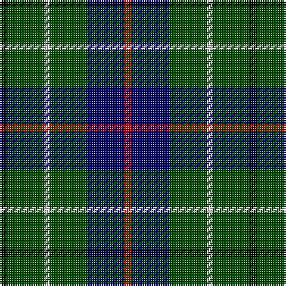

**Bands:** [KGWGBR](/stripes/kgwgbr/) · **Stripes:** [K DG LB DG DB R](/stripes/stripes6/) K DG LB DG DB R

This was sourced from weddslist.  It is a [6 band tartan](/bands/bands6/).

Original link http://www.weddslist.com/cgi-bin/tartans/pg.pl?source=rb

## Register references

External register numbers recorded for this tartan.

- Scottish Register of Tartans: [2540](https://www.tartanregister.gov.uk/tartanDetails.aspx?ref=2540)
- Scottish Register of Tartans: [2666](https://www.tartanregister.gov.uk/tartanDetails.aspx?ref=2666)
- Scottish Register of Tartans: [3808](https://www.tartanregister.gov.uk/tartanDetails.aspx?ref=3808)
- Scottish Tartans Authority (ITI): 218
- Scottish Tartans World Register: 1010
- Scottish Tartans World Register: 1585
- Scottish Tartans World Register: 218

## Thread count
K/4 G21 N3 G21 DB21 R/4

## Palette
Each colour and its ΔE from the base-6 reference it is a variant of.

| Colour | Shade | Base | ΔE (OKLab) |
|---|---|---|---|
| DB | <code style="background-color:#000064;">#000064</code> `#000064` | B <code style="background-color:#2A418A;">#2A418A</code> | 0.18 |
| G | <code style="background-color:#004C00;">#004C00</code> `#004C00` | G <code style="background-color:#006100;">#006100</code> | 0.07 |
| K | <code style="background-color:#000000;">#000000</code> `#000000` | K <code style="background-color:#000000;">#000000</code> | 0.00 |
| N | <code style="background-color:#D0D0D0;">#D0D0D0</code> `#D0D0D0` | W <code style="background-color:#F7F7F7;">#F7F7F7</code> | 0.12 |
| R | <code style="background-color:#C80000;">#C80000</code> `#C80000` | R <code style="background-color:#CC0000;">#CC0000</code> | 0.01 |

# Sample pattern

## Nearest tartans

The nearest existing variants by ΔTartan distance.

1. [Duncan](/setts/s6/k4dg21lr3dg21db21r4~x2/) — ΔT 0.66
1. [Duncan](/setts/s6/k4dg21lr3dg21db21r4/) — ΔT 0.66
1. [Duncan](/setts/s6/k4g21w3g21db21r4~x2/) — ΔT 0.82
1. [Cameron Hunting](/setts/s7/r3dg10r3dg14db16dg3ly2/) — ΔT 1.08
1. [Aztec, New Mexico](/setts/s8/r3k8g17ly2g17k8b8k2~x2/) — ΔT 1.20
1. [Lee (Personal)](/setts/s7/dg2k1dg12r4dg3db9lb2~x4/) — ΔT 1.22
1. [Tennent (Personal)](/setts/s8/r1k7g7k7db7k7r1w1~x4/) — ΔT 1.25
1. [Cameron Hunting](/setts/s7/r3dg10r3dg14db16dg3ly2~x2/) — ΔT 1.27
1. [Cameron of Lochiel (Hunting)](/setts/s7/r3g10r3g14db16g3ly2~x2/) — ΔT 1.28
1. [Lossiemouth/Hersbruck](/setts/s6/g26db3g12k10dp15w2~x2/) — ΔT 1.28

## Neighbour map

Every grey dot is one of 14313 variants placed by the first two principal components of the ΔTartan feature space (44% of its variance). Red is this tartan; blue dots are its nearest — click one to open its page.

<svg viewBox="0 0 640 380" role="img" style="max-width:100%;height:auto;border:1px solid #e0e0e0;border-radius:4px;display:block" xmlns="http://www.w3.org/2000/svg"><image href="/nn/cloud.v1.png" width="640" height="380"/><a href="/setts/s6/k4dg21lr3dg21db21r4~x2/"><circle cx="277.8" cy="244.8" r="4" fill="#3465a4"><title>Duncan</title></circle></a><a href="/setts/s6/k4dg21lr3dg21db21r4/"><circle cx="277.8" cy="244.8" r="4" fill="#3465a4"><title>Duncan</title></circle></a><a href="/setts/s6/k4g21w3g21db21r4~x2/"><circle cx="264.9" cy="234.9" r="4" fill="#3465a4"><title>Duncan</title></circle></a><a href="/setts/s7/r3dg10r3dg14db16dg3ly2/"><circle cx="263.6" cy="229.8" r="4" fill="#3465a4"><title>Cameron Hunting</title></circle></a><a href="/setts/s8/r3k8g17ly2g17k8b8k2~x2/"><circle cx="222.9" cy="207.7" r="4" fill="#3465a4"><title>Aztec, New Mexico</title></circle></a><a href="/setts/s7/dg2k1dg12r4dg3db9lb2~x4/"><circle cx="248.4" cy="194.8" r="4" fill="#3465a4"><title>Lee (Personal)</title></circle></a><a href="/setts/s8/r1k7g7k7db7k7r1w1~x4/"><circle cx="236.0" cy="231.2" r="4" fill="#3465a4"><title>Tennent (Personal)</title></circle></a><a href="/setts/s7/r3dg10r3dg14db16dg3ly2~x2/"><circle cx="285.4" cy="241.5" r="4" fill="#3465a4"><title>Cameron Hunting</title></circle></a><a href="/setts/s7/r3g10r3g14db16g3ly2~x2/"><circle cx="260.0" cy="225.1" r="4" fill="#3465a4"><title>Cameron of Lochiel (Hunting)</title></circle></a><a href="/setts/s6/g26db3g12k10dp15w2~x2/"><circle cx="275.6" cy="207.5" r="4" fill="#3465a4"><title>Lossiemouth/Hersbruck</title></circle></a><circle cx="258.6" cy="235.5" r="5" fill="#c00000"/></svg>

ID: /setts/s6/k4dg21lb3dg21db21r4/
