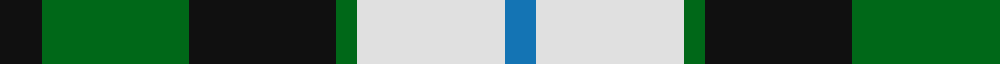
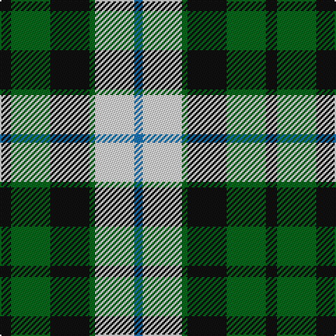

**Bands:** [KGKGWB](/stripes/kgkgwb/) · **Stripes:** [K G K G W B](/stripes/stripes6/) K G K G W B

This was sourced from tartans-authority.  It is a [6 band tartan](/bands/bands6/).

Original link http://www.tartansauthority.com/tartan-ferret/display/7015/

## Variants

Other setts woven to the same stripe pattern.

- [MacKay Dress](/setts/s6/k4g23k23g2w23b4~x2/)

## Thread count
K/8 G28 K28 G4 LN28 B/6

## Palette
Each colour and its ΔE from the base-6 reference it is a variant of.

| Colour | Shade | Base | ΔE (OKLab) |
|---|---|---|---|
| B | <code style="background-color:#1474B4;">#1474B4</code> `#1474B4` | B <code style="background-color:#2A418A;">#2A418A</code> | 0.15 |
| G | <code style="background-color:#006818;">#006818</code> `#006818` | G <code style="background-color:#006100;">#006100</code> | 0.02 |
| K | <code style="background-color:#101010;">#101010</code> `#101010` | K <code style="background-color:#000000;">#000000</code> | 0.17 |
| LN | <code style="background-color:#E0E0E0;">#E0E0E0</code> `#E0E0E0` | W <code style="background-color:#F7F7F7;">#F7F7F7</code> | 0.07 |

# Sample pattern

## Nearest tartans

The nearest existing variants by ΔTartan distance.

1. [Loch Leven, Check](/setts/s6/k2g13k11t4w9k2~x2/) — ΔT 0.66
1. [Lawson, William 2002](/setts/s7/k4w19k11dg15k3dg16ly3~x2/) — ΔT 0.85
1. [MacKay Dress](/setts/s6/k4g23k23g2w23b4~x2/) — ΔT 0.85
1. [Wellington, or Waterloo](/setts/s6/t3g6k6t4r1t1~x2/) — ΔT 0.92
1. [Cape Breton](/setts/s7/ly5k5g17k6y24k6ly3~x2/) — ΔT 0.93
1. [Melville](/setts/s6/k4w2g13k13t12k2~x2/) — ΔT 1.05
1. [Lawsons' Whisky](/setts/s7/k9w38k22g31k5g31ly5/) — ΔT 1.07
1. [Davidson of Tulloch](/setts/s5/r2db10k5g12w2~x2/) — ΔT 1.09
1. [Unnamed, No 26](/setts/s6/w4db4g22k20db20w3/) — ΔT 1.09
1. [Wellington, or Waterloo](/setts/s6/t3g12k14t11r3t3~x2/) — ΔT 1.09

## Neighbour map

Every grey dot is one of 14299 variants placed by the first two principal components of the ΔTartan feature space (44% of its variance). Red is this tartan; blue dots are its nearest — click one to open its page.

<svg viewBox="0 0 640 380" role="img" style="max-width:100%;height:auto;border:1px solid #e0e0e0;border-radius:4px;display:block" xmlns="http://www.w3.org/2000/svg"><image href="/nn/cloud.v1.png" width="640" height="380"/><a href="/setts/s6/k2g13k11t4w9k2~x2/"><circle cx="113.1" cy="227.8" r="4" fill="#3465a4"><title>Loch Leven, Check</title></circle></a><a href="/setts/s7/k4w19k11dg15k3dg16ly3~x2/"><circle cx="148.6" cy="224.2" r="4" fill="#3465a4"><title>Lawson, William 2002</title></circle></a><a href="/setts/s6/k4g23k23g2w23b4~x2/"><circle cx="144.5" cy="194.8" r="4" fill="#3465a4"><title>MacKay Dress</title></circle></a><a href="/setts/s6/t3g6k6t4r1t1~x2/"><circle cx="128.6" cy="243.8" r="4" fill="#3465a4"><title>Wellington, or Waterloo</title></circle></a><a href="/setts/s7/ly5k5g17k6y24k6ly3~x2/"><circle cx="132.8" cy="200.0" r="4" fill="#3465a4"><title>Cape Breton</title></circle></a><a href="/setts/s6/k4w2g13k13t12k2~x2/"><circle cx="166.6" cy="238.0" r="4" fill="#3465a4"><title>Melville</title></circle></a><a href="/setts/s7/k9w38k22g31k5g31ly5/"><circle cx="151.6" cy="211.8" r="4" fill="#3465a4"><title>Lawsons' Whisky</title></circle></a><a href="/setts/s5/r2db10k5g12w2~x2/"><circle cx="119.5" cy="224.9" r="4" fill="#3465a4"><title>Davidson of Tulloch</title></circle></a><a href="/setts/s6/w4db4g22k20db20w3/"><circle cx="118.2" cy="224.4" r="4" fill="#3465a4"><title>Unnamed, No 26</title></circle></a><a href="/setts/s6/t3g12k14t11r3t3~x2/"><circle cx="115.7" cy="248.1" r="4" fill="#3465a4"><title>Wellington, or Waterloo</title></circle></a><circle cx="120.4" cy="222.5" r="5" fill="#c00000"/></svg>

ID: /setts/s6/k4g14k14g2w14b3~x2/
