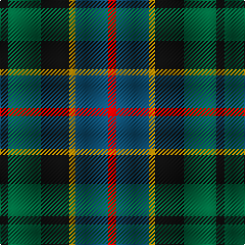

In pattern [KGKYBR](/stripes/kgkybr/).

This was sourced from register-of-tartans.  It is a [6 stripe tartan](/stripes/stripes6/).

Original link https://www.tartanregister.gov.uk/tartanDetails.aspx?ref=265

## Attestations

This cloth appears in 2 source records; the oldest owns this page.

- 01/01/1957 — Birse (register-of-tartans, [record](https://www.tartanregister.gov.uk/tartanDetails.aspx?ref=265))
- pre 1957 — Birse (Name) (tartans-authority, [record](http://www.tartansauthority.com/tartan-ferret/display/1087/))

## Register references

External register numbers recorded for this tartan.

- Scottish Register of Tartans: [265](https://www.tartanregister.gov.uk/tartanDetails.aspx?ref=265)
- Scottish Tartans Authority (ITI): 1087
- Scottish Tartans World Register: 1087

## Thread count
K/8 G32 K28 DY6 Ba32 R/8

## Palette
Each colour and the base-6 reference it is a variant of.

| Colour | Shade | Base |
|---|---|---|
| B | <code style="background-color:#5C8CA8;">#5C8CA8</code> `oklch(61.7% 0.067 235.0)` <small>#5C8CA8</small> | B <code style="background-color:#2A418A;">#2A418A</code> |
| Ba | <code style="background-color:#105880;">#105880</code> `oklch(43.9% 0.093 239.7)` <small>#105880</small> | B <code style="background-color:#2A418A;">#2A418A</code> |
| DY | <code style="background-color:#BC8C00;">#BC8C00</code> `oklch(66.8% 0.137 84.1)` <small>#BC8C00</small> | Y <code style="background-color:#F2BF00;">#F2BF00</code> |
| G | <code style="background-color:#00643C;">#00643C</code> `oklch(44.3% 0.104 157.7)` <small>#00643C</small> | G <code style="background-color:#006100;">#006100</code> |
| K | <code style="background-color:#101010;">#101010</code> `oklch(17.3% 0.000 89.9)` <small>#101010</small> | K <code style="background-color:#000000;">#000000</code> |
| LG | <code style="background-color:#789484;">#789484</code> `oklch(64.0% 0.040 160.0)` <small>#789484</small> | G <code style="background-color:#006100;">#006100</code> |
| R | <code style="background-color:#C80000;">#C80000</code> `oklch(52.3% 0.215 29.2)` <small>#C80000</small> | R <code style="background-color:#CC0000;">#CC0000</code> |
| Y | <code style="background-color:#F0C800;">#F0C800</code> `oklch(84.3% 0.173 94.3)` <small>#F0C800</small> | Y <code style="background-color:#F2BF00;">#F2BF00</code> |

# Sample pattern

## Nearest tartans

The nearest existing variants by ΔTartan distance, with this tartan at the top so the swatches line up against it.

ΔTartan

Tartan

Sett

—

<a href="/ttd/edit/#slug=k4g16k14lo3n16r4~x2">Birse</a> <a class="nn-out" href="/setts/s6/k4g16k14lo3n16r4~x2/" title="open its dictionary page">↗</a>

0.79

<a href="/ttd/edit/#slug=db1r1db6k6dg6w1~x2">Wellington</a> <a class="nn-out" href="/setts/s6/db1r1db6k6dg6w1~x2/" title="open its dictionary page">↗</a>

0.80

<a href="/ttd/edit/#slug=k6t2db12g8r5k2g3~x4">Cooke (Personal)</a> <a class="nn-out" href="/setts/s7/k6t2db12g8r5k2g3~x4/" title="open its dictionary page">↗</a>

0.83

<a href="/ttd/edit/#slug=r1db6k3dg6w1~x4">Davidson of Tulloch #2</a> <a class="nn-out" href="/setts/s5/r1db6k3dg6w1~x4/" title="open its dictionary page">↗</a>

0.88

<a href="/ttd/edit/#slug=r2k1db6k2g6m2~x4">MacEachain (Clan)</a> <a class="nn-out" href="/setts/s6/r2k1db6k2g6m2~x4/" title="open its dictionary page">↗</a>

0.89

<a href="/ttd/edit/#slug=r4g11k11g2n11y3~x4">Casely</a> <a class="nn-out" href="/setts/s6/r4g11k11g2n11y3~x4/" title="open its dictionary page">↗</a>

0.91

<a href="/ttd/edit/#slug=r4g11k11g2n11ly3~x4">Casely (Name)</a> <a class="nn-out" href="/setts/s6/r4g11k11g2n11ly3~x4/" title="open its dictionary page">↗</a>

0.96

<a href="/ttd/edit/#slug=t2g6ly1k6db6k1db1~x2">Hogarth of Firhill</a> <a class="nn-out" href="/setts/s7/t2g6ly1k6db6k1db1~x2/" title="open its dictionary page">↗</a>

0.96

<a href="/ttd/edit/#slug=k2ly1dg6k6db6w1~x4">Dyce #3</a> <a class="nn-out" href="/setts/s6/k2ly1dg6k6db6w1~x4/" title="open its dictionary page">↗</a>

0.98

<a href="/ttd/edit/#slug=dg17ly2k14r2db9r2db10~x2">MacDonald (Flora.. )</a> <a class="nn-out" href="/setts/s7/dg17ly2k14r2db9r2db10~x2/" title="open its dictionary page">↗</a>

0.99

<a href="/ttd/edit/#slug=b2dg6ly1k6db6k1db1~x2">Hogarth of Firhill #2</a> <a class="nn-out" href="/setts/s7/b2dg6ly1k6db6k1db1~x2/" title="open its dictionary page">↗</a>

## Neighbour map

Every grey dot is one of 14299 variants placed by the first two principal components of the ΔTartan feature space (44% of its variance). Red is this tartan; blue dots are its nearest — click one to open its page.

<svg viewBox="0 0 640 380" role="img" style="max-width:100%;height:auto;border:1px solid #e0e0e0;border-radius:4px;display:block" xmlns="http://www.w3.org/2000/svg"><image href="/nn/cloud.v1.png" width="640" height="380"/><a href="/setts/s6/db1r1db6k6dg6w1~x2/"><circle cx="142.2" cy="236.4" r="4" fill="#3465a4"><title>Wellington</title></circle></a><a href="/setts/s7/k6t2db12g8r5k2g3~x4/"><circle cx="114.2" cy="235.2" r="4" fill="#3465a4"><title>Cooke (Personal)</title></circle></a><a href="/setts/s5/r1db6k3dg6w1~x4/"><circle cx="146.7" cy="247.1" r="4" fill="#3465a4"><title>Davidson of Tulloch #2</title></circle></a><a href="/setts/s6/r2k1db6k2g6m2~x4/"><circle cx="118.5" cy="240.6" r="4" fill="#3465a4"><title>MacEachain (Clan)</title></circle></a><a href="/setts/s6/r4g11k11g2n11y3~x4/"><circle cx="132.9" cy="263.6" r="4" fill="#3465a4"><title>Casely</title></circle></a><a href="/setts/s6/r4g11k11g2n11ly3~x4/"><circle cx="98.5" cy="243.1" r="4" fill="#3465a4"><title>Casely (Name)</title></circle></a><a href="/setts/s7/t2g6ly1k6db6k1db1~x2/"><circle cx="116.1" cy="225.7" r="4" fill="#3465a4"><title>Hogarth of Firhill</title></circle></a><a href="/setts/s6/k2ly1dg6k6db6w1~x4/"><circle cx="135.4" cy="239.1" r="4" fill="#3465a4"><title>Dyce #3</title></circle></a><a href="/setts/s7/dg17ly2k14r2db9r2db10~x2/"><circle cx="160.9" cy="220.5" r="4" fill="#3465a4"><title>MacDonald (Flora.. )</title></circle></a><a href="/setts/s7/b2dg6ly1k6db6k1db1~x2/"><circle cx="120.0" cy="229.0" r="4" fill="#3465a4"><title>Hogarth of Firhill #2</title></circle></a><circle cx="127.2" cy="254.5" r="5" fill="#c00000"/></svg>

ID: /setts/s6/k4g16k14lo3n16r4~x2/
