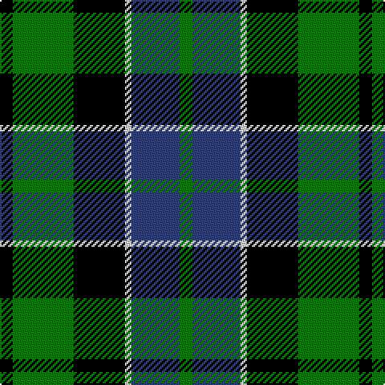

In pattern [GBWKGK](/stripes/gbwkgk/).

This was sourced from weddslist.  It is a [6 stripe tartan](/stripes/stripes6/).

Original link http://www.weddslist.com/cgi-bin/tartans/pg.pl?source=sts

## Thread count
K/8 G38 K32 LN4 B30 G/8

## Palette
Each colour and the base-6 reference it is a variant of.

| Colour | Shade | Base |
|---|---|---|
| B | <code style="background-color:#304080;">#304080</code> `oklch(39.4% 0.109 270.2)` <small>#304080</small> | B <code style="background-color:#2A418A;">#2A418A</code> |
| G | <code style="background-color:#008000;">#008000</code> `oklch(52.0% 0.177 142.5)` <small>#008000</small> | G <code style="background-color:#006100;">#006100</code> |
| K | <code style="background-color:#000000;">#000000</code> `oklch(0.0% 0.000 0.0)` <small>#000000</small> | K <code style="background-color:#000000;">#000000</code> |
| LN | <code style="background-color:#E0E0E0;">#E0E0E0</code> `oklch(90.7% 0.000 89.9)` <small>#E0E0E0</small> | W <code style="background-color:#F7F7F7;">#F7F7F7</code> |

# Sample pattern

## Nearest tartans

The nearest existing variants by ΔTartan distance.

1. [Melville](/setts/s6/k4w2g18k13db12k2~x2/) — ΔT 0.28
1. [Graham of Menteith](/setts/s6/g18t2g4k14db12k3~x2/) — ΔT 0.34
1. [MacNeil 1](/setts/s6/w1db9k9g9k2w1~x4/) — ΔT 0.59
1. [Wilson's, Folio 131](/setts/s5/db12k17g19w2k5~x2/) — ΔT 0.60
1. [MacCallum](/setts/s7/g8k2t1g4k6db6k1~x2/) — ΔT 0.63
1. [Ferguson of Balquhidder](/setts/s6/k2g12k12r1db12g2~x2/) — ΔT 0.68
1. [Blair](/setts/s7/db3r1db10k8g10r1g3~x4/) — ΔT 0.72
1. [MacKirdy](/setts/s5/k2g12k11db12w1~x2/) — ΔT 0.73
1. [Wilson's, No 150 "Coburg"](/setts/s6/g18t2g4k14p12k3~x2/) — ΔT 0.75
1. [Gunn](/setts/s6/r2g12k12g1db12g1~x2/) — ΔT 0.75

## Neighbour map

Every grey dot is one of 14299 variants placed by the first two principal components of the ΔTartan feature space (44% of its variance). Red is this tartan; blue dots are its nearest — click one to open its page.

<svg viewBox="0 0 640 380" role="img" style="max-width:100%;height:auto;border:1px solid #e0e0e0;border-radius:4px;display:block" xmlns="http://www.w3.org/2000/svg"><image href="/nn/cloud.v1.png" width="640" height="380"/><a href="/setts/s6/k4w2g18k13db12k2~x2/"><circle cx="159.8" cy="221.5" r="4" fill="#3465a4"><title>Melville</title></circle></a><a href="/setts/s6/g18t2g4k14db12k3~x2/"><circle cx="177.8" cy="228.0" r="4" fill="#3465a4"><title>Graham of Menteith</title></circle></a><a href="/setts/s6/w1db9k9g9k2w1~x4/"><circle cx="146.6" cy="216.6" r="4" fill="#3465a4"><title>MacNeil 1</title></circle></a><a href="/setts/s5/db12k17g19w2k5~x2/"><circle cx="165.1" cy="240.6" r="4" fill="#3465a4"><title>Wilson's, Folio 131</title></circle></a><a href="/setts/s7/g8k2t1g4k6db6k1~x2/"><circle cx="171.3" cy="231.1" r="4" fill="#3465a4"><title>MacCallum</title></circle></a><a href="/setts/s6/k2g12k12r1db12g2~x2/"><circle cx="171.6" cy="211.8" r="4" fill="#3465a4"><title>Ferguson of Balquhidder</title></circle></a><a href="/setts/s7/db3r1db10k8g10r1g3~x4/"><circle cx="167.4" cy="213.5" r="4" fill="#3465a4"><title>Blair</title></circle></a><a href="/setts/s5/k2g12k11db12w1~x2/"><circle cx="161.3" cy="227.2" r="4" fill="#3465a4"><title>MacKirdy</title></circle></a><a href="/setts/s6/g18t2g4k14p12k3~x2/"><circle cx="177.0" cy="220.1" r="4" fill="#3465a4"><title>Wilson's, No 150 &quot;Coburg&quot;</title></circle></a><a href="/setts/s6/r2g12k12g1db12g1~x2/"><circle cx="173.1" cy="206.0" r="4" fill="#3465a4"><title>Gunn</title></circle></a><circle cx="162.2" cy="224.2" r="5" fill="#c00000"/></svg>

ID: /setts/s6/k4g19k16w2db15g4~x2/
