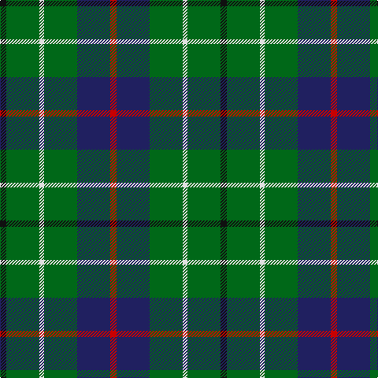

In pattern [KGWGBR](/patterns/kgwgbr/).

This was sourced from register-of-tartans.  It is a [6 stripes tartan](/stripes/stripes6/).

Original link https://www.tartanregister.gov.uk/tartanDetails.aspx?ref=1025

## Attestations

This cloth appears in 2 source records; the oldest owns this page.

- 01/01/1880 — Duncan (register-of-tartans, [record](https://www.tartanregister.gov.uk/tartanDetails.aspx?ref=1025))
- pre 1880 — Duncan (Clan) (tartans-authority, [record](http://www.tartansauthority.com/tartan-ferret/display/1112/))

## Thread count
K/8 G42 LN6 G42 DB42 R/8

## Palette
Each colour and its ΔE from the base-6 reference it is a variant of.

| Colour | Shade | Base | ΔE (OKLab) |
|---|---|---|---|
| DB | <code style="background-color:#202060;">#202060</code> `#202060` | B <code style="background-color:#2A418A;">#2A418A</code> | 0.11 |
| G | <code style="background-color:#006818;">#006818</code> `#006818` | G <code style="background-color:#006100;">#006100</code> | 0.02 |
| K | <code style="background-color:#101010;">#101010</code> `#101010` | K <code style="background-color:#000000;">#000000</code> | 0.17 |
| LN | <code style="background-color:#E0E0E0;">#E0E0E0</code> `#E0E0E0` | W <code style="background-color:#F7F7F7;">#F7F7F7</code> | 0.07 |
| R | <code style="background-color:#C80000;">#C80000</code> `#C80000` | R <code style="background-color:#CC0000;">#CC0000</code> | 0.01 |

# Sample pattern

## Nearest tartans

The nearest existing variants by ΔTartan distance.

1. [Duncan Clan Tartan Tartan Number: 1112. Earliest known date: 1906 Duncans and Robertsons share a common ancester, one of the ancient Earls of Atholl, 'Fat Duncan', who led the clan at the Battle of Bannockburn. This sett is also known as Leslie of Wardis or Leslie Hunting, (No. 1113) but Duncan lacks the broad black present in the Leslie Hunting. See products available Copyright © Blair Urquhart, Comrie, 2015](/setts/s6/k4g21w3g21b21r4x2~b2c2c80-g006818-k101010-rc80000-we0e0e0/) — ΔT 0.23
1. [Duncan](/setts/s6/k4g21w3g21b21r4~b000064-g004c00-k000000-rc80000-wd0d0d0/) — ΔT 0.82
1. [Duncan, or Leslie of Wardis](/setts/s6/k4g21w3g21b21r4x2~b304080-g008000-k000000-rc00000-we0e0e0/) — ΔT 0.83
1. [Aztec, New Mexico](/setts/s8/r3k8g17y2g17k8b8k2x2~b3850c8-g146400-k101010-rff0000-yffe600/) — ΔT 1.04
1. [Duncan](/setts/s6/k4g21y3g21b21r4x2~b000052-g11450d-k000000-raa0000-yaaaaaa/) — ΔT 1.04
1. [Duncan](/setts/s6/k4g21y3g21b21r4~b000052-g11450d-k000000-raa0000-yaaaaaa/) — ΔT 1.04
1. [Cameron of Lochiel (Hunting) Clan/Family Tartan Tartan Number: 5351. Earliest known date: 01/01/1940 Design close to Cameron Hunting which has two red lines shown in Vestiarium Scoticum. This design evolved in the 1940s by J G MacKay of Portree and was first put on show at the Cameron Gathering at Achnacarry in 1956. (original STA ref: 1535) See products available Copyright © Blair Urquhart, Comrie, 2015](/setts/s7/r5g20r5g20b24g6y4~b2c2c80-g006818-rc80000-ye8c000/) — ΔT 1.06
1. [Lossiemouth/Hersbruck](/setts/s6/g26b3g12k10ba15w2x2~b2c2c80-ba780078-g006818-k101010-we0e0e0/) — ΔT 1.08
1. [Cameron Hunting Clan Tartan Tartan Number: 1535. Earliest known date: 1956 A document written in Latin of 1689 descibes the Cameron men from Lochaber as being clad in blue and yellow when they followed their great Chief, Sir Ewan Cameron, to battle and victory at Killiecrankie. This new design was evolved in the 1940s by J G MacKay of Portree and first put on show at the Cameron Gathering at Achnacarry in 1956. The original Cameron first appeared in the Vestiarium Scoticum (1842). See products available Copyright © Blair Urquhart, Comrie, 2015](/setts/s7/r3g10r3g14b16g3y2x2~b2c2c80-g006818-re87878-ye8c000/) — ΔT 1.12
1. [Cameron of Lochiel (Hunting)](/setts/s7/r3g10r3g14b16g3y2x2~b1c0070-g006818-rc80000-ye8c000/) — ΔT 1.17

## Neighbour map

Every grey dot is one of 15726 variants placed by the first two principal components of the ΔTartan feature space (44% of its variance). Red is this tartan; blue dots are its nearest — click one to open its page.

<svg viewBox="0 0 640 380" role="img" style="max-width:100%;height:auto;border:1px solid #e0e0e0;border-radius:4px;display:block" xmlns="http://www.w3.org/2000/svg"><image href="/nn/cloud.v1.png" width="640" height="380"/><a href="/setts/s6/k4g21w3g21b21r4x2~b2c2c80-g006818-k101010-rc80000-we0e0e0/"><circle cx="263.8" cy="233.1" r="4" fill="#3465a4"><title>Duncan Clan Tartan Tartan Number: 1112. Earliest known date: 1906 Duncans and Robertsons share a common ancester, one of the ancient Earls of Atholl, 'Fat Duncan', who led the clan at the Battle of Bannockburn. This sett is also known as Leslie of Wardis or Leslie Hunting, (No. 1113) but Duncan lacks the broad black present in the Leslie Hunting. See products available Copyright © Blair Urquhart, Comrie, 2015</title></circle></a><a href="/setts/s6/k4g21w3g21b21r4~b000064-g004c00-k000000-rc80000-wd0d0d0/"><circle cx="255.6" cy="234.3" r="4" fill="#3465a4"><title>Duncan</title></circle></a><a href="/setts/s6/k4g21w3g21b21r4x2~b304080-g008000-k000000-rc00000-we0e0e0/"><circle cx="245.2" cy="226.0" r="4" fill="#3465a4"><title>Duncan, or Leslie of Wardis</title></circle></a><a href="/setts/s8/r3k8g17y2g17k8b8k2x2~b3850c8-g146400-k101010-rff0000-yffe600/"><circle cx="220.0" cy="206.6" r="4" fill="#3465a4"><title>Aztec, New Mexico</title></circle></a><a href="/setts/s6/k4g21y3g21b21r4x2~b000052-g11450d-k000000-raa0000-yaaaaaa/"><circle cx="275.1" cy="241.7" r="4" fill="#3465a4"><title>Duncan</title></circle></a><a href="/setts/s6/k4g21y3g21b21r4~b000052-g11450d-k000000-raa0000-yaaaaaa/"><circle cx="275.1" cy="241.7" r="4" fill="#3465a4"><title>Duncan</title></circle></a><a href="/setts/s7/r5g20r5g20b24g6y4~b2c2c80-g006818-rc80000-ye8c000/"><circle cx="261.8" cy="246.6" r="4" fill="#3465a4"><title>Cameron of Lochiel (Hunting) Clan/Family Tartan Tartan Number: 5351. Earliest known date: 01/01/1940 Design close to Cameron Hunting which has two red lines shown in Vestiarium Scoticum. This design evolved in the 1940s by J G MacKay of Portree and was first put on show at the Cameron Gathering at Achnacarry in 1956. (original STA ref: 1535) See products available Copyright © Blair Urquhart, Comrie, 2015</title></circle></a><a href="/setts/s6/g26b3g12k10ba15w2x2~b2c2c80-ba780078-g006818-k101010-we0e0e0/"><circle cx="273.2" cy="206.3" r="4" fill="#3465a4"><title>Lossiemouth/Hersbruck</title></circle></a><a href="/setts/s7/r3g10r3g14b16g3y2x2~b2c2c80-g006818-re87878-ye8c000/"><circle cx="264.8" cy="227.3" r="4" fill="#3465a4"><title>Cameron Hunting Clan Tartan Tartan Number: 1535. Earliest known date: 1956 A document written in Latin of 1689 descibes the Cameron men from Lochaber as being clad in blue and yellow when they followed their great Chief, Sir Ewan Cameron, to battle and victory at Killiecrankie. This new design was evolved in the 1940s by J G MacKay of Portree and first put on show at the Cameron Gathering at Achnacarry in 1956. The original Cameron first appeared in the Vestiarium Scoticum (1842). See products available Copyright © Blair Urquhart, Comrie, 2015</title></circle></a><a href="/setts/s7/r3g10r3g14b16g3y2x2~b1c0070-g006818-rc80000-ye8c000/"><circle cx="257.2" cy="225.1" r="4" fill="#3465a4"><title>Cameron of Lochiel (Hunting)</title></circle></a><circle cx="262.2" cy="233.1" r="5" fill="#c00000"/></svg>

ID: /setts/s6/k4g21w3g21b21r4x2~b202060-g006818-k101010-rc80000-we0e0e0/
