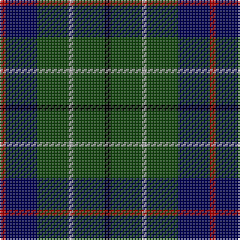

In pattern [KGYGBR](/patterns/kgygbr/).

This was sourced from weddslist.  It is a [6 stripes tartan](/stripes/stripes6/).

Original link http://www.weddslist.com/cgi-bin/tartans/pg.pl?source=x

## Thread count
DR/4 DB21 DG21 N3 DG21 K/4

## Palette
Each colour and its ΔE from the base-6 reference it is a variant of.

| Colour | Shade | Base | ΔE (OKLab) |
|---|---|---|---|
| DB | <code style="background-color:#000052;">#000052</code> `#000052` | B <code style="background-color:#2A418A;">#2A418A</code> | 0.20 |
| DG | <code style="background-color:#11450D;">#11450D</code> `#11450D` | G <code style="background-color:#006100;">#006100</code> | 0.09 |
| DR | <code style="background-color:#AA0000;">#AA0000</code> `#AA0000` | R <code style="background-color:#CC0000;">#CC0000</code> | 0.07 |
| K | <code style="background-color:#000000;">#000000</code> `#000000` | K <code style="background-color:#000000;">#000000</code> | 0.00 |
| N | <code style="background-color:#AAAAAA;">#AAAAAA</code> `#AAAAAA` | Y <code style="background-color:#F2BF00;">#F2BF00</code> | 0.19 |

# Sample pattern

## Nearest tartans

The nearest existing variants by ΔTartan distance.

1. [Duncan](/setts/s6/k4g21y3g21b21r4~b000052-g11450d-k000000-raa0000-yaaaaaa~x2/) — ΔT 0.00
1. [Duncan](/setts/s6/k4g21w3g21b21r4~b000064-g004c00-k000000-rc80000-wd0d0d0/) — ΔT 0.66
1. [Duncan](/setts/s6/k4g21w3g21b21r4~b202060-g006818-k101010-rc80000-we0e0e0~x2/) — ΔT 1.04
1. [Cameron Hunting](/setts/s7/r3g10r3g14b16g3y2~b000052-g11450d-raa0000-yaaaa00~x2/) — ΔT 1.05
1. [Cameron Hunting](/setts/s7/r3g10r3g14b16g3y2~b000052-g11450d-raa0000-yaaaa00/) — ΔT 1.05
1. [Duncan Clan Tartan Tartan Number: 1112. Earliest known date: 1906 Duncans and Robertsons share a common ancester, one of the ancient Earls of Atholl, 'Fat Duncan', who led the clan at the Battle of Bannockburn. This sett is also known as Leslie of Wardis or Leslie Hunting, (No. 1113) but Duncan lacks the broad black present in the Leslie Hunting. See products available Copyright © Blair Urquhart, Comrie, 2015](/setts/s6/k4g21w3g21b21r4~b2c2c80-g006818-k101010-rc80000-we0e0e0~x2/) — ΔT 1.10
1. [Tennent (Personal)](/setts/s8/r1k7g7k7b7k7r1w1~b2c2c80-g006818-k101010-rc80000-wf8f8f8~x4/) — ΔT 1.15
1. [Murray](/setts/s6/b3k16g16k16ba3b3~b3c82af-ba2c4084-g005020-k101010~x2/) — ΔT 1.19
1. [Salvation Army Htg (Corporate)](/setts/s7/b5g8k1y2k1g8b4~b1c1c50-g285800-k101010-ycca800~x4/) — ΔT 1.27
1. [Cameron Hunting](/setts/s7/r3g10r3g14b16g3y2~b000064-g004c00-rc80000-yffc800/) — ΔT 1.28

## Neighbour map

Every grey dot is one of 15726 variants placed by the first two principal components of the ΔTartan feature space (44% of its variance). Red is this tartan; blue dots are its nearest — click one to open its page.

<svg viewBox="0 0 640 380" role="img" style="max-width:100%;height:auto;border:1px solid #e0e0e0;border-radius:4px;display:block" xmlns="http://www.w3.org/2000/svg"><image href="/nn/cloud.v1.png" width="640" height="380"/><a href="/setts/s6/k4g21y3g21b21r4~b000052-g11450d-k000000-raa0000-yaaaaaa~x2/"><circle cx="275.1" cy="241.7" r="4" fill="#3465a4"><title>Duncan</title></circle></a><a href="/setts/s6/k4g21w3g21b21r4~b000064-g004c00-k000000-rc80000-wd0d0d0/"><circle cx="255.6" cy="234.3" r="4" fill="#3465a4"><title>Duncan</title></circle></a><a href="/setts/s6/k4g21w3g21b21r4~b202060-g006818-k101010-rc80000-we0e0e0~x2/"><circle cx="262.2" cy="233.1" r="4" fill="#3465a4"><title>Duncan</title></circle></a><a href="/setts/s7/r3g10r3g14b16g3y2~b000052-g11450d-raa0000-yaaaa00~x2/"><circle cx="282.7" cy="238.7" r="4" fill="#3465a4"><title>Cameron Hunting</title></circle></a><a href="/setts/s7/r3g10r3g14b16g3y2~b000052-g11450d-raa0000-yaaaa00/"><circle cx="282.7" cy="238.7" r="4" fill="#3465a4"><title>Cameron Hunting</title></circle></a><a href="/setts/s6/k4g21w3g21b21r4~b2c2c80-g006818-k101010-rc80000-we0e0e0~x2/"><circle cx="263.8" cy="233.1" r="4" fill="#3465a4"><title>Duncan Clan Tartan Tartan Number: 1112. Earliest known date: 1906 Duncans and Robertsons share a common ancester, one of the ancient Earls of Atholl, 'Fat Duncan', who led the clan at the Battle of Bannockburn. This sett is also known as Leslie of Wardis or Leslie Hunting, (No. 1113) but Duncan lacks the broad black present in the Leslie Hunting. See products available Copyright © Blair Urquhart, Comrie, 2015</title></circle></a><a href="/setts/s8/r1k7g7k7b7k7r1w1~b2c2c80-g006818-k101010-rc80000-wf8f8f8~x4/"><circle cx="233.4" cy="229.4" r="4" fill="#3465a4"><title>Tennent (Personal)</title></circle></a><a href="/setts/s6/b3k16g16k16ba3b3~b3c82af-ba2c4084-g005020-k101010~x2/"><circle cx="298.3" cy="276.9" r="4" fill="#3465a4"><title>Murray</title></circle></a><a href="/setts/s7/b5g8k1y2k1g8b4~b1c1c50-g285800-k101010-ycca800~x4/"><circle cx="293.1" cy="248.7" r="4" fill="#3465a4"><title>Salvation Army Htg (Corporate)</title></circle></a><a href="/setts/s7/r3g10r3g14b16g3y2~b000064-g004c00-rc80000-yffc800/"><circle cx="260.8" cy="229.3" r="4" fill="#3465a4"><title>Cameron Hunting</title></circle></a><circle cx="275.1" cy="241.7" r="5" fill="#c00000"/></svg>

ID: /setts/s6/k4g21y3g21b21r4~b000052-g11450d-k000000-raa0000-yaaaaaa/
