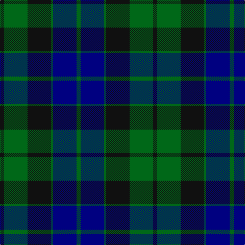

In pattern [GBGKGK](/stripes/gbgkgk/).

This was sourced from register-of-tartans.  It is a [6 stripe tartan](/stripes/stripes6/).

Original link https://www.tartanregister.gov.uk/tartanDetails.aspx?ref=2500

## Register references

External register numbers recorded for this tartan.

- Scottish Register of Tartans: [2500](https://www.tartanregister.gov.uk/tartanDetails.aspx?ref=2500)
- Scottish Tartans Authority (ITI): 703
- Scottish Tartans World Register: 703

## Thread count
K/8 G46 K46 G4 DB46 G/8

## Palette
Each colour and its ΔE from the base-6 reference it is a variant of.

| Colour | Shade | Base | ΔE (OKLab) |
|---|---|---|---|
| DB | <code style="background-color:#000080;">#000080</code> `#000080` | B <code style="background-color:#2A418A;">#2A418A</code> | 0.14 |
| G | <code style="background-color:#006818;">#006818</code> `#006818` | G <code style="background-color:#006100;">#006100</code> | 0.02 |
| K | <code style="background-color:#101010;">#101010</code> `#101010` | K <code style="background-color:#000000;">#000000</code> | 0.17 |

# Sample pattern

## Nearest tartans

The nearest existing variants by ΔTartan distance.

1. [Gunn](/setts/s6/r2g12k12g1db12g2~x2/) — ΔT 1.06
1. [Mowat (Clans Originaux)](/setts/s7/db24k3db5k23ly2k11g22~x2/) — ΔT 1.12
1. [MacKay - 1800 (Clan)](/setts/s6/k4g23k23g2n23g4~x2/) — ΔT 1.15
1. [Graham of Menteith](/setts/s6/g8b1g1k6db6k1~x4/) — ΔT 1.15
1. [Reid and Taylor](/setts/s7/k2g10k9db9r1k1db2~x2/) — ΔT 1.15
1. [Graham of Montrose](/setts/s6/k4dg19k16w2db15dg4~x2/) — ΔT 1.16
1. [National Galleries of Scotland](/setts/s7/k7g22k22db6r2db15r2~x2/) — ΔT 1.17
1. [Graham of Menteith (Clan)](/setts/s6/g8t1g1k6db6k1~x4/) — ΔT 1.18
1. [Ferguson of Balquhidder #2](/setts/s6/k4g25k24r3db24g4~x2/) — ΔT 1.18
1. [MacThomas LC](/setts/s7/dg5dp3dg32k16db32dp3db5/) — ΔT 1.21

## Neighbour map

Every grey dot is one of 14299 variants placed by the first two principal components of the ΔTartan feature space (44% of its variance). Red is this tartan; blue dots are its nearest — click one to open its page.

<svg viewBox="0 0 640 380" role="img" style="max-width:100%;height:auto;border:1px solid #e0e0e0;border-radius:4px;display:block" xmlns="http://www.w3.org/2000/svg"><image href="/nn/cloud.v1.png" width="640" height="380"/><a href="/setts/s6/r2g12k12g1db12g2~x2/"><circle cx="216.6" cy="230.6" r="4" fill="#3465a4"><title>Gunn</title></circle></a><a href="/setts/s7/db24k3db5k23ly2k11g22~x2/"><circle cx="238.5" cy="231.6" r="4" fill="#3465a4"><title>Mowat (Clans Originaux)</title></circle></a><a href="/setts/s6/k4g23k23g2n23g4~x2/"><circle cx="252.1" cy="254.5" r="4" fill="#3465a4"><title>MacKay - 1800 (Clan)</title></circle></a><a href="/setts/s6/g8b1g1k6db6k1~x4/"><circle cx="220.4" cy="250.2" r="4" fill="#3465a4"><title>Graham of Menteith</title></circle></a><a href="/setts/s7/k2g10k9db9r1k1db2~x2/"><circle cx="221.3" cy="231.7" r="4" fill="#3465a4"><title>Reid and Taylor</title></circle></a><a href="/setts/s6/k4dg19k16w2db15dg4~x2/"><circle cx="222.9" cy="254.1" r="4" fill="#3465a4"><title>Graham of Montrose</title></circle></a><a href="/setts/s7/k7g22k22db6r2db15r2~x2/"><circle cx="218.5" cy="229.4" r="4" fill="#3465a4"><title>National Galleries of Scotland</title></circle></a><a href="/setts/s6/g8t1g1k6db6k1~x4/"><circle cx="218.0" cy="248.8" r="4" fill="#3465a4"><title>Graham of Menteith (Clan)</title></circle></a><a href="/setts/s6/k4g25k24r3db24g4~x2/"><circle cx="204.4" cy="248.3" r="4" fill="#3465a4"><title>Ferguson of Balquhidder #2</title></circle></a><a href="/setts/s7/dg5dp3dg32k16db32dp3db5/"><circle cx="234.9" cy="223.5" r="4" fill="#3465a4"><title>MacThomas LC</title></circle></a><circle cx="244.7" cy="255.3" r="5" fill="#c00000"/></svg>

ID: /setts/s6/k4g23k23g2db23g4~x2/
