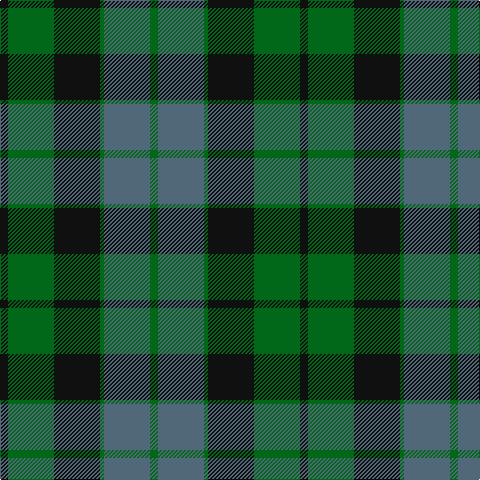

In pattern [GBGKGK](/stripes/gbgkgk/).

This was sourced from tartans-authority.  It is a [6 stripe tartan](/stripes/stripes6/).

Original link http://www.tartansauthority.com/tartan-ferret/display/703/

## Thread count
K/8 G46 K46 G4 N46 G/8

## Palette
Each colour and the base-6 reference it is a variant of.

| Colour | Shade | Base |
|---|---|---|
| G | <code style="background-color:#006818;">#006818</code> `oklch(45.0% 0.142 145.0)` <small>#006818</small> | G <code style="background-color:#006100;">#006100</code> |
| K | <code style="background-color:#101010;">#101010</code> `oklch(17.3% 0.000 89.9)` <small>#101010</small> | K <code style="background-color:#000000;">#000000</code> |
| N | <code style="background-color:#506878;">#506878</code> `oklch(50.4% 0.038 237.7)` <small>#506878</small> | B <code style="background-color:#2A418A;">#2A418A</code> |

# Sample pattern

## Nearest tartans

The nearest existing variants by ΔTartan distance.

1. [MacKay Clan Tartan Tartan Number: 703. Earliest known date: 1816 Wilson's of Bannockburn (1819) record the same sett with blue changed to purple. Logan calls the colour 'corbeau' which is in fact a dark shade of green. The pattern shows a marked similarity to the Gunn tartan in all but colour, suggesting a territorial origin for both. Recently historians of Scottish dress have tended to stress the geographical sources, rather than the clan associations of the earliest Highland tartans. A sample was signed and sealed by the Chief for Highland Society of London in 1816. See products available Copyright © Blair Urquhart, Comrie, 2015](/setts/s6/k3g14k14g2dt14g3~x2/) — ΔT 1.11
1. [MacKay (Logan)](/setts/s6/k4g23k23g2db23g4~x2/) — ΔT 1.15
1. [Graham of Menteith (Clan)](/setts/s6/g8t1g1k6db6k1~x4/) — ΔT 1.22
1. [Graham of Montrose](/setts/s6/k4dg19k16w2db15dg4~x2/) — ΔT 1.22
1. [Coburg](/setts/s6/g18t2g4k14dp12k3~x2/) — ΔT 1.23
1. [Blaylock Annandale (Name)](/setts/s7/g24db6t3k6db12k15g4~x2/) — ΔT 1.27
1. [Strange of Balcaskie (Clan)](/setts/s7/g32dy7g7dy16db32ly3dy8~x2/) — ΔT 1.30
1. [Ferguson of Balquhidder #2](/setts/s6/k4g25k24r3db24g4~x2/) — ΔT 1.30
1. [Glasgow, Rock and Wheel](/setts/s7/g25m4db24m21g25m4db2~x2/) — ΔT 1.31
1. [Thompson/Thomson/MacTavish Hunting](/setts/s6/t4dy28dg6t12k12t3~x2/) — ΔT 1.31

## Neighbour map

Every grey dot is one of 14299 variants placed by the first two principal components of the ΔTartan feature space (44% of its variance). Red is this tartan; blue dots are its nearest — click one to open its page.

<svg viewBox="0 0 640 380" role="img" style="max-width:100%;height:auto;border:1px solid #e0e0e0;border-radius:4px;display:block" xmlns="http://www.w3.org/2000/svg"><image href="/nn/cloud.v1.png" width="640" height="380"/><a href="/setts/s6/k3g14k14g2dt14g3~x2/"><circle cx="250.6" cy="291.6" r="4" fill="#3465a4"><title>MacKay Clan Tartan Tartan Number: 703. Earliest known date: 1816 Wilson's of Bannockburn (1819) record the same sett with blue changed to purple. Logan calls the colour 'corbeau' which is in fact a dark shade of green. The pattern shows a marked similarity to the Gunn tartan in all but colour, suggesting a territorial origin for both. Recently historians of Scottish dress have tended to stress the geographical sources, rather than the clan associations of the earliest Highland tartans. A sample was signed and sealed by the Chief for Highland Society of London in 1816. See products available Copyright © Blair Urquhart, Comrie, 2015</title></circle></a><a href="/setts/s6/k4g23k23g2db23g4~x2/"><circle cx="244.7" cy="255.3" r="4" fill="#3465a4"><title>MacKay (Logan)</title></circle></a><a href="/setts/s6/g8t1g1k6db6k1~x4/"><circle cx="218.0" cy="248.8" r="4" fill="#3465a4"><title>Graham of Menteith (Clan)</title></circle></a><a href="/setts/s6/k4dg19k16w2db15dg4~x2/"><circle cx="222.9" cy="254.1" r="4" fill="#3465a4"><title>Graham of Montrose</title></circle></a><a href="/setts/s6/g18t2g4k14dp12k3~x2/"><circle cx="229.5" cy="248.4" r="4" fill="#3465a4"><title>Coburg</title></circle></a><a href="/setts/s7/g24db6t3k6db12k15g4~x2/"><circle cx="212.8" cy="248.1" r="4" fill="#3465a4"><title>Blaylock Annandale (Name)</title></circle></a><a href="/setts/s7/g32dy7g7dy16db32ly3dy8~x2/"><circle cx="243.8" cy="240.5" r="4" fill="#3465a4"><title>Strange of Balcaskie (Clan)</title></circle></a><a href="/setts/s6/k4g25k24r3db24g4~x2/"><circle cx="204.4" cy="248.3" r="4" fill="#3465a4"><title>Ferguson of Balquhidder #2</title></circle></a><a href="/setts/s7/g25m4db24m21g25m4db2~x2/"><circle cx="291.4" cy="245.1" r="4" fill="#3465a4"><title>Glasgow, Rock and Wheel</title></circle></a><a href="/setts/s6/t4dy28dg6t12k12t3~x2/"><circle cx="249.9" cy="241.5" r="4" fill="#3465a4"><title>Thompson/Thomson/MacTavish Hunting</title></circle></a><circle cx="252.1" cy="254.5" r="5" fill="#c00000"/></svg>

ID: /setts/s6/k4g23k23g2n23g4~x2/
