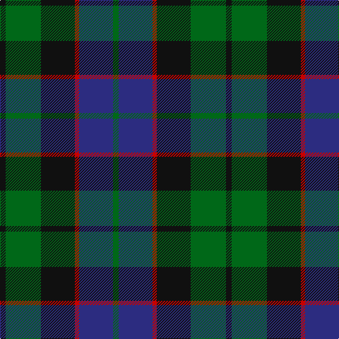

In pattern [GBRKGK](/stripes/gbrkgk/).

This was sourced from register-of-tartans.  It is a [6 stripe tartan](/stripes/stripes6/).

Original link https://www.tartanregister.gov.uk/tartanDetails.aspx?ref=1167

## Also known as

This cloth is also recorded under:

- Ferguson of Balquhidder
- Ferguson of Balquhidder #2

## Attestations

This cloth appears in 4 source records; the oldest owns this page.

- 01/01/1831 — Ferguson of Balquhidder #2 (register-of-tartans, [record](https://www.tartanregister.gov.uk/tartanDetails.aspx?ref=1167))
- 1831 — Ferguson of Balquhidder - 1831 (Clan (tartans-authority, [record](http://www.tartansauthority.com/tartan-ferret/display/738/))
- undated — Ferguson (weddslist, [record](http://www.weddslist.com/cgi-bin/tartans/pg.pl?source=sts))
- undated — Ferguson of Balquhidder Clan Tartan Tartan Number: 738. Earliest known date: 1977 (1831) Logan records only two threads for the red stripe. D.C. Stewart calls this Ferguson of Balquhidder to differenciate it from the Ferguson of Athol. Chiefs of the Clan are the Fergussons of Kilkerran, descended from Fergus of Dalriada, who brought the 'Stone of Scone' to Scotland. The Fergussons of Perthshire were recognised as the principal Highland branch of the clan and the chiefship belonged to 'MacFhearghuis' of Dunfallandy. The present day chief is Sir Charles Fergusson of Kilkerran, Bt. See products available Copyright © Blair Urquhart, Comrie, 2015 (house-of-tartan, [record](http://www.house-of-tartan.scotland.net/house/TartanViewjs.asp?colr=Def&tnam=738))

## Register references

External register numbers recorded for this tartan.

- Scottish Register of Tartans: [1167](https://www.tartanregister.gov.uk/tartanDetails.aspx?ref=1167)
- Scottish Tartans Authority (ITI): 738
- Scottish Tartans World Register: 738

## Thread count
K/8 G50 K48 R6 DB48 G/8

## Palette
Each colour and the base-6 reference it is a variant of.

| Colour | Shade | Base |
|---|---|---|
| DB | <code style="background-color:#2C2C80;">#2C2C80</code> `oklch(35.0% 0.138 276.6)` <small>#2C2C80</small> | B <code style="background-color:#2A418A;">#2A418A</code> |
| G | <code style="background-color:#006818;">#006818</code> `oklch(45.0% 0.142 145.0)` <small>#006818</small> | G <code style="background-color:#006100;">#006100</code> |
| K | <code style="background-color:#101010;">#101010</code> `oklch(17.3% 0.000 89.9)` <small>#101010</small> | K <code style="background-color:#000000;">#000000</code> |
| R | <code style="background-color:#C80000;">#C80000</code> `oklch(52.3% 0.215 29.2)` <small>#C80000</small> | R <code style="background-color:#CC0000;">#CC0000</code> |

# Sample pattern

## Nearest tartans

The nearest existing variants by ΔTartan distance.

1. [Graham of Menteith (Clan)](/setts/s6/g8t1g1k6db6k1~x4/) — ΔT 0.50
1. [Reid and Taylor](/setts/s7/k2g10k9db9r1k1db2~x2/) — ΔT 0.56
1. [Graham of Montrose](/setts/s6/k4dg19k16w2db15dg4~x2/) — ΔT 0.56
1. [Renfrew](/setts/s7/db6k2db18k18g18k3r2~x2/) — ΔT 0.58
1. [Graham of Menteith](/setts/s6/g8b1g1k6db6k1~x4/) — ΔT 0.59
1. [Callum Beg (Fashion)](/setts/s6/g1db6k6g6r1g1~x6/) — ΔT 0.60
1. [Gallamore](/setts/s6/k3db14r2k14g14k3~x2/) — ΔT 0.60
1. [Unnamed 19th Century Plaid](/setts/s7/g8t1g1k6dp6k1dp3~x4/) — ΔT 0.66
1. [Blaylock Annandale (Name)](/setts/s7/g24db6t3k6db12k15g4~x2/) — ΔT 0.66
1. [Gunn](/setts/s6/r2g12k12g1db12g2~x2/) — ΔT 0.66

## Neighbour map

Every grey dot is one of 14299 variants placed by the first two principal components of the ΔTartan feature space (44% of its variance). Red is this tartan; blue dots are its nearest — click one to open its page.

<svg viewBox="0 0 640 380" role="img" style="max-width:100%;height:auto;border:1px solid #e0e0e0;border-radius:4px;display:block" xmlns="http://www.w3.org/2000/svg"><image href="/nn/cloud.v1.png" width="640" height="380"/><a href="/setts/s6/g8t1g1k6db6k1~x4/"><circle cx="218.0" cy="248.8" r="4" fill="#3465a4"><title>Graham of Menteith (Clan)</title></circle></a><a href="/setts/s7/k2g10k9db9r1k1db2~x2/"><circle cx="221.3" cy="231.7" r="4" fill="#3465a4"><title>Reid and Taylor</title></circle></a><a href="/setts/s6/k4dg19k16w2db15dg4~x2/"><circle cx="222.9" cy="254.1" r="4" fill="#3465a4"><title>Graham of Montrose</title></circle></a><a href="/setts/s7/db6k2db18k18g18k3r2~x2/"><circle cx="219.3" cy="238.9" r="4" fill="#3465a4"><title>Renfrew</title></circle></a><a href="/setts/s6/g8b1g1k6db6k1~x4/"><circle cx="220.4" cy="250.2" r="4" fill="#3465a4"><title>Graham of Menteith</title></circle></a><a href="/setts/s6/g1db6k6g6r1g1~x6/"><circle cx="197.7" cy="260.1" r="4" fill="#3465a4"><title>Callum Beg (Fashion)</title></circle></a><a href="/setts/s6/k3db14r2k14g14k3~x2/"><circle cx="214.2" cy="260.7" r="4" fill="#3465a4"><title>Gallamore</title></circle></a><a href="/setts/s7/g8t1g1k6dp6k1dp3~x4/"><circle cx="203.2" cy="241.8" r="4" fill="#3465a4"><title>Unnamed 19th Century Plaid</title></circle></a><a href="/setts/s7/g24db6t3k6db12k15g4~x2/"><circle cx="212.8" cy="248.1" r="4" fill="#3465a4"><title>Blaylock Annandale (Name)</title></circle></a><a href="/setts/s6/r2g12k12g1db12g2~x2/"><circle cx="216.6" cy="230.6" r="4" fill="#3465a4"><title>Gunn</title></circle></a><circle cx="204.4" cy="248.3" r="5" fill="#c00000"/></svg>

ID: /setts/s6/k4g25k24r3db24g4~x2/
