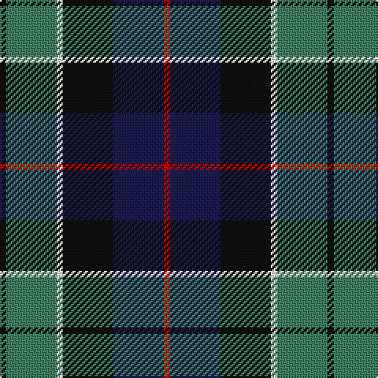

In pattern [KGWKBR](/patterns/kgwkbr/).

This was sourced from tartans-authority.  It is a [6 stripes tartan](/stripes/stripes6/).

Original link http://www.tartansauthority.com/tartan-ferret/display/6376/

## Attestations

This cloth appears in 2 source records; the oldest owns this page.

- 1882 — Syme (Clan) (tartans-authority, [record](http://www.tartansauthority.com/tartan-ferret/display/6376/))
- 01/01/1888 — Syme (register-of-tartans, [record](https://www.tartanregister.gov.uk/tartanDetails.aspx?ref=4059))

## Thread count
K/4 G32 W4 K32 DB32 R/4

## Palette
Each colour and its ΔE from the base-6 reference it is a variant of.

| Colour | Shade | Base | ΔE (OKLab) |
|---|---|---|---|
| DB | <code style="background-color:#1C1C50;">#1C1C50</code> `#1C1C50` | B <code style="background-color:#2A418A;">#2A418A</code> | 0.14 |
| G | <code style="background-color:#408060;">#408060</code> `#408060` | G <code style="background-color:#006100;">#006100</code> | 0.14 |
| K | <code style="background-color:#101010;">#101010</code> `#101010` | K <code style="background-color:#000000;">#000000</code> | 0.17 |
| R | <code style="background-color:#C80000;">#C80000</code> `#C80000` | R <code style="background-color:#CC0000;">#CC0000</code> | 0.01 |
| W | <code style="background-color:#F8F8F8;">#F8F8F8</code> `#F8F8F8` | W <code style="background-color:#F7F7F7;">#F7F7F7</code> | 0.00 |

# Sample pattern

## Nearest tartans

The nearest existing variants by ΔTartan distance.

1. [Galbraith](/setts/s6/k4g34k32r4b34w4-b2c2c80-g006818-k101010-rc80000-wfcfcfc/) — ΔT 0.32
1. [Hunter (Galbraith etc)](/setts/s6/k4g34k32r4b34w4-b1c0070-g006818-k101010-rc80000-wf8f8f8/) — ΔT 0.36
1. [Leslie Hunting Clan Tartan Tartan Number: 1113. Earliest known date: 1810-15 Said to have been worn by George 14th Earl of Rothes who died in 1841. This sett is shown by Smibert (1850) and by W & A Smith (1850) but without the definition of 'Hunting'. This sett is very similar to Duncan, the difference lies in the broad black present in the Leslie Hunting which is green in the Duncan See products available Copyright © Blair Urquhart, Comrie, 2015](/setts/s6/r4b16k16w2g16k2-b2c2c80-g006818-k101010-rc80000-we0e0e0/) — ΔT 0.39
1. [Colquhoun Clan Tartan Tartan Number: 274. Earliest known date: 1810-15 The Bonnie Banks and Braes of Loch Lomand were the setting for the interesting and sometimes violent history of the Colquhouns of Luss. Their tartan is well documented, appearing in the earliest collections, and certified by the Chief, with his seal and signature, in the archives of the Highland Society of London. (c.1816). The Clan tartan, in its present form, was woven by Wilson's of Bannockburn at the beginning of the 19th century and recorded in the firms pattern books dated 1819. Wilson often used purple in place of blue and produced proportionately equivalent patterns in different weights of cloth. Logan recorded a similar sett in 1831. The Vestiarium Scoticum shows a pattern with the white stripe next to the blue but this is regarded as an error. See products available Copyright © Blair Urquhart, Comrie, 2015](/setts/s7/r6g32w4k32b32k4b4-b2c2c80-g006818-k101010-rc80000-we0e0e0/) — ΔT 0.52
1. [Leslie Hunting](/setts/s6/k4g32w4k32b32r4-b202060-g006818-k101010-rc80000-we0e0e0/) — ΔT 0.57
1. [Fruin Colquhoun (Commemorative?)](/setts/s7/r10g38w6k38b38k6b4-b2c2c80-g00643c-k101010-rc80000-we0e0e0/) — ΔT 0.60
1. [Swankie (Personal)](/setts/s7/k8b42g20ga8k40r12b6-b1474b4-g604000-ga8c7038-k101010-rc80000/) — ΔT 0.66
1. [Mitchell (Clan)](/setts/s6/k4g34k32r4b34y4-b1c0070-g006818-k101010-r880000-yb8b8b8/) — ΔT 0.69
1. [MacLeod of Assynt Clan Tartan Tartan Number: 1582. Earliest known date: 1906 In a portrait of the 24th chief, John Norman, painted posthumously (perhaps by Julius Jacobson, born 1811) in 1835, John Norman is shown in the costume worn for the visit of George IV to Edinburgh in 1822. The snuff-box may be evidence that the Vestiarium 'loud' design, which is very similar to that of the snuff box, had particular significance for John Norman or his wife, Ann Stephenson. (Ruairidh MacLeod, Tartans of Clan MacLeod, 1990.) See products available Copyright © Blair Urquhart, Comrie, 2015](/setts/s6/r6k4g30k20b40y4-b2c2c80-g006818-k101010-rc80000-ye8c000/) — ΔT 0.69
1. [Russell Clan Tartan Tartan Number: 1094. Earliest known date: c.1815 It seems certain that the tartan was first known as Galbraith. William Wilson and Sons of Bannockburn recorded the pattern as Russell in their pattern book of 1847, although it was named Hunter in the earlier book of 1819. See products available Copyright © Blair Urquhart, Comrie, 2015](/setts/s6/k4g24k24r2b24w4-b2c2c80-g006818-k101010-rc80000-we0e0e0/) — ΔT 0.69

## Neighbour map

Every grey dot is one of 15726 variants placed by the first two principal components of the ΔTartan feature space (44% of its variance). Red is this tartan; blue dots are its nearest — click one to open its page.

<svg viewBox="0 0 640 380" role="img" style="max-width:100%;height:auto;border:1px solid #e0e0e0;border-radius:4px;display:block" xmlns="http://www.w3.org/2000/svg"><image href="/nn/cloud.v1.png" width="640" height="380"/><a href="/setts/s6/k4g34k32r4b34w4-b2c2c80-g006818-k101010-rc80000-wfcfcfc/"><circle cx="147.0" cy="210.2" r="4" fill="#3465a4"><title>Galbraith</title></circle></a><a href="/setts/s6/k4g34k32r4b34w4-b1c0070-g006818-k101010-rc80000-wf8f8f8/"><circle cx="143.8" cy="210.0" r="4" fill="#3465a4"><title>Hunter (Galbraith etc)</title></circle></a><a href="/setts/s6/r4b16k16w2g16k2-b2c2c80-g006818-k101010-rc80000-we0e0e0/"><circle cx="135.1" cy="217.5" r="4" fill="#3465a4"><title>Leslie Hunting Clan Tartan Tartan Number: 1113. Earliest known date: 1810-15 Said to have been worn by George 14th Earl of Rothes who died in 1841. This sett is shown by Smibert (1850) and by W &amp; A Smith (1850) but without the definition of 'Hunting'. This sett is very similar to Duncan, the difference lies in the broad black present in the Leslie Hunting which is green in the Duncan See products available Copyright © Blair Urquhart, Comrie, 2015</title></circle></a><a href="/setts/s7/r6g32w4k32b32k4b4-b2c2c80-g006818-k101010-rc80000-we0e0e0/"><circle cx="145.6" cy="202.4" r="4" fill="#3465a4"><title>Colquhoun Clan Tartan Tartan Number: 274. Earliest known date: 1810-15 The Bonnie Banks and Braes of Loch Lomand were the setting for the interesting and sometimes violent history of the Colquhouns of Luss. Their tartan is well documented, appearing in the earliest collections, and certified by the Chief, with his seal and signature, in the archives of the Highland Society of London. (c.1816). The Clan tartan, in its present form, was woven by Wilson's of Bannockburn at the beginning of the 19th century and recorded in the firms pattern books dated 1819. Wilson often used purple in place of blue and produced proportionately equivalent patterns in different weights of cloth. Logan recorded a similar sett in 1831. The Vestiarium Scoticum shows a pattern with the white stripe next to the blue but this is regarded as an error. See products available Copyright © Blair Urquhart, Comrie, 2015</title></circle></a><a href="/setts/s6/k4g32w4k32b32r4-b202060-g006818-k101010-rc80000-we0e0e0/"><circle cx="156.3" cy="217.7" r="4" fill="#3465a4"><title>Leslie Hunting</title></circle></a><a href="/setts/s7/r10g38w6k38b38k6b4-b2c2c80-g00643c-k101010-rc80000-we0e0e0/"><circle cx="143.5" cy="199.7" r="4" fill="#3465a4"><title>Fruin Colquhoun (Commemorative?)</title></circle></a><a href="/setts/s7/k8b42g20ga8k40r12b6-b1474b4-g604000-ga8c7038-k101010-rc80000/"><circle cx="143.7" cy="210.9" r="4" fill="#3465a4"><title>Swankie (Personal)</title></circle></a><a href="/setts/s6/k4g34k32r4b34y4-b1c0070-g006818-k101010-r880000-yb8b8b8/"><circle cx="158.5" cy="217.2" r="4" fill="#3465a4"><title>Mitchell (Clan)</title></circle></a><a href="/setts/s6/r6k4g30k20b40y4-b2c2c80-g006818-k101010-rc80000-ye8c000/"><circle cx="182.0" cy="204.6" r="4" fill="#3465a4"><title>MacLeod of Assynt Clan Tartan Tartan Number: 1582. Earliest known date: 1906 In a portrait of the 24th chief, John Norman, painted posthumously (perhaps by Julius Jacobson, born 1811) in 1835, John Norman is shown in the costume worn for the visit of George IV to Edinburgh in 1822. The snuff-box may be evidence that the Vestiarium 'loud' design, which is very similar to that of the snuff box, had particular significance for John Norman or his wife, Ann Stephenson. (Ruairidh MacLeod, Tartans of Clan MacLeod, 1990.) See products available Copyright © Blair Urquhart, Comrie, 2015</title></circle></a><a href="/setts/s6/k4g24k24r2b24w4-b2c2c80-g006818-k101010-rc80000-we0e0e0/"><circle cx="163.8" cy="201.0" r="4" fill="#3465a4"><title>Russell Clan Tartan Tartan Number: 1094. Earliest known date: c.1815 It seems certain that the tartan was first known as Galbraith. William Wilson and Sons of Bannockburn recorded the pattern as Russell in their pattern book of 1847, although it was named Hunter in the earlier book of 1819. See products available Copyright © Blair Urquhart, Comrie, 2015</title></circle></a><circle cx="144.2" cy="209.9" r="5" fill="#c00000"/></svg>

ID: /setts/s6/k4g32w4k32b32r4-b1c1c50-g408060-k101010-rc80000-wf8f8f8/
