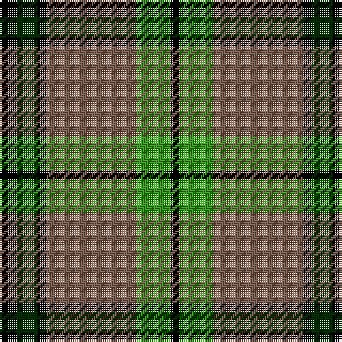

In pattern [KGKRGK](/patterns/kgkrgk/).

This was sourced from weddslist.  It is a [6 stripes tartan](/stripes/stripes6/).

Original link http://www.weddslist.com/cgi-bin/tartans/pg.pl?source=sts

## Thread count
K/8 DG10 K4 LT42 G16 K/4

## Palette
Each colour and its ΔE from the base-6 reference it is a variant of.

| Colour | Shade | Base | ΔE (OKLab) |
|---|---|---|---|
| DG | <code style="background-color:#003000;">#003000</code> `#003000` | G <code style="background-color:#006100;">#006100</code> | 0.17 |
| G | <code style="background-color:#30A010;">#30A010</code> `#30A010` | G <code style="background-color:#006100;">#006100</code> | 0.20 |
| K | <code style="background-color:#000000;">#000000</code> `#000000` | K <code style="background-color:#000000;">#000000</code> | 0.00 |
| LT | <code style="background-color:#806050;">#806050</code> `#806050` | R <code style="background-color:#CC0000;">#CC0000</code> | 0.17 |

# Sample pattern

## Nearest tartans

The nearest existing variants by ΔTartan distance.

1. [Strummer, Joe (Commemorative)](/setts/s7/k3g3y6k12y1r2g2x4~g604000-k101010-r888888-ybc8c00/) — ΔT 0.90
1. [Blackstock Hunting](/setts/s7/k2r7k6g12y1g1k2x4~g006818-k101010-rc80000-ye8c000/) — ΔT 1.01
1. [Bro-Leon](/setts/s9/b4k22y2k2g7y2k2y17k4x2~b2c2c80-g408060-k101010-ybc8c00/) — ΔT 1.02
1. [Aiton](/setts/s8/b6k1g3k1b3k1g10r3x2~b304080-g008000-k000000-rc00000/) — ΔT 1.08
1. [John Telfar, Dunbar hunting](/setts/s7/g5k2g28k10r26b4g4x2~b304080-g008000-k000000-r806050/) — ΔT 1.09
1. [Asheville Firefighters, The](/setts/s6/k17g48y4r10w12g4~g004028-k101010-rc80000-wa8ace8-yffe600/) — ΔT 1.12
1. [Merric Dark Camel.. Trade Tartan Tartan Number: 1688. Earliest known date: 1985 School colours. See products available Copyright © Blair Urquhart, Comrie, 2015](/setts/s7/r2w8k14g25w2k2w2x2~g604000-k101010-rc80000-we0e0e0/) — ΔT 1.13
1. [Invertere](/setts/s8/y5g14r4b4r27g3r4y5x2~b000050-g003000-r806050-yf0c000/) — ΔT 1.15
1. [New Glasgow (Canada)](/setts/s8/g28r4b25w5r22g27r4b2x2~b000048-g004c00-rdc0000-wffffff/) — ΔT 1.15
1. [Georgia](/setts/s8/g36k2g2k2g3k12b10r20x2~b5480b0-g008000-k000000-rc00000/) — ΔT 1.16

## Neighbour map

Every grey dot is one of 15726 variants placed by the first two principal components of the ΔTartan feature space (44% of its variance). Red is this tartan; blue dots are its nearest — click one to open its page.

<svg viewBox="0 0 640 380" role="img" style="max-width:100%;height:auto;border:1px solid #e0e0e0;border-radius:4px;display:block" xmlns="http://www.w3.org/2000/svg"><image href="/nn/cloud.v1.png" width="640" height="380"/><a href="/setts/s7/k3g3y6k12y1r2g2x4~g604000-k101010-r888888-ybc8c00/"><circle cx="262.6" cy="195.2" r="4" fill="#3465a4"><title>Strummer, Joe (Commemorative)</title></circle></a><a href="/setts/s7/k2r7k6g12y1g1k2x4~g006818-k101010-rc80000-ye8c000/"><circle cx="227.2" cy="195.1" r="4" fill="#3465a4"><title>Blackstock Hunting</title></circle></a><a href="/setts/s9/b4k22y2k2g7y2k2y17k4x2~b2c2c80-g408060-k101010-ybc8c00/"><circle cx="246.5" cy="170.6" r="4" fill="#3465a4"><title>Bro-Leon</title></circle></a><a href="/setts/s8/b6k1g3k1b3k1g10r3x2~b304080-g008000-k000000-rc00000/"><circle cx="222.0" cy="200.4" r="4" fill="#3465a4"><title>Aiton</title></circle></a><a href="/setts/s7/g5k2g28k10r26b4g4x2~b304080-g008000-k000000-r806050/"><circle cx="250.7" cy="190.2" r="4" fill="#3465a4"><title>John Telfar, Dunbar hunting</title></circle></a><a href="/setts/s6/k17g48y4r10w12g4~g004028-k101010-rc80000-wa8ace8-yffe600/"><circle cx="259.4" cy="178.9" r="4" fill="#3465a4"><title>Asheville Firefighters, The</title></circle></a><a href="/setts/s7/r2w8k14g25w2k2w2x2~g604000-k101010-rc80000-we0e0e0/"><circle cx="231.9" cy="166.3" r="4" fill="#3465a4"><title>Merric Dark Camel.. Trade Tartan Tartan Number: 1688. Earliest known date: 1985 School colours. See products available Copyright © Blair Urquhart, Comrie, 2015</title></circle></a><a href="/setts/s8/y5g14r4b4r27g3r4y5x2~b000050-g003000-r806050-yf0c000/"><circle cx="269.3" cy="190.1" r="4" fill="#3465a4"><title>Invertere</title></circle></a><a href="/setts/s8/g28r4b25w5r22g27r4b2x2~b000048-g004c00-rdc0000-wffffff/"><circle cx="226.0" cy="187.3" r="4" fill="#3465a4"><title>New Glasgow (Canada)</title></circle></a><a href="/setts/s8/g36k2g2k2g3k12b10r20x2~b5480b0-g008000-k000000-rc00000/"><circle cx="240.9" cy="154.1" r="4" fill="#3465a4"><title>Georgia</title></circle></a><circle cx="242.6" cy="196.5" r="5" fill="#c00000"/></svg>

ID: /setts/s6/k4g5k2r21ga8k2x2~g003000-ga30a010-k000000-r806050/
