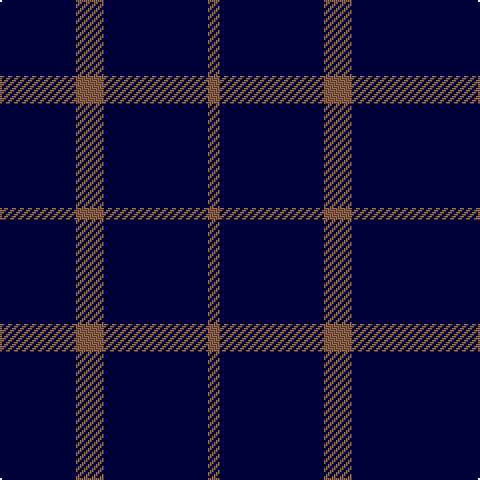

In pattern [KKKRKR](/patterns/kkkrkr/).

This was sourced from weddslist.  It is a [6 stripes tartan](/stripes/stripes6/).

Original link http://www.weddslist.com/cgi-bin/tartans/pg.pl?source=sts

## Thread count
DB/8 DB24 DB6 LT14 DB52 LT/6

## Palette
Each colour and its ΔE from the base-6 reference it is a variant of.

| Colour | Shade | Base | ΔE (OKLab) |
|---|---|---|---|
| DB | <code style="background-color:#000030;">#000030</code> `#000030` | K <code style="background-color:#000000;">#000000</code> | 0.17 |
| LT | <code style="background-color:#806050;">#806050</code> `#806050` | R <code style="background-color:#CC0000;">#CC0000</code> | 0.17 |

# Sample pattern

## Nearest tartans

The nearest existing variants by ΔTartan distance.

1. [Brooks Brothers Tattersall Blue](/setts/s5/r1b9y2b9y1~b202060-r880000-ya08858~x4/) — ΔT 1.59
1. [Elliott](/setts/s4/b16r4b3ra1~b000064-r900000-rac80000~x2/) — ΔT 1.90
1. [Coinean Dubh](/setts/s4/b50k12b21w5~b003c64-k101010-wffffff~x2/) — ΔT 1.96
1. [Sultan of Qaboo's Air Force](/setts/s6/b24ba6b10ba6b32y3~b1c0070-ba5c8ca8-ye8c000~x2/) — ΔT 1.98
1. [Freedom of Scotland](/setts/s6/k15b7k6b11k50b4~b5c5c5c-k101010~x2/) — ΔT 2.12
1. [Gadsden (Artefact)](/setts/s5/r3k16g2k2g2~g285800-k00002c-rc80000~x2/) — ΔT 2.15
1. [GOLF (Wonderland Publications) Corporate Tartan Tartan Number: 10698. Earliest known date: 13 September 2012 This tartan was created for the designers’ limited edition publication, GOLF, a registered trademark of Wonderland Publications, a division of Bad Halo Ltd. The tartan is intended to capture the soul and the spirit of the book - and the game. See products available Copyright © Blair Urquhart, Comrie, 2015](/setts/s9/k10b3k6g1k6g1k6g2k6~baa00ff-g008b00-k101010~x2/) — ΔT 2.16
1. [Dollar Academy (1930s) (Corporate)](/setts/s6/b9k9b9k9b42w5~b2c2c80-k101010-we0e0e0~x2/) — ΔT 2.19
1. [Dollar Academy](/setts/s6/b9k9b9k9b42w5~b2c2c80-k101010-wc0c0c0~x2/) — ΔT 2.20
1. [Hebridean (Old..) District Tartan Tartan Number: 414. Earliest known date: pre 2003 The design 'Heather Tartan' has been produced at the request of the Royal Society for Prevention of Cruelty to Children, as the Society's corporate tartan. The colours of the design are taken from the Society's badge and lettrhead. Dark Pink Mix, Light Pink Mix, Kingfisher and Emerald. See products available Copyright © Blair Urquhart, Comrie, 2015](/setts/s7/b10r1b10r2b10r1g2~b2c2c80-g006818-rc80000~x2/) — ΔT 2.21

## Neighbour map

Every grey dot is one of 15726 variants placed by the first two principal components of the ΔTartan feature space (44% of its variance). Red is this tartan; blue dots are its nearest — click one to open its page.

<svg viewBox="0 0 640 380" role="img" style="max-width:100%;height:auto;border:1px solid #e0e0e0;border-radius:4px;display:block" xmlns="http://www.w3.org/2000/svg"><image href="/nn/cloud.v1.png" width="640" height="380"/><a href="/setts/s5/r1b9y2b9y1~b202060-r880000-ya08858~x4/"><circle cx="542.4" cy="271.6" r="4" fill="#3465a4"><title>Brooks Brothers Tattersall Blue</title></circle></a><a href="/setts/s4/b16r4b3ra1~b000064-r900000-rac80000~x2/"><circle cx="552.6" cy="253.1" r="4" fill="#3465a4"><title>Elliott</title></circle></a><a href="/setts/s4/b50k12b21w5~b003c64-k101010-wffffff~x2/"><circle cx="506.3" cy="279.9" r="4" fill="#3465a4"><title>Coinean Dubh</title></circle></a><a href="/setts/s6/b24ba6b10ba6b32y3~b1c0070-ba5c8ca8-ye8c000~x2/"><circle cx="508.8" cy="256.1" r="4" fill="#3465a4"><title>Sultan of Qaboo's Air Force</title></circle></a><a href="/setts/s6/k15b7k6b11k50b4~b5c5c5c-k101010~x2/"><circle cx="563.7" cy="265.7" r="4" fill="#3465a4"><title>Freedom of Scotland</title></circle></a><a href="/setts/s5/r3k16g2k2g2~g285800-k00002c-rc80000~x2/"><circle cx="445.9" cy="247.7" r="4" fill="#3465a4"><title>Gadsden (Artefact)</title></circle></a><a href="/setts/s9/k10b3k6g1k6g1k6g2k6~baa00ff-g008b00-k101010~x2/"><circle cx="495.3" cy="260.4" r="4" fill="#3465a4"><title>GOLF (Wonderland Publications) Corporate Tartan Tartan Number: 10698. Earliest known date: 13 September 2012 This tartan was created for the designers’ limited edition publication, GOLF, a registered trademark of Wonderland Publications, a division of Bad Halo Ltd. The tartan is intended to capture the soul and the spirit of the book - and the game. See products available Copyright © Blair Urquhart, Comrie, 2015</title></circle></a><a href="/setts/s6/b9k9b9k9b42w5~b2c2c80-k101010-we0e0e0~x2/"><circle cx="446.1" cy="251.1" r="4" fill="#3465a4"><title>Dollar Academy (1930s) (Corporate)</title></circle></a><a href="/setts/s6/b9k9b9k9b42w5~b2c2c80-k101010-wc0c0c0~x2/"><circle cx="461.9" cy="257.5" r="4" fill="#3465a4"><title>Dollar Academy</title></circle></a><a href="/setts/s7/b10r1b10r2b10r1g2~b2c2c80-g006818-rc80000~x2/"><circle cx="568.6" cy="262.9" r="4" fill="#3465a4"><title>Hebridean (Old..) District Tartan Tartan Number: 414. Earliest known date: pre 2003 The design 'Heather Tartan' has been produced at the request of the Royal Society for Prevention of Cruelty to Children, as the Society's corporate tartan. The colours of the design are taken from the Society's badge and lettrhead. Dark Pink Mix, Light Pink Mix, Kingfisher and Emerald. See products available Copyright © Blair Urquhart, Comrie, 2015</title></circle></a><circle cx="550.6" cy="283.6" r="5" fill="#c00000"/></svg>

ID: /setts/s6/k4k12k3r7k26r3~k000030-r806050~x2/
