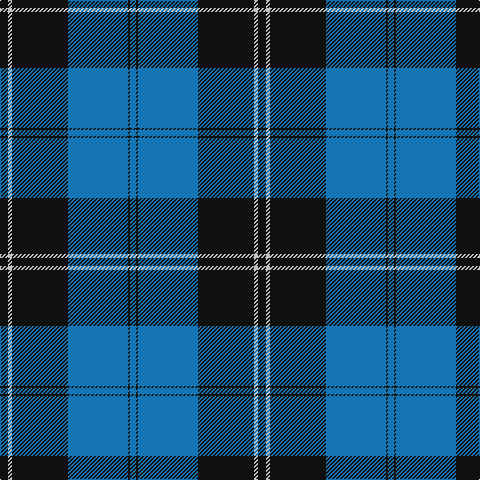

In pattern [BKBKWK](/stripes/bkbkwk/).

This was sourced from register-of-tartans.  It is a [6 stripe tartan](/stripes/stripes6/).

Original link https://www.tartanregister.gov.uk/tartanDetails.aspx?ref=3454

## Also known as

This cloth is also recorded under:

- Ramsay, Blue Htg

## Attestations

This cloth appears in 2 source records; the oldest owns this page.

- 01/01/1950 — Ramsay Blue Hunting (register-of-tartans, [record](https://www.tartanregister.gov.uk/tartanDetails.aspx?ref=3454))
- pre 1950 — Ramsay, Blue Htg (Clan) (tartans-authority, [record](http://www.tartansauthority.com/tartan-ferret/display/259/))

## Register references

External register numbers recorded for this tartan.

- Scottish Register of Tartans: [3454](https://www.tartanregister.gov.uk/tartanDetails.aspx?ref=3454)
- Scottish Tartans Authority (ITI): 259
- Scottish Tartans World Register: 259

## Thread count
K/8 N4 K56 B60 K2 B/6

## Palette
Each colour and the base-6 reference it is a variant of.

| Colour | Shade | Base |
|---|---|---|
| B | <code style="background-color:#1474B4;">#1474B4</code> `oklch(54.0% 0.129 245.1)` <small>#1474B4</small> | B <code style="background-color:#2A418A;">#2A418A</code> |
| K | <code style="background-color:#101010;">#101010</code> `oklch(17.3% 0.000 89.9)` <small>#101010</small> | K <code style="background-color:#000000;">#000000</code> |
| N | <code style="background-color:#C0C0C0;">#C0C0C0</code> `oklch(80.8% 0.000 89.9)` <small>#C0C0C0</small> | W <code style="background-color:#F7F7F7;">#F7F7F7</code> |

# Sample pattern

## Nearest tartans

The nearest existing variants by ΔTartan distance, with this tartan at the top so the swatches line up against it.

ΔTartan

Tartan

Sett

—

<a href="/ttd/edit/#slug=k4lb2k28b30k1b3~x2">Ramsay Blue Hunting</a> <a class="nn-out" href="/setts/s6/k4lb2k28b30k1b3~x2/" title="open its dictionary page">↗</a>

0.70

<a href="/ttd/edit/#slug=k4ly1k20b20k1b4~x4">Oakleigh (Corporate)</a> <a class="nn-out" href="/setts/s6/k4ly1k20b20k1b4~x4/" title="open its dictionary page">↗</a>

1.15

<a href="/ttd/edit/#slug=db52k28w5k3w2k10">St Andrews, Earl of</a> <a class="nn-out" href="/setts/s6/db52k28w5k3w2k10/" title="open its dictionary page">↗</a>

1.22

<a href="/ttd/edit/#slug=r3k1b27k27w3~x2">Bro-Spirit of Northmen (Corporate)</a> <a class="nn-out" href="/setts/s5/r3k1b27k27w3~x2/" title="open its dictionary page">↗</a>

1.27

<a href="/ttd/edit/#slug=r1b1k17b17k1w1~x4">Sorbie (Name)</a> <a class="nn-out" href="/setts/s6/r1b1k17b17k1w1~x4/" title="open its dictionary page">↗</a>

1.37

<a href="/ttd/edit/#slug=db23w1db1w1db8g22r1db3~x4">Roxburgh, Green (District)</a> <a class="nn-out" href="/setts/s8/db23w1db1w1db8g22r1db3~x4/" title="open its dictionary page">↗</a>

1.37

<a href="/ttd/edit/#slug=k4lg3k30lg33r1lg4~x2">Intergen (Corporate)</a> <a class="nn-out" href="/setts/s6/k4lg3k30lg33r1lg4~x2/" title="open its dictionary page">↗</a>

1.40

<a href="/ttd/edit/#slug=db72k21g16t3g17t3~x2">MacRobart</a> <a class="nn-out" href="/setts/s6/db72k21g16t3g17t3~x2/" title="open its dictionary page">↗</a>

1.47

<a href="/ttd/edit/#slug=k4w2k28db30k1db3~x2">Ramsay</a> <a class="nn-out" href="/setts/s6/k4w2k28db30k1db3~x2/" title="open its dictionary page">↗</a>

1.47

<a href="/ttd/edit/#slug=b18w1k3w1b9w1k45b4~x2">Lynn (Personal)</a> <a class="nn-out" href="/setts/s8/b18w1k3w1b9w1k45b4~x2/" title="open its dictionary page">↗</a>

1.48

<a href="/ttd/edit/#slug=k30b40ly3b5w2b6~x2">Micron</a> <a class="nn-out" href="/setts/s6/k30b40ly3b5w2b6~x2/" title="open its dictionary page">↗</a>

## Neighbour map

Every grey dot is one of 14299 variants placed by the first two principal components of the ΔTartan feature space (44% of its variance). Red is this tartan; blue dots are its nearest — click one to open its page.

<svg viewBox="0 0 640 380" role="img" style="max-width:100%;height:auto;border:1px solid #e0e0e0;border-radius:4px;display:block" xmlns="http://www.w3.org/2000/svg"><image href="/nn/cloud.v1.png" width="640" height="380"/><a href="/setts/s6/k4ly1k20b20k1b4~x4/"><circle cx="353.1" cy="199.9" r="4" fill="#3465a4"><title>Oakleigh (Corporate)</title></circle></a><a href="/setts/s6/db52k28w5k3w2k10/"><circle cx="369.2" cy="188.6" r="4" fill="#3465a4"><title>St Andrews, Earl of</title></circle></a><a href="/setts/s5/r3k1b27k27w3~x2/"><circle cx="303.9" cy="173.9" r="4" fill="#3465a4"><title>Bro-Spirit of Northmen (Corporate)</title></circle></a><a href="/setts/s6/r1b1k17b17k1w1~x4/"><circle cx="316.0" cy="172.5" r="4" fill="#3465a4"><title>Sorbie (Name)</title></circle></a><a href="/setts/s8/db23w1db1w1db8g22r1db3~x4/"><circle cx="375.1" cy="157.8" r="4" fill="#3465a4"><title>Roxburgh, Green (District)</title></circle></a><a href="/setts/s6/k4lg3k30lg33r1lg4~x2/"><circle cx="323.4" cy="147.0" r="4" fill="#3465a4"><title>Intergen (Corporate)</title></circle></a><a href="/setts/s6/db72k21g16t3g17t3~x2/"><circle cx="327.8" cy="172.8" r="4" fill="#3465a4"><title>MacRobart</title></circle></a><a href="/setts/s6/k4w2k28db30k1db3~x2/"><circle cx="364.6" cy="178.8" r="4" fill="#3465a4"><title>Ramsay</title></circle></a><a href="/setts/s8/b18w1k3w1b9w1k45b4~x2/"><circle cx="415.6" cy="129.7" r="4" fill="#3465a4"><title>Lynn (Personal)</title></circle></a><a href="/setts/s6/k30b40ly3b5w2b6~x2/"><circle cx="355.6" cy="175.0" r="4" fill="#3465a4"><title>Micron</title></circle></a><circle cx="366.3" cy="178.0" r="5" fill="#c00000"/></svg>

ID: /setts/s6/k4lb2k28b30k1b3~x2/
