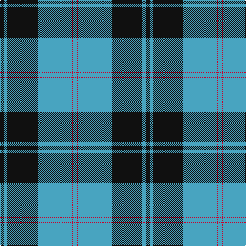

In pattern [KYKYRY](/stripes/kykyry/).

This was sourced from tartans-authority.  It is a [6 stripe tartan](/stripes/stripes6/).

Original link http://www.tartansauthority.com/tartan-ferret/display/4092/

## Thread count
K/8 B6 K60 Ba66 R2 Ba/8

## Palette
Each colour and the base-6 reference it is a variant of.

| Colour | Shade | Base |
|---|---|---|
| B | <code style="background-color:#48A4C0;">#48A4C0</code> `oklch(67.5% 0.096 221.0)` <small>#48A4C0</small> | Y <code style="background-color:#F2BF00;">#F2BF00</code> |
| Ba | <code style="background-color:#48A4C0;">#48A4C0</code> `oklch(67.5% 0.096 221.0)` <small>#48A4C0</small> | Y <code style="background-color:#F2BF00;">#F2BF00</code> |
| K | <code style="background-color:#101010;">#101010</code> `oklch(17.3% 0.000 89.9)` <small>#101010</small> | K <code style="background-color:#000000;">#000000</code> |
| R | <code style="background-color:#C8002C;">#C8002C</code> `oklch(52.6% 0.212 22.0)` <small>#C8002C</small> | R <code style="background-color:#CC0000;">#CC0000</code> |

# Sample pattern

## Nearest tartans

The nearest existing variants by ΔTartan distance, with this tartan at the top so the swatches line up against it.

ΔTartan

Tartan

Sett

—

<a href="/ttd/edit/#slug=k4lg3k30lg33r1lg4~x2">Intergen (Corporate)</a> <a class="nn-out" href="/setts/s6/k4lg3k30lg33r1lg4~x2/" title="open its dictionary page">↗</a>

1.09

<a href="/ttd/edit/#slug=lg33r1lg4r1lg33k30ly3k4ly3k30~x2">Intergen</a> <a class="nn-out" href="/setts/s10/lg33r1lg4r1lg33k30ly3k4ly3k30~x2/" title="open its dictionary page">↗</a>

1.09

<a href="/ttd/edit/#slug=r3k1b27k27w3~x2">Bro-Spirit of Northmen (Corporate)</a> <a class="nn-out" href="/setts/s5/r3k1b27k27w3~x2/" title="open its dictionary page">↗</a>

1.09

<a href="/ttd/edit/#slug=g30w8db32ly1db8~x2">Wimbledon</a> <a class="nn-out" href="/setts/s5/g30w8db32ly1db8~x2/" title="open its dictionary page">↗</a>

1.23

<a href="/ttd/edit/#slug=k4w1lb2w1k16t36lb4~x2">NHS Grampian (Corporate)</a> <a class="nn-out" href="/setts/s7/k4w1lb2w1k16t36lb4~x2/" title="open its dictionary page">↗</a>

1.27

<a href="/ttd/edit/#slug=ly21g26db62w2dg2w2">Nynashamn Whisky Society (Corporate)</a> <a class="nn-out" href="/setts/s6/ly21g26db62w2dg2w2/" title="open its dictionary page">↗</a>

1.27

<a href="/ttd/edit/#slug=dt42lb2lb2lb2dt5dt12lb32dt4~x2">Longniddry Blue (Dance)</a> <a class="nn-out" href="/setts/s8/dt42lb2lb2lb2dt5dt12lb32dt4~x2/" title="open its dictionary page">↗</a>

1.32

<a href="/ttd/edit/#slug=db72k21g16t3g17t3~x2">MacRobart</a> <a class="nn-out" href="/setts/s6/db72k21g16t3g17t3~x2/" title="open its dictionary page">↗</a>

1.32

<a href="/ttd/edit/#slug=w3k35o24k1ly3~x2">George Heriots</a> <a class="nn-out" href="/setts/s5/w3k35o24k1ly3~x2/" title="open its dictionary page">↗</a>

1.35

<a href="/ttd/edit/#slug=k30b40ly3b5w2b6~x2">Micron</a> <a class="nn-out" href="/setts/s6/k30b40ly3b5w2b6~x2/" title="open its dictionary page">↗</a>

1.37

<a href="/ttd/edit/#slug=r4g40k21lo2k21g2~x2">Unidentified Furnishing #2</a> <a class="nn-out" href="/setts/s6/r4g40k21lo2k21g2~x2/" title="open its dictionary page">↗</a>

## Neighbour map

Every grey dot is one of 14299 variants placed by the first two principal components of the ΔTartan feature space (44% of its variance). Red is this tartan; blue dots are its nearest — click one to open its page.

<svg viewBox="0 0 640 380" role="img" style="max-width:100%;height:auto;border:1px solid #e0e0e0;border-radius:4px;display:block" xmlns="http://www.w3.org/2000/svg"><image href="/nn/cloud.v1.png" width="640" height="380"/><a href="/setts/s10/lg33r1lg4r1lg33k30ly3k4ly3k30~x2/"><circle cx="303.9" cy="128.5" r="4" fill="#3465a4"><title>Intergen</title></circle></a><a href="/setts/s5/r3k1b27k27w3~x2/"><circle cx="303.9" cy="173.9" r="4" fill="#3465a4"><title>Bro-Spirit of Northmen (Corporate)</title></circle></a><a href="/setts/s5/g30w8db32ly1db8~x2/"><circle cx="305.4" cy="180.3" r="4" fill="#3465a4"><title>Wimbledon</title></circle></a><a href="/setts/s7/k4w1lb2w1k16t36lb4~x2/"><circle cx="349.1" cy="123.0" r="4" fill="#3465a4"><title>NHS Grampian (Corporate)</title></circle></a><a href="/setts/s6/ly21g26db62w2dg2w2/"><circle cx="301.2" cy="128.1" r="4" fill="#3465a4"><title>Nynashamn Whisky Society (Corporate)</title></circle></a><a href="/setts/s8/dt42lb2lb2lb2dt5dt12lb32dt4~x2/"><circle cx="287.3" cy="139.3" r="4" fill="#3465a4"><title>Longniddry Blue (Dance)</title></circle></a><a href="/setts/s6/db72k21g16t3g17t3~x2/"><circle cx="327.8" cy="172.8" r="4" fill="#3465a4"><title>MacRobart</title></circle></a><a href="/setts/s5/w3k35o24k1ly3~x2/"><circle cx="343.2" cy="150.5" r="4" fill="#3465a4"><title>George Heriots</title></circle></a><a href="/setts/s6/k30b40ly3b5w2b6~x2/"><circle cx="355.6" cy="175.0" r="4" fill="#3465a4"><title>Micron</title></circle></a><a href="/setts/s6/r4g40k21lo2k21g2~x2/"><circle cx="298.8" cy="185.1" r="4" fill="#3465a4"><title>Unidentified Furnishing #2</title></circle></a><circle cx="323.4" cy="147.0" r="5" fill="#c00000"/></svg>

ID: /setts/s6/k4lg3k30lg33r1lg4~x2/
