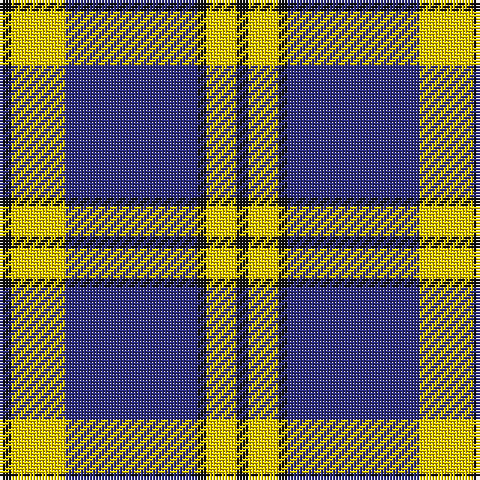

This page is one **sett** — a single exact thread-count. It belongs to the [tartan](/tartans/k4ly18db44k3ly10k4/)
(the same proportion at any scale), whose colour order is pattern [KYBKYK](/stripes/kybkyk/).

Sourced from tartans-authority.  It is a [6 stripe tartan](/stripes/stripes6/).

Original link http://www.tartansauthority.com/tartan-ferret/display/10572/

## Register references

External register numbers recorded for this tartan.

- Scottish Register of Tartans: [10572](https://www.tartanregister.gov.uk/tartanDetails?ref=10572)
- Scottish Tartans Authority (ITI): 10572

## Thread count
K/4 Y18 DB44 K3 Y10 K/4

## Palette

Palette: <strong>Tartan Register</strong>
<table><thead><tr><th>Colour</th><th>Threads</th><th>Shade</th><th>Base</th><th>OKLCh</th></tr></thead><tbody><tr><td>K/</td><td style="text-align:right;font-variant-numeric:tabular-nums">4</td><td><code style="background-color:#101010;">#101010</code> <small style="color:#888">#101010</small></td><td>K <code style="background-color:#000000;">#000000</code></td><td><small style="color:#888">oklch(17.3% 0.000 89.9)</small></td></tr><tr><td>Y</td><td style="text-align:right;font-variant-numeric:tabular-nums">18</td><td><code style="background-color:#FCCC00;">#FCCC00</code> <small style="color:#888">#FCCC00</small></td><td>Y <code style="background-color:#F2BF00;">#F2BF00</code></td><td><small style="color:#888">oklch(86.2% 0.176 91.5)</small></td></tr><tr><td>DB</td><td style="text-align:right;font-variant-numeric:tabular-nums">44</td><td><code style="background-color:#2C2C80;">#2C2C80</code> <small style="color:#888">#2C2C80</small></td><td>B <code style="background-color:#2A418A;">#2A418A</code></td><td><small style="color:#888">oklch(35.0% 0.138 276.6)</small></td></tr><tr><td>K</td><td style="text-align:right;font-variant-numeric:tabular-nums">3</td><td><code style="background-color:#101010;">#101010</code> <small style="color:#888">#101010</small></td><td>K <code style="background-color:#000000;">#000000</code></td><td><small style="color:#888">oklch(17.3% 0.000 89.9)</small></td></tr><tr><td>Y</td><td style="text-align:right;font-variant-numeric:tabular-nums">10</td><td><code style="background-color:#FCCC00;">#FCCC00</code> <small style="color:#888">#FCCC00</small></td><td>Y <code style="background-color:#F2BF00;">#F2BF00</code></td><td><small style="color:#888">oklch(86.2% 0.176 91.5)</small></td></tr><tr><td>K/</td><td style="text-align:right;font-variant-numeric:tabular-nums">4</td><td><code style="background-color:#101010;">#101010</code> <small style="color:#888">#101010</small></td><td>K <code style="background-color:#000000;">#000000</code></td><td><small style="color:#888">oklch(17.3% 0.000 89.9)</small></td></tr></tbody></table>

# Sample pattern

## Nearest tartans

The nearest existing variants by ΔTartan distance, with this tartan at the top so the swatches line up against it.

ΔTartan

Tartan

Sett

—

<a href="/ttd/edit/#slug=k4ly18db44k3ly10k4">Stutterheim (Corporate)</a> <a class="nn-out" href="/setts/s6/k4ly18db44k3ly10k4/" title="open its dictionary page">↗</a>

0.87

<a href="/ttd/edit/#slug=w4k26t26k2t5w2~x2">Indian Pipe Band (Corporate)</a> <a class="nn-out" href="/setts/s6/w4k26t26k2t5w2~x2/" title="open its dictionary page">↗</a>

0.94

<a href="/ttd/edit/#slug=k4ly18n44k3ly10k4">Stutterheim</a> <a class="nn-out" href="/setts/s6/k4ly18n44k3ly10k4/" title="open its dictionary page">↗</a>

0.96

<a href="/ttd/edit/#slug=lr3k24lr6k8w4k8lr35k2~x2">Nowell/Noel 1951 (Name)</a> <a class="nn-out" href="/setts/s8/lr3k24lr6k8w4k8lr35k2~x2/" title="open its dictionary page">↗</a>

0.98

<a href="/ttd/edit/#slug=lb40k3lb3k3lb3o8k24o8~x2">O'Sullivan-Beare (Family)</a> <a class="nn-out" href="/setts/s8/lb40k3lb3k3lb3o8k24o8~x2/" title="open its dictionary page">↗</a>

1.01

<a href="/ttd/edit/#slug=w5k20w10k1r2~x2">Cornish Flag (District)</a> <a class="nn-out" href="/setts/s5/w5k20w10k1r2~x2/" title="open its dictionary page">↗</a>

1.10

<a href="/ttd/edit/#slug=k5w25r6k45w4~x2">Shembe Zulu Church</a> <a class="nn-out" href="/setts/s5/k5w25r6k45w4~x2/" title="open its dictionary page">↗</a>

1.13

<a href="/ttd/edit/#slug=db19w1db6w1db2w2lo2w1lo18~x4">Highland Park High School (Texas)</a> <a class="nn-out" href="/setts/s9/db19w1db6w1db2w2lo2w1lo18~x4/" title="open its dictionary page">↗</a>

1.15

<a href="/ttd/edit/#slug=o72k16w9k4w5k16~x2">Machair (warp)</a> <a class="nn-out" href="/setts/s6/o72k16w9k4w5k16~x2/" title="open its dictionary page">↗</a>

1.21

<a href="/ttd/edit/#slug=db19w1db6w1db2w2ly2w1ly18~x4">Highland Park High School (Texas)</a> <a class="nn-out" href="/setts/s9/db19w1db6w1db2w2ly2w1ly18~x4/" title="open its dictionary page">↗</a>

1.22

<a href="/ttd/edit/#slug=k12lr1k2lr6k4lr3k4lr21r4~x2">MacKnight (Name)</a> <a class="nn-out" href="/setts/s9/k12lr1k2lr6k4lr3k4lr21r4~x2/" title="open its dictionary page">↗</a>

## Neighbour map

Every grey dot is one of 14359 variants placed by the first two principal components of the ΔTartan feature space (44% of its variance). Red is this tartan; blue dots are its nearest — click one to open its page.

<svg viewBox="0 0 640 380" role="img" style="max-width:100%;height:auto;border:1px solid #e0e0e0;border-radius:4px;display:block" xmlns="http://www.w3.org/2000/svg"><image href="/nn/cloud.v1.png" width="640" height="380"/><a href="/setts/s6/w4k26t26k2t5w2~x2/"><circle cx="280.5" cy="194.8" r="4" fill="#3465a4"><title>Indian Pipe Band (Corporate)</title></circle></a><a href="/setts/s6/k4ly18n44k3ly10k4/"><circle cx="305.0" cy="178.3" r="4" fill="#3465a4"><title>Stutterheim</title></circle></a><a href="/setts/s8/lr3k24lr6k8w4k8lr35k2~x2/"><circle cx="304.3" cy="170.1" r="4" fill="#3465a4"><title>Nowell/Noel 1951 (Name)</title></circle></a><a href="/setts/s8/lb40k3lb3k3lb3o8k24o8~x2/"><circle cx="272.9" cy="162.2" r="4" fill="#3465a4"><title>O'Sullivan-Beare (Family)</title></circle></a><a href="/setts/s5/w5k20w10k1r2~x2/"><circle cx="324.2" cy="182.4" r="4" fill="#3465a4"><title>Cornish Flag (District)</title></circle></a><a href="/setts/s5/k5w25r6k45w4~x2/"><circle cx="315.9" cy="199.3" r="4" fill="#3465a4"><title>Shembe Zulu Church</title></circle></a><a href="/setts/s9/db19w1db6w1db2w2lo2w1lo18~x4/"><circle cx="314.8" cy="140.5" r="4" fill="#3465a4"><title>Highland Park High School (Texas)</title></circle></a><a href="/setts/s6/o72k16w9k4w5k16~x2/"><circle cx="361.1" cy="169.6" r="4" fill="#3465a4"><title>Machair (warp)</title></circle></a><a href="/setts/s9/db19w1db6w1db2w2ly2w1ly18~x4/"><circle cx="305.4" cy="136.7" r="4" fill="#3465a4"><title>Highland Park High School (Texas)</title></circle></a><a href="/setts/s9/k12lr1k2lr6k4lr3k4lr21r4~x2/"><circle cx="325.1" cy="160.1" r="4" fill="#3465a4"><title>MacKnight (Name)</title></circle></a><circle cx="297.5" cy="177.7" r="5" fill="#c00000"/></svg>

ID: /setts/s6/k4ly18db44k3ly10k4/
