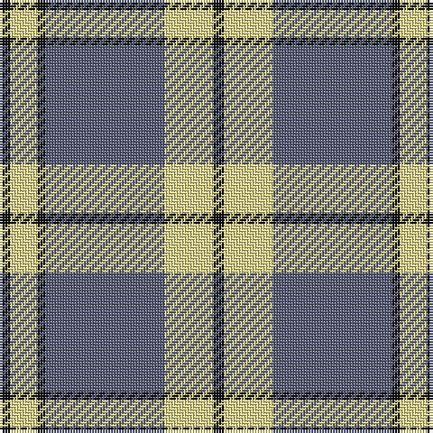

**Bands:** [KYKBYK](/stripes/kykbyk/) · **Stripes:** [K LY K N LY K](/stripes/stripes6/) K LY K N LY K

This was sourced from register-of-tartans.  It is a [6 band tartan](/bands/bands6/).

Original link https://www.tartanregister.gov.uk/tartanDetails.aspx?ref=10572

## Register references

External register numbers recorded for this tartan.

- Scottish Register of Tartans: [10572](https://www.tartanregister.gov.uk/tartanDetails.aspx?ref=10572)

## Thread count
K/4 LY18 N44 K3 LY10 K/4

## Palette
Each colour and its ΔE from the base-6 reference it is a variant of.

| Colour | Shade | Base | ΔE (OKLab) |
|---|---|---|---|
| K | <code style="background-color:#101010;">#101010</code> `#101010` | K <code style="background-color:#000000;">#000000</code> | 0.17 |
| LY | <code style="background-color:#ECDC8E;">#ECDC8E</code> `#ECDC8E` | Y <code style="background-color:#F2BF00;">#F2BF00</code> | 0.10 |
| N | <code style="background-color:#565C76;">#565C76</code> `#565C76` | B <code style="background-color:#2A418A;">#2A418A</code> | 0.11 |

# Sample pattern

## Nearest tartans

The nearest existing variants by ΔTartan distance.

1. [O'Sullivan-Beare (Family)](/setts/s8/lb40k3lb3k3lb3o8k24o8~x2/) — ΔT 0.79
1. [Stutterheim (Corporate)](/setts/s6/k4ly18db44k3ly10k4/) — ΔT 0.94
1. [Tiree Grey](/setts/s6/lb3k3lb3k3o15r1~x4/) — ΔT 1.06
1. [Forbes Dress (Clans Originaux)](/setts/s7/w6b3w20k2w3k25w3~x2/) — ΔT 1.10
1. [MacPherson of Cluny (Black and White)](/setts/s7/w5r3w35k28w4k11w2~x2/) — ΔT 1.13
1. [Highland Park High School (Texas)](/setts/s9/db19w1db6w1db2w2ly2w1ly18~x4/) — ΔT 1.14
1. [MacPherson - 1842 (VS) Dress](/setts/s7/w1m2w17k11w2k4ly1~x4/) — ΔT 1.20
1. [Kansai Highland Games](/setts/s5/dp2k1dp16g17w2~x4/) — ΔT 1.23
1. [Machair](/setts/s6/lo72dt16w9dt4w5dt16~x2/) — ΔT 1.24
1. [Kansai Highland Games Corporate Tartan Tartan Number: 2708. Earliest known date: 1999 Designed for the first Highland Games in Japan, started by Maud Robertson and heavy weight husband, Masonori Nomiyam. See products available Copyright © Blair Urquhart, Comrie, 2015](/setts/s5/dp2k1dp16g16w2~x4/) — ΔT 1.25

## Neighbour map

Every grey dot is one of 14299 variants placed by the first two principal components of the ΔTartan feature space (44% of its variance). Red is this tartan; blue dots are its nearest — click one to open its page.

<svg viewBox="0 0 640 380" role="img" style="max-width:100%;height:auto;border:1px solid #e0e0e0;border-radius:4px;display:block" xmlns="http://www.w3.org/2000/svg"><image href="/nn/cloud.v1.png" width="640" height="380"/><a href="/setts/s8/lb40k3lb3k3lb3o8k24o8~x2/"><circle cx="273.8" cy="161.4" r="4" fill="#3465a4"><title>O'Sullivan-Beare (Family)</title></circle></a><a href="/setts/s6/k4ly18db44k3ly10k4/"><circle cx="298.4" cy="176.7" r="4" fill="#3465a4"><title>Stutterheim (Corporate)</title></circle></a><a href="/setts/s6/lb3k3lb3k3o15r1~x4/"><circle cx="291.5" cy="170.8" r="4" fill="#3465a4"><title>Tiree Grey</title></circle></a><a href="/setts/s7/w6b3w20k2w3k25w3~x2/"><circle cx="282.1" cy="169.7" r="4" fill="#3465a4"><title>Forbes Dress (Clans Originaux)</title></circle></a><a href="/setts/s7/w5r3w35k28w4k11w2~x2/"><circle cx="302.1" cy="157.5" r="4" fill="#3465a4"><title>MacPherson of Cluny (Black and White)</title></circle></a><a href="/setts/s9/db19w1db6w1db2w2ly2w1ly18~x4/"><circle cx="306.4" cy="136.1" r="4" fill="#3465a4"><title>Highland Park High School (Texas)</title></circle></a><a href="/setts/s7/w1m2w17k11w2k4ly1~x4/"><circle cx="281.9" cy="139.9" r="4" fill="#3465a4"><title>MacPherson - 1842 (VS) Dress</title></circle></a><a href="/setts/s5/dp2k1dp16g17w2~x4/"><circle cx="288.3" cy="176.1" r="4" fill="#3465a4"><title>Kansai Highland Games</title></circle></a><a href="/setts/s6/lo72dt16w9dt4w5dt16~x2/"><circle cx="382.0" cy="178.5" r="4" fill="#3465a4"><title>Machair</title></circle></a><a href="/setts/s5/dp2k1dp16g16w2~x4/"><circle cx="293.0" cy="180.2" r="4" fill="#3465a4"><title>Kansai Highland Games Corporate Tartan Tartan Number: 2708. Earliest known date: 1999 Designed for the first Highland Games in Japan, started by Maud Robertson and heavy weight husband, Masonori Nomiyam. See products available Copyright © Blair Urquhart, Comrie, 2015</title></circle></a><circle cx="305.9" cy="177.5" r="5" fill="#c00000"/></svg>

ID: /setts/s6/k4ly18n44k3ly10k4/
