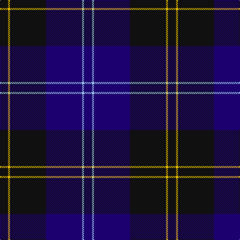

**Bands:** [KYKBWB](/stripes/kykbwb/) · **Stripes:** [K LY K DB LB DB](/stripes/stripes6/) K LY K DB LB DB

This was sourced from tartans-authority.  It is a [6 band tartan](/bands/bands6/).

Original link http://www.tartansauthority.com/tartan-ferret/display/8074/

## Thread count
K/16 Y4 K72 DB72 LB4 DB/16

## Palette
Each colour and its ΔE from the base-6 reference it is a variant of.

| Colour | Shade | Base | ΔE (OKLab) |
|---|---|---|---|
| DB | <code style="background-color:#1C0070;">#1C0070</code> `#1C0070` | B <code style="background-color:#2A418A;">#2A418A</code> | 0.14 |
| K | <code style="background-color:#101010;">#101010</code> `#101010` | K <code style="background-color:#000000;">#000000</code> | 0.17 |
| LB | <code style="background-color:#98C8E8;">#98C8E8</code> `#98C8E8` | W <code style="background-color:#F7F7F7;">#F7F7F7</code> | 0.18 |
| Y | <code style="background-color:#E8C000;">#E8C000</code> `#E8C000` | Y <code style="background-color:#F2BF00;">#F2BF00</code> | 0.02 |

# Sample pattern

## Nearest tartans

The nearest existing variants by ΔTartan distance.

1. [Slanj Dress (Corporate)](/setts/s8/k4db36k4db4k34b3k3w4~x2/) — ΔT 1.18
1. [Auckland (Fashion)](/setts/s8/dg3k3db2k16db2k2db24lb2~x2/) — ΔT 1.21
1. [Deighan (Burham Kent) (Name)](/setts/s5/n4db43k20n7o2~x2/) — ΔT 1.22
1. [Hutton](/setts/s6/k2dg7db2dg7db16r1~x6/) — ΔT 1.27
1. [Robert Gordon University](/setts/s6/k4r2k12db12k1lo2~x2/) — ΔT 1.37
1. [Pride of Kinross](/setts/s8/k20db2k6db2k4db27w2db8~x2/) — ΔT 1.40
1. [Largan (?)](/setts/s6/db8k39db8k39db87r6/) — ΔT 1.47
1. [Marchmont (Personal)](/setts/s7/k1db12k12g1k12db12g1~x4/) — ΔT 1.48
1. [Edzell, U.S. Navy](/setts/s6/db104db16w8db66r3db16/) — ΔT 1.49
1. [Williams (New York) (Personal)](/setts/s5/k30db6k6db41lt2~x2/) — ΔT 1.49

## Neighbour map

Every grey dot is one of 14299 variants placed by the first two principal components of the ΔTartan feature space (44% of its variance). Red is this tartan; blue dots are its nearest — click one to open its page.

<svg viewBox="0 0 640 380" role="img" style="max-width:100%;height:auto;border:1px solid #e0e0e0;border-radius:4px;display:block" xmlns="http://www.w3.org/2000/svg"><image href="/nn/cloud.v1.png" width="640" height="380"/><a href="/setts/s8/k4db36k4db4k34b3k3w4~x2/"><circle cx="348.3" cy="202.5" r="4" fill="#3465a4"><title>Slanj Dress (Corporate)</title></circle></a><a href="/setts/s8/dg3k3db2k16db2k2db24lb2~x2/"><circle cx="362.1" cy="205.0" r="4" fill="#3465a4"><title>Auckland (Fashion)</title></circle></a><a href="/setts/s5/n4db43k20n7o2~x2/"><circle cx="403.1" cy="225.5" r="4" fill="#3465a4"><title>Deighan (Burham Kent) (Name)</title></circle></a><a href="/setts/s6/k2dg7db2dg7db16r1~x6/"><circle cx="360.6" cy="234.7" r="4" fill="#3465a4"><title>Hutton</title></circle></a><a href="/setts/s6/k4r2k12db12k1lo2~x2/"><circle cx="338.7" cy="237.6" r="4" fill="#3465a4"><title>Robert Gordon University</title></circle></a><a href="/setts/s8/k20db2k6db2k4db27w2db8~x2/"><circle cx="389.9" cy="221.9" r="4" fill="#3465a4"><title>Pride of Kinross</title></circle></a><a href="/setts/s6/db8k39db8k39db87r6/"><circle cx="429.9" cy="254.8" r="4" fill="#3465a4"><title>Largan (?)</title></circle></a><a href="/setts/s7/k1db12k12g1k12db12g1~x4/"><circle cx="366.9" cy="264.5" r="4" fill="#3465a4"><title>Marchmont (Personal)</title></circle></a><a href="/setts/s6/db104db16w8db66r3db16/"><circle cx="387.3" cy="186.3" r="4" fill="#3465a4"><title>Edzell, U.S. Navy</title></circle></a><a href="/setts/s5/k30db6k6db41lt2~x2/"><circle cx="436.3" cy="253.4" r="4" fill="#3465a4"><title>Williams (New York) (Personal)</title></circle></a><circle cx="368.2" cy="219.3" r="5" fill="#c00000"/></svg>

ID: /setts/s6/k4ly1k18db18lb1db4~x4/
