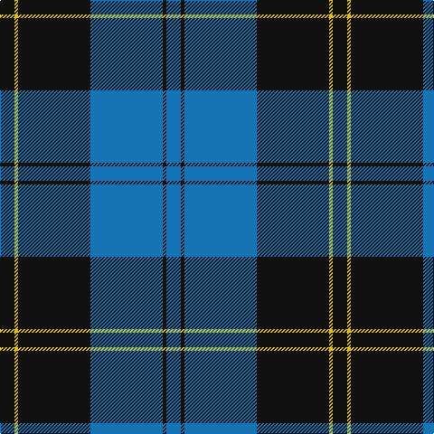

In pattern [BKBKYK](/stripes/bkbkyk/).

This was sourced from tartans-authority.  It is a [6 stripe tartan](/stripes/stripes6/).

Original link http://www.tartansauthority.com/tartan-ferret/display/6017/

## Thread count
K/16 Y4 K80 B80 K4 B/16

## Palette
Each colour and the base-6 reference it is a variant of.

| Colour | Shade | Base |
|---|---|---|
| B | <code style="background-color:#1474B4;">#1474B4</code> `oklch(54.0% 0.129 245.1)` <small>#1474B4</small> | B <code style="background-color:#2A418A;">#2A418A</code> |
| K | <code style="background-color:#101010;">#101010</code> `oklch(17.3% 0.000 89.9)` <small>#101010</small> | K <code style="background-color:#000000;">#000000</code> |
| Y | <code style="background-color:#E8C000;">#E8C000</code> `oklch(81.9% 0.168 93.7)` <small>#E8C000</small> | Y <code style="background-color:#F2BF00;">#F2BF00</code> |

# Sample pattern

## Nearest tartans

The nearest existing variants by ΔTartan distance.

1. [Ramsay Blue Hunting](/setts/s6/k4lb2k28b30k1b3~x2/) — ΔT 0.70
1. [Sorbie (Name)](/setts/s6/r1b1k17b17k1w1~x4/) — ΔT 1.11
1. [Slanj (Corporate)](/setts/s6/m4k28b3k3b25k3~x2/) — ΔT 1.22
1. [St Andrews, Earl of](/setts/s6/db52k28w5k3w2k10/) — ΔT 1.26
1. [Micron](/setts/s6/k30b40ly3b5w2b6~x2/) — ΔT 1.31
1. [Bro-Spirit of Northmen (Corporate)](/setts/s5/r3k1b27k27w3~x2/) — ΔT 1.31
1. [Gracie](/setts/s8/g47r3g6db35lo3~x2/) — ΔT 1.34
1. [Home (Clan)](/setts/s8/k36r3k3r3k9b36g3b2~x2/) — ΔT 1.35
1. [Roxburgh, Green (District)](/setts/s8/db23w1db1w1db8g22r1db3~x4/) — ΔT 1.35
1. [Sorbie](/setts/s10/k1b17k17b1r1b1k17b17k1w1~x4/) — ΔT 1.38

## Neighbour map

Every grey dot is one of 14299 variants placed by the first two principal components of the ΔTartan feature space (44% of its variance). Red is this tartan; blue dots are its nearest — click one to open its page.

<svg viewBox="0 0 640 380" role="img" style="max-width:100%;height:auto;border:1px solid #e0e0e0;border-radius:4px;display:block" xmlns="http://www.w3.org/2000/svg"><image href="/nn/cloud.v1.png" width="640" height="380"/><a href="/setts/s6/k4lb2k28b30k1b3~x2/"><circle cx="366.3" cy="178.0" r="4" fill="#3465a4"><title>Ramsay Blue Hunting</title></circle></a><a href="/setts/s6/r1b1k17b17k1w1~x4/"><circle cx="316.0" cy="172.5" r="4" fill="#3465a4"><title>Sorbie (Name)</title></circle></a><a href="/setts/s6/m4k28b3k3b25k3~x2/"><circle cx="323.6" cy="227.2" r="4" fill="#3465a4"><title>Slanj (Corporate)</title></circle></a><a href="/setts/s6/db52k28w5k3w2k10/"><circle cx="369.2" cy="188.6" r="4" fill="#3465a4"><title>St Andrews, Earl of</title></circle></a><a href="/setts/s6/k30b40ly3b5w2b6~x2/"><circle cx="355.6" cy="175.0" r="4" fill="#3465a4"><title>Micron</title></circle></a><a href="/setts/s5/r3k1b27k27w3~x2/"><circle cx="303.9" cy="173.9" r="4" fill="#3465a4"><title>Bro-Spirit of Northmen (Corporate)</title></circle></a><a href="/setts/s8/g47r3g6db35lo3~x2/"><circle cx="326.3" cy="189.7" r="4" fill="#3465a4"><title>Gracie</title></circle></a><a href="/setts/s8/k36r3k3r3k9b36g3b2~x2/"><circle cx="318.7" cy="160.7" r="4" fill="#3465a4"><title>Home (Clan)</title></circle></a><a href="/setts/s8/db23w1db1w1db8g22r1db3~x4/"><circle cx="375.1" cy="157.8" r="4" fill="#3465a4"><title>Roxburgh, Green (District)</title></circle></a><a href="/setts/s10/k1b17k17b1r1b1k17b17k1w1~x4/"><circle cx="315.6" cy="163.9" r="4" fill="#3465a4"><title>Sorbie</title></circle></a><circle cx="353.1" cy="199.9" r="5" fill="#c00000"/></svg>

ID: /setts/s6/k4ly1k20b20k1b4~x4/
