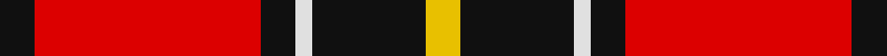
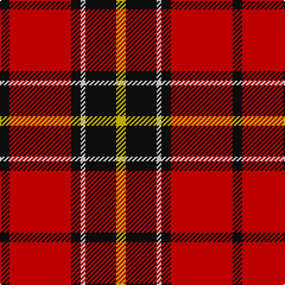

In pattern [KRKWKY](/stripes/krkwky/).

This was sourced from register-of-tartans.  It is a [6 stripe tartan](/stripes/stripes6/).

Original link https://www.tartanregister.gov.uk/tartanDetails.aspx?ref=1015

## Also known as

This cloth is also recorded under:

- Dunbar #2

## Attestations

This cloth appears in 2 source records; the oldest owns this page.

- undated — Dunbar #2 (register-of-tartans, [record](https://www.tartanregister.gov.uk/tartanDetails.aspx?ref=1015))
- undated — Dunbar (weddslist, [record](http://www.weddslist.com/cgi-bin/tartans/pg.pl?source=sts))

## Register references

External register numbers recorded for this tartan.

- Scottish Register of Tartans: [1015](https://www.tartanregister.gov.uk/tartanDetails.aspx?ref=1015)
- Scottish Tartans World Register: 2045

## Thread count
K/8 R52 K8 LN4 K26 Y/8

## Palette
Each colour and the base-6 reference it is a variant of.

| Colour | Shade | Base |
|---|---|---|
| K | <code style="background-color:#101010;">#101010</code> `oklch(17.3% 0.000 89.9)` <small>#101010</small> | K <code style="background-color:#000000;">#000000</code> |
| LN | <code style="background-color:#E0E0E0;">#E0E0E0</code> `oklch(90.7% 0.000 89.9)` <small>#E0E0E0</small> | W <code style="background-color:#F7F7F7;">#F7F7F7</code> |
| R | <code style="background-color:#DC0000;">#DC0000</code> `oklch(56.2% 0.230 29.2)` <small>#DC0000</small> | R <code style="background-color:#CC0000;">#CC0000</code> |
| Y | <code style="background-color:#E8C000;">#E8C000</code> `oklch(81.9% 0.168 93.7)` <small>#E8C000</small> | Y <code style="background-color:#F2BF00;">#F2BF00</code> |

# Sample pattern

## Nearest tartans

The nearest existing variants by ΔTartan distance.

1. [MacPherson Red Cluny](/setts/s7/r6k3r29k23w4k7ly3~x2/) — ΔT 0.65
1. [MacKintosh #4](/setts/s6/r5w2r28k12dg16r3~x2/) — ΔT 0.91
1. [Ramsay Red Clan Tartan Tartan Number: 1238. Earliest known date: 1842 Ramsay was one of the names adopted by members of the Clan MacGregor when their own was proscribed. It is not surprising then that an early MacGregor sett was used as a basis for the Ramsay tartan. It is possible that the tartan was in existance long before the earliest recorded date given. See products available Copyright © Blair Urquhart, Comrie, 2015](/setts/s6/r5m2r30k28w2k4~x2/) — ΔT 0.95
1. [MacKintosh 6](/setts/s6/r5w2r28k12g16r3~x2/) — ΔT 0.99
1. [Cetoloni (Personal)](/setts/s6/db1r12k6ly1k6db1~x4/) — ΔT 1.09
1. [Fraser VS](/setts/s6/r1db6r1dg6r12lb1/) — ΔT 1.13
1. [Billy Apple® Red](/setts/s4/g1r13k8ly1~x6/) — ΔT 1.14
1. [Dunbar Ancient](/setts/s6/r28k4w2k13~x2/) — ΔT 1.18
1. [MacDuff](/setts/s7/r4k2r24k6db6g16r3~x2/) — ΔT 1.20
1. [Oklahoma State University (Corporate](/setts/s4/r80k52w7o12/) — ΔT 1.21

## Neighbour map

Every grey dot is one of 14299 variants placed by the first two principal components of the ΔTartan feature space (44% of its variance). Red is this tartan; blue dots are its nearest — click one to open its page.

<svg viewBox="0 0 640 380" role="img" style="max-width:100%;height:auto;border:1px solid #e0e0e0;border-radius:4px;display:block" xmlns="http://www.w3.org/2000/svg"><image href="/nn/cloud.v1.png" width="640" height="380"/><a href="/setts/s7/r6k3r29k23w4k7ly3~x2/"><circle cx="261.4" cy="174.4" r="4" fill="#3465a4"><title>MacPherson Red Cluny</title></circle></a><a href="/setts/s6/r5w2r28k12dg16r3~x2/"><circle cx="301.3" cy="181.1" r="4" fill="#3465a4"><title>MacKintosh #4</title></circle></a><a href="/setts/s6/r5m2r30k28w2k4~x2/"><circle cx="325.6" cy="168.7" r="4" fill="#3465a4"><title>Ramsay Red Clan Tartan Tartan Number: 1238. Earliest known date: 1842 Ramsay was one of the names adopted by members of the Clan MacGregor when their own was proscribed. It is not surprising then that an early MacGregor sett was used as a basis for the Ramsay tartan. It is possible that the tartan was in existance long before the earliest recorded date given. See products available Copyright © Blair Urquhart, Comrie, 2015</title></circle></a><a href="/setts/s6/r5w2r28k12g16r3~x2/"><circle cx="284.0" cy="177.6" r="4" fill="#3465a4"><title>MacKintosh 6</title></circle></a><a href="/setts/s6/db1r12k6ly1k6db1~x4/"><circle cx="273.5" cy="187.5" r="4" fill="#3465a4"><title>Cetoloni (Personal)</title></circle></a><a href="/setts/s6/r1db6r1dg6r12lb1/"><circle cx="281.5" cy="184.5" r="4" fill="#3465a4"><title>Fraser VS</title></circle></a><a href="/setts/s4/g1r13k8ly1~x6/"><circle cx="330.1" cy="191.1" r="4" fill="#3465a4"><title>Billy Apple® Red</title></circle></a><a href="/setts/s6/r28k4w2k13~x2/"><circle cx="334.4" cy="176.8" r="4" fill="#3465a4"><title>Dunbar Ancient</title></circle></a><a href="/setts/s7/r4k2r24k6db6g16r3~x2/"><circle cx="261.2" cy="178.3" r="4" fill="#3465a4"><title>MacDuff</title></circle></a><a href="/setts/s4/r80k52w7o12/"><circle cx="289.6" cy="205.7" r="4" fill="#3465a4"><title>Oklahoma State University (Corporate</title></circle></a><circle cx="281.4" cy="165.5" r="5" fill="#c00000"/></svg>

ID: /setts/s6/k4r26k4w2k13ly4~x2/
