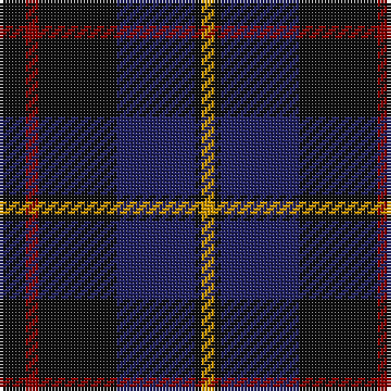

In pattern [KRKBKY](/stripes/krkbky/).

This was sourced from register-of-tartans.  It is a [6 stripe tartan](/stripes/stripes6/).

Original link https://www.tartanregister.gov.uk/tartanDetails.aspx?ref=3519

## Also known as

This cloth is also recorded under:

- Robert Gordon University University

## Attestations

This cloth appears in 3 source records; the oldest owns this page.

- 01/01/1997 — Robert Gordon University (register-of-tartans, [record](https://www.tartanregister.gov.uk/tartanDetails.aspx?ref=3519))
- pre 1998 — Robert Gordon University (Corporate) (tartans-authority, [record](http://www.tartansauthority.com/tartan-ferret/display/2450/))
- undated — Robert Gordon University University Tartan Tartan Number: 2450. Earliest known date: pre 2002 Designed by Mike King of Philip King Kiltmakers in Aberdeen. See products available Copyright © Blair Urquhart, Comrie, 2015 (house-of-tartan, [record](http://www.house-of-tartan.scotland.net/house/TartanViewjs.asp?colr=Def&tnam=2450))

## Register references

External register numbers recorded for this tartan.

- Scottish Register of Tartans: [3519](https://www.tartanregister.gov.uk/tartanDetails.aspx?ref=3519)
- Scottish Tartans Authority (ITI): 2450
- Scottish Tartans World Register: 2450

## Thread count
K/8 DR4 K24 DB24 K2 DY/4

## Palette
Each colour and the base-6 reference it is a variant of.

| Colour | Shade | Base |
|---|---|---|
| DB | <code style="background-color:#202060;">#202060</code> `oklch(28.9% 0.111 276.9)` <small>#202060</small> | B <code style="background-color:#2A418A;">#2A418A</code> |
| DR | <code style="background-color:#880000;">#880000</code> `oklch(39.4% 0.162 29.2)` <small>#880000</small> | R <code style="background-color:#CC0000;">#CC0000</code> |
| DY | <code style="background-color:#D09800;">#D09800</code> `oklch(71.4% 0.147 82.1)` <small>#D09800</small> | Y <code style="background-color:#F2BF00;">#F2BF00</code> |
| K | <code style="background-color:#101010;">#101010</code> `oklch(17.3% 0.000 89.9)` <small>#101010</small> | K <code style="background-color:#000000;">#000000</code> |

# Sample pattern

## Nearest tartans

The nearest existing variants by ΔTartan distance.

1. [Patriot, The (Fashion)](/setts/s7/k10db4k34dt2k2dt30w3~x2/) — ΔT 1.11
1. [Givens (Arizona)](/setts/s6/k42w5dg16k5k5db21~x2/) — ΔT 1.12
1. [Saorsa](/setts/s7/dp18dg24k3db6dp2db5dp18~x2/) — ΔT 1.15
1. [Givens (Arizona)](/setts/s6/k42w5k5dg16k5db21~x2/) — ΔT 1.17
1. [Joe Strummer Commemorative](/setts/s7/k3dy3y6k12y1dy2dy2~x4/) — ΔT 1.29
1. [Cork, County (District)](/setts/s9/dg28r12dg4k20lo2k3lo2k3dg7~x2/) — ΔT 1.30
1. [Perthshire, New /Tourist Board](/setts/s6/db37r10dg22db11dg3r3~x2/) — ΔT 1.30
1. [Slanj Dress (Corporate)](/setts/s8/k4db36k4db4k34b3k3w4~x2/) — ΔT 1.32
1. [Nairn](/setts/s5/r1k8g2db4r1~x8/) — ΔT 1.33
1. [Hutton](/setts/s6/k2dg7db2dg7db16r1~x6/) — ΔT 1.35

## Neighbour map

Every grey dot is one of 14299 variants placed by the first two principal components of the ΔTartan feature space (44% of its variance). Red is this tartan; blue dots are its nearest — click one to open its page.

<svg viewBox="0 0 640 380" role="img" style="max-width:100%;height:auto;border:1px solid #e0e0e0;border-radius:4px;display:block" xmlns="http://www.w3.org/2000/svg"><image href="/nn/cloud.v1.png" width="640" height="380"/><a href="/setts/s7/k10db4k34dt2k2dt30w3~x2/"><circle cx="388.7" cy="210.9" r="4" fill="#3465a4"><title>Patriot, The (Fashion)</title></circle></a><a href="/setts/s6/k42w5dg16k5k5db21~x2/"><circle cx="306.3" cy="242.0" r="4" fill="#3465a4"><title>Givens (Arizona)</title></circle></a><a href="/setts/s7/dp18dg24k3db6dp2db5dp18~x2/"><circle cx="335.2" cy="248.3" r="4" fill="#3465a4"><title>Saorsa</title></circle></a><a href="/setts/s6/k42w5k5dg16k5db21~x2/"><circle cx="309.3" cy="244.8" r="4" fill="#3465a4"><title>Givens (Arizona)</title></circle></a><a href="/setts/s7/k3dy3y6k12y1dy2dy2~x4/"><circle cx="284.9" cy="206.1" r="4" fill="#3465a4"><title>Joe Strummer Commemorative</title></circle></a><a href="/setts/s9/dg28r12dg4k20lo2k3lo2k3dg7~x2/"><circle cx="319.1" cy="203.0" r="4" fill="#3465a4"><title>Cork, County (District)</title></circle></a><a href="/setts/s6/db37r10dg22db11dg3r3~x2/"><circle cx="387.9" cy="265.7" r="4" fill="#3465a4"><title>Perthshire, New /Tourist Board</title></circle></a><a href="/setts/s8/k4db36k4db4k34b3k3w4~x2/"><circle cx="348.3" cy="202.5" r="4" fill="#3465a4"><title>Slanj Dress (Corporate)</title></circle></a><a href="/setts/s5/r1k8g2db4r1~x8/"><circle cx="274.4" cy="244.0" r="4" fill="#3465a4"><title>Nairn</title></circle></a><a href="/setts/s6/k2dg7db2dg7db16r1~x6/"><circle cx="360.6" cy="234.7" r="4" fill="#3465a4"><title>Hutton</title></circle></a><circle cx="338.7" cy="237.6" r="5" fill="#c00000"/></svg>

ID: /setts/s6/k4r2k12db12k1lo2~x2/
