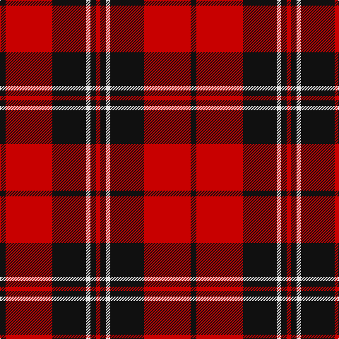

This page is one **sett** — a single exact thread-count. It belongs to the [tartan](/tartans/k4r33k24ln3k4r3/)
(the same proportion at any scale), whose colour order is pattern [KRKWKR](/stripes/krkwkr/).

Sourced from register-of-tartans.  It is a [6 stripe tartan](/stripes/stripes6/).

Original link https://www.tartanregister.gov.uk/tartanDetails.aspx?ref=2985

2 attestations — the source records this cloth was collapsed from (oldest owns this page)

<ul>
<li>01/06/1996 — Monmouth College (register-of-tartans, <a href="https://www.tartanregister.gov.uk/tartanDetails.aspx?ref=2985">record</a>)</li>
<li>June 1996 — Monmouth College (Corporate) (tartans-authority, <a href="http://www.tartansauthority.com/tartan-ferret/display/5672/">record</a>)</li>
</ul>

## Register references

External register numbers recorded for this tartan.

- Scottish Register of Tartans: [2985](https://www.tartanregister.gov.uk/tartanDetails.aspx?ref=2985)
- Scottish Tartans Authority (ITI): 5672

## Thread count
K/8 R66 K48 LN6 K8 R/6

## Palette
Each colour and the base-6 reference it is a variant of.

| Colour | Shade | Base |
|---|---|---|
| K | <code style="background-color:#101010;">#101010</code> `oklch(17.3% 0.000 89.9)` <small>#101010</small> | K <code style="background-color:#000000;">#000000</code> |
| LN | <code style="background-color:#E0E0E0;">#E0E0E0</code> `oklch(90.7% 0.000 89.9)` <small>#E0E0E0</small> | W <code style="background-color:#F7F7F7;">#F7F7F7</code> |
| R | <code style="background-color:#C80000;">#C80000</code> `oklch(52.3% 0.215 29.2)` <small>#C80000</small> | R <code style="background-color:#CC0000;">#CC0000</code> |

# Sample pattern

## Nearest tartans

The nearest existing variants by ΔTartan distance, with this tartan at the top so the swatches line up against it.

ΔTartan

Tartan

Sett

—

<a href="/ttd/edit/#slug=k4r33k24w3k4r3~x2">Monmouth College</a> <a class="nn-out" href="/setts/s6/k4r33k24w3k4r3~x2/" title="open its dictionary page">↗</a>

0.78

<a href="/ttd/edit/#slug=k3r2k30r28k2r2w3~x2">Cunningham #2</a> <a class="nn-out" href="/setts/s7/k3r2k30r28k2r2w3~x2/" title="open its dictionary page">↗</a>

0.79

<a href="/ttd/edit/#slug=k8r1k8r11ly1r1~x4">Swanstrom (Personal)</a> <a class="nn-out" href="/setts/s6/k8r1k8r11ly1r1~x4/" title="open its dictionary page">↗</a>

0.80

<a href="/setts/s6/r28k4w2k13~x2/">Dunbar Ancient</a>

0.85

<a href="/ttd/edit/#slug=k2r16k8ly1k8r2~x4">Brodie (Clan)</a> <a class="nn-out" href="/setts/s6/k2r16k8ly1k8r2~x4/" title="open its dictionary page">↗</a>

0.86

<a href="/ttd/edit/#slug=k16r2k2r12w1~x2">MacIver</a> <a class="nn-out" href="/setts/s5/k16r2k2r12w1~x2/" title="open its dictionary page">↗</a>

0.99

<a href="/ttd/edit/#slug=r5m2r30k28w2k4~x2">Ramsay Red Clan Tartan Tartan Number: 1238. Earliest known date: 1842 Ramsay was one of the names adopted by members of the Clan MacGregor when their own was proscribed. It is not surprising then that an early MacGregor sett was used as a basis for the Ramsay tartan. It is possible that the tartan was in existance long before the earliest recorded date given. See products available Copyright © Blair Urquhart, Comrie, 2015</a> <a class="nn-out" href="/setts/s6/r5m2r30k28w2k4~x2/" title="open its dictionary page">↗</a>

1.02

<a href="/ttd/edit/#slug=k2r6k2r6k12ly1~x4">MacQueen</a> <a class="nn-out" href="/setts/s6/k2r6k2r6k12ly1~x4/" title="open its dictionary page">↗</a>

1.04

<a href="/ttd/edit/#slug=k3r15k11ly2k4r3~x2">Brodie (Clan)</a> <a class="nn-out" href="/setts/s6/k3r15k11ly2k4r3~x2/" title="open its dictionary page">↗</a>

1.08

<a href="/ttd/edit/#slug=r20k2r2k15w1~x2">Masai Shuka 15 (Artefact)</a> <a class="nn-out" href="/setts/s5/r20k2r2k15w1~x2/" title="open its dictionary page">↗</a>

1.11

<a href="/ttd/edit/#slug=k6r3k28r28k3r6~x2">Erskine, Black &amp; Red (Clan)</a> <a class="nn-out" href="/setts/s6/k6r3k28r28k3r6~x2/" title="open its dictionary page">↗</a>

## Neighbour map

Every grey dot is one of 14299 variants placed by the first two principal components of the ΔTartan feature space (44% of its variance). Red is this tartan; blue dots are its nearest — click one to open its page.

<svg viewBox="0 0 640 380" role="img" style="max-width:100%;height:auto;border:1px solid #e0e0e0;border-radius:4px;display:block" xmlns="http://www.w3.org/2000/svg"><image href="/nn/cloud.v1.png" width="640" height="380"/><a href="/setts/s7/k3r2k30r28k2r2w3~x2/"><circle cx="350.9" cy="166.8" r="4" fill="#3465a4"><title>Cunningham #2</title></circle></a><a href="/setts/s6/k8r1k8r11ly1r1~x4/"><circle cx="336.5" cy="214.7" r="4" fill="#3465a4"><title>Swanstrom (Personal)</title></circle></a><a href="/setts/s6/r28k4w2k13~x2/"><circle cx="334.4" cy="176.8" r="4" fill="#3465a4"><title>Dunbar Ancient</title></circle></a><a href="/setts/s6/k2r16k8ly1k8r2~x4/"><circle cx="341.2" cy="198.6" r="4" fill="#3465a4"><title>Brodie (Clan)</title></circle></a><a href="/setts/s5/k16r2k2r12w1~x2/"><circle cx="360.3" cy="195.2" r="4" fill="#3465a4"><title>MacIver</title></circle></a><a href="/setts/s6/r5m2r30k28w2k4~x2/"><circle cx="325.6" cy="168.7" r="4" fill="#3465a4"><title>Ramsay Red Clan Tartan Tartan Number: 1238. Earliest known date: 1842 Ramsay was one of the names adopted by members of the Clan MacGregor when their own was proscribed. It is not surprising then that an early MacGregor sett was used as a basis for the Ramsay tartan. It is possible that the tartan was in existance long before the earliest recorded date given. See products available Copyright © Blair Urquhart, Comrie, 2015</title></circle></a><a href="/setts/s6/k2r6k2r6k12ly1~x4/"><circle cx="342.4" cy="216.7" r="4" fill="#3465a4"><title>MacQueen</title></circle></a><a href="/setts/s6/k3r15k11ly2k4r3~x2/"><circle cx="287.9" cy="227.7" r="4" fill="#3465a4"><title>Brodie (Clan)</title></circle></a><a href="/setts/s5/r20k2r2k15w1~x2/"><circle cx="386.4" cy="183.9" r="4" fill="#3465a4"><title>Masai Shuka 15 (Artefact)</title></circle></a><a href="/setts/s6/k6r3k28r28k3r6~x2/"><circle cx="361.6" cy="231.6" r="4" fill="#3465a4"><title>Erskine, Black &amp; Red (Clan)</title></circle></a><circle cx="335.4" cy="193.5" r="5" fill="#c00000"/></svg>

ID: /setts/s6/k4r33k24w3k4r3~x2/
