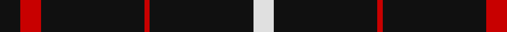
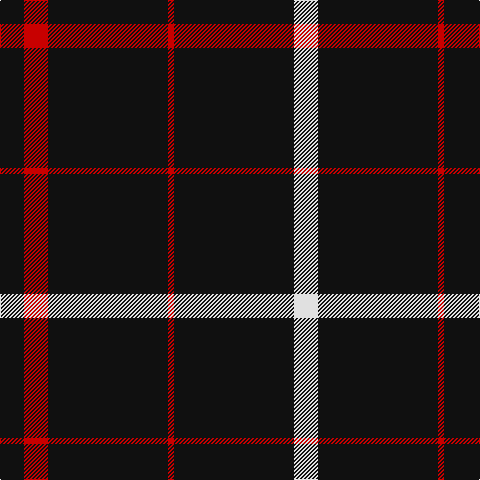

**Bands:** [KRKRKW](/stripes/krkrkw/) · **Stripes:** [K R K R K W](/stripes/stripes6/) K R K R K W

This was sourced from register-of-tartans.  It is a [6 band tartan](/bands/bands6/).

Original link https://www.tartanregister.gov.uk/tartanDetails.aspx?ref=2047

## Attestations

This cloth appears in 2 source records; the oldest owns this page.

- 01/01/1972 — Lanoir (register-of-tartans, [record](https://www.tartanregister.gov.uk/tartanDetails.aspx?ref=2047))
- pre 1972 — Lanoir (Fashion) (tartans-authority, [record](http://www.tartansauthority.com/tartan-ferret/display/5385/))

## Register references

External register numbers recorded for this tartan.

- Scottish Register of Tartans: [2047](https://www.tartanregister.gov.uk/tartanDetails.aspx?ref=2047)
- Scottish Tartans Authority (ITI): 5385

## Thread count
K/24 R24 K120 R6 K120 LN/24

## Palette
Each colour and its ΔE from the base-6 reference it is a variant of.

| Colour | Shade | Base | ΔE (OKLab) |
|---|---|---|---|
| K | <code style="background-color:#101010;">#101010</code> `#101010` | K <code style="background-color:#000000;">#000000</code> | 0.17 |
| LN | <code style="background-color:#E0E0E0;">#E0E0E0</code> `#E0E0E0` | W <code style="background-color:#F7F7F7;">#F7F7F7</code> | 0.07 |
| R | <code style="background-color:#C80000;">#C80000</code> `#C80000` | R <code style="background-color:#CC0000;">#CC0000</code> | 0.01 |

# Sample pattern

## Nearest tartans

The nearest existing variants by ΔTartan distance.

1. [Believe - Colette](/setts/s7/n3k31w6k8n3k12w2~x2/) — ΔT 1.21
1. [Believe - Colette](/setts/s7/n3k31w6k7n3k12w2~x2/) — ΔT 1.29
1. [St. Mirren Football Club (Sports)](/setts/s9/k7w2k21r2k34w5k3w2k7~x2/) — ΔT 1.37
1. [Gwynn](/setts/s8/k45ly4k4ly9k4ly4k45r4~x2/) — ΔT 1.40
1. [Sunderland of Scotland (Fashion)](/setts/s7/o1k21o5k3o5k9r1~x4/) — ΔT 1.43
1. [Harvie](/setts/s5/k4r11k32ly1k4~x2/) — ΔT 1.43
1. [East of Scotland Tartan Army](/setts/s6/dt40ly10dt8r20dt100w5/) — ΔT 1.44
1. [Merola (2016)](/setts/s6/k36ly5k1ly1lr5k12~x2/) — ΔT 1.45
1. [Savannah Harley Davidson (Corporate)](/setts/s9/k25w1n3w1k31n3k31w2o9~x2/) — ΔT 1.49
1. [Brand Ambassador](/setts/s9/r4k16w4k16r4k42r20k83r2/) — ΔT 1.62

## Neighbour map

Every grey dot is one of 14313 variants placed by the first two principal components of the ΔTartan feature space (44% of its variance). Red is this tartan; blue dots are its nearest — click one to open its page.

<svg viewBox="0 0 640 380" role="img" style="max-width:100%;height:auto;border:1px solid #e0e0e0;border-radius:4px;display:block" xmlns="http://www.w3.org/2000/svg"><image href="/nn/cloud.v1.png" width="640" height="380"/><a href="/setts/s7/n3k31w6k8n3k12w2~x2/"><circle cx="475.7" cy="194.7" r="4" fill="#3465a4"><title>Believe - Colette</title></circle></a><a href="/setts/s7/n3k31w6k7n3k12w2~x2/"><circle cx="472.5" cy="192.2" r="4" fill="#3465a4"><title>Believe - Colette</title></circle></a><a href="/setts/s9/k7w2k21r2k34w5k3w2k7~x2/"><circle cx="560.2" cy="181.0" r="4" fill="#3465a4"><title>St. Mirren Football Club (Sports)</title></circle></a><a href="/setts/s8/k45ly4k4ly9k4ly4k45r4~x2/"><circle cx="517.0" cy="195.9" r="4" fill="#3465a4"><title>Gwynn</title></circle></a><a href="/setts/s7/o1k21o5k3o5k9r1~x4/"><circle cx="480.2" cy="194.5" r="4" fill="#3465a4"><title>Sunderland of Scotland (Fashion)</title></circle></a><a href="/setts/s5/k4r11k32ly1k4~x2/"><circle cx="539.8" cy="185.5" r="4" fill="#3465a4"><title>Harvie</title></circle></a><a href="/setts/s6/dt40ly10dt8r20dt100w5/"><circle cx="518.6" cy="181.2" r="4" fill="#3465a4"><title>East of Scotland Tartan Army</title></circle></a><a href="/setts/s6/k36ly5k1ly1lr5k12~x2/"><circle cx="552.3" cy="162.1" r="4" fill="#3465a4"><title>Merola (2016)</title></circle></a><a href="/setts/s9/k25w1n3w1k31n3k31w2o9~x2/"><circle cx="539.9" cy="156.0" r="4" fill="#3465a4"><title>Savannah Harley Davidson (Corporate)</title></circle></a><a href="/setts/s9/r4k16w4k16r4k42r20k83r2/"><circle cx="574.5" cy="146.6" r="4" fill="#3465a4"><title>Brand Ambassador</title></circle></a><circle cx="538.5" cy="209.8" r="5" fill="#c00000"/></svg>

ID: /setts/s6/k4r4k20r1k20w4~x6/
