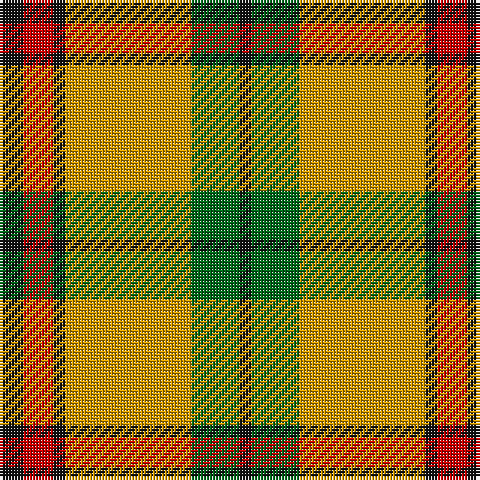

In pattern [KGYKRK](/stripes/kgykrk/).

This was sourced from register-of-tartans.  It is a [6 stripe tartan](/stripes/stripes6/).

Original link https://www.tartanregister.gov.uk/tartanDetails.aspx?ref=2412

## Register references

External register numbers recorded for this tartan.

- Scottish Register of Tartans: [2412](https://www.tartanregister.gov.uk/tartanDetails.aspx?ref=2412)
- Scottish Tartans Authority (ITI): 1121
- Scottish Tartans World Register: 1121

## Thread count
K/8 R10 K4 DY42 G16 K/4

## Palette
Each colour and its ΔE from the base-6 reference it is a variant of.

| Colour | Shade | Base | ΔE (OKLab) |
|---|---|---|---|
| DY | <code style="background-color:#D09800;">#D09800</code> `#D09800` | Y <code style="background-color:#F2BF00;">#F2BF00</code> | 0.12 |
| G | <code style="background-color:#006818;">#006818</code> `#006818` | G <code style="background-color:#006100;">#006100</code> | 0.02 |
| K | <code style="background-color:#101010;">#101010</code> `#101010` | K <code style="background-color:#000000;">#000000</code> | 0.17 |
| R | <code style="background-color:#C80000;">#C80000</code> `#C80000` | R <code style="background-color:#CC0000;">#CC0000</code> | 0.01 |

# Sample pattern

## Nearest tartans

The nearest existing variants by ΔTartan distance.

1. [MacDuck (Corporate)](/setts/s6/k4r5k2ly21g8k2~x2/) — ΔT 0.79
1. [Starr (1978) (Name)](/setts/s7/k2r4w1r10g12r2w2~x4/) — ΔT 0.94
1. [MacGregor of Balquidder - 1831 (Clan](/setts/s6/g9r2g9r14k1w2~x4/) — ΔT 1.23
1. [MacMillan Society of Glasgow](/setts/s9/r16k3r16g44k3g8k3ly20k4~x2/) — ΔT 1.24
1. [Thomson Camel (Jedburgh Mill)](/setts/s6/r4k2lb10k10y28k3~x2/) — ΔT 1.25
1. [Unidentfied (Ligioner Highland Games](/setts/s6/do4g25lo10g3lo18r4~x2/) — ΔT 1.25
1. [Elgin District Tartan Tartan Number: 2196. Earliest known date: 1998 A sample of this tartan was recorded by the Scottish Tartans Society during the period 1970 to 1990. See products available Copyright © Blair Urquhart, Comrie, 2015](/setts/s7/do5lo4do26lo26do4lo3w5~x2/) — ΔT 1.27
1. [Orange Fanaticos (Corporate)](/setts/s7/t12lo75k22w12k22w16t8/) — ΔT 1.28
1. [Celtic Combat](/setts/s6/k2o20k8dg18o3w2~x2/) — ΔT 1.29
1. [Brisbane (Artefact)](/setts/s8/g18w3ly1r2ly1r3ly1r10~x4/) — ΔT 1.30

## Neighbour map

Every grey dot is one of 14299 variants placed by the first two principal components of the ΔTartan feature space (44% of its variance). Red is this tartan; blue dots are its nearest — click one to open its page.

<svg viewBox="0 0 640 380" role="img" style="max-width:100%;height:auto;border:1px solid #e0e0e0;border-radius:4px;display:block" xmlns="http://www.w3.org/2000/svg"><image href="/nn/cloud.v1.png" width="640" height="380"/><a href="/setts/s6/k4r5k2ly21g8k2~x2/"><circle cx="227.9" cy="171.9" r="4" fill="#3465a4"><title>MacDuck (Corporate)</title></circle></a><a href="/setts/s7/k2r4w1r10g12r2w2~x4/"><circle cx="264.8" cy="177.1" r="4" fill="#3465a4"><title>Starr (1978) (Name)</title></circle></a><a href="/setts/s6/g9r2g9r14k1w2~x4/"><circle cx="289.3" cy="194.3" r="4" fill="#3465a4"><title>MacGregor of Balquidder - 1831 (Clan</title></circle></a><a href="/setts/s9/r16k3r16g44k3g8k3ly20k4~x2/"><circle cx="237.5" cy="159.7" r="4" fill="#3465a4"><title>MacMillan Society of Glasgow</title></circle></a><a href="/setts/s6/r4k2lb10k10y28k3~x2/"><circle cx="261.2" cy="176.9" r="4" fill="#3465a4"><title>Thomson Camel (Jedburgh Mill)</title></circle></a><a href="/setts/s6/do4g25lo10g3lo18r4~x2/"><circle cx="222.4" cy="205.2" r="4" fill="#3465a4"><title>Unidentfied (Ligioner Highland Games</title></circle></a><a href="/setts/s7/do5lo4do26lo26do4lo3w5~x2/"><circle cx="263.2" cy="188.5" r="4" fill="#3465a4"><title>Elgin District Tartan Tartan Number: 2196. Earliest known date: 1998 A sample of this tartan was recorded by the Scottish Tartans Society during the period 1970 to 1990. See products available Copyright © Blair Urquhart, Comrie, 2015</title></circle></a><a href="/setts/s7/t12lo75k22w12k22w16t8/"><circle cx="198.6" cy="172.1" r="4" fill="#3465a4"><title>Orange Fanaticos (Corporate)</title></circle></a><a href="/setts/s6/k2o20k8dg18o3w2~x2/"><circle cx="237.3" cy="204.2" r="4" fill="#3465a4"><title>Celtic Combat</title></circle></a><a href="/setts/s8/g18w3ly1r2ly1r3ly1r10~x4/"><circle cx="282.8" cy="138.0" r="4" fill="#3465a4"><title>Brisbane (Artefact)</title></circle></a><circle cx="247.2" cy="181.5" r="5" fill="#c00000"/></svg>

ID: /setts/s6/k4r5k2lo21g8k2~x2/
