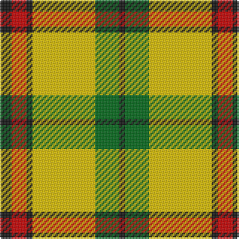

In pattern [KGYKRK](/stripes/kgykrk/).

This was sourced from tartans-authority.  It is a [6 stripe tartan](/stripes/stripes6/).

Original link http://www.tartansauthority.com/tartan-ferret/display/1121/

## Also known as

This cloth is also recorded under:

- MacDuck Final version
- MacDuck, Final version

## Attestations

This cloth appears in 3 source records; the oldest owns this page.

- 1942 — MacDuck (Corporate) (tartans-authority, [record](http://www.tartansauthority.com/tartan-ferret/display/1121/))
- undated — MacDuck, Final version (weddslist, [record](http://www.weddslist.com/cgi-bin/tartans/pg.pl?source=sts))
- undated — MacDuck Final version Corporate Tartan Tartan Number: 1121. Earliest known date: 1942 Ancient MacDuck, old colours, as worn by Scrooge MacDuck, uncle to the famous cartoon character Donald Duck and great uncle to Huey, Duey and Luey. See products available Copyright © Blair Urquhart, Comrie, 2015 (house-of-tartan, [record](http://www.house-of-tartan.scotland.net/house/TartanViewjs.asp?colr=Def&tnam=1121))

## Thread count
K/8 R10 K4 Y42 G16 K/4

## Palette
Each colour and the base-6 reference it is a variant of.

| Colour | Shade | Base |
|---|---|---|
| G | <code style="background-color:#006818;">#006818</code> `oklch(45.0% 0.142 145.0)` <small>#006818</small> | G <code style="background-color:#006100;">#006100</code> |
| K | <code style="background-color:#101010;">#101010</code> `oklch(17.3% 0.000 89.9)` <small>#101010</small> | K <code style="background-color:#000000;">#000000</code> |
| R | <code style="background-color:#C80000;">#C80000</code> `oklch(52.3% 0.215 29.2)` <small>#C80000</small> | R <code style="background-color:#CC0000;">#CC0000</code> |
| Y | <code style="background-color:#E8C000;">#E8C000</code> `oklch(81.9% 0.168 93.7)` <small>#E8C000</small> | Y <code style="background-color:#F2BF00;">#F2BF00</code> |

# Sample pattern

## Nearest tartans

The nearest existing variants by ΔTartan distance.

1. [MacDuck #2](/setts/s6/k4r5k2lo21g8k2~x2/) — ΔT 0.79
1. [Unidentfied (Ligioner Highland Games](/setts/s6/do4g25lo10g3lo18r4~x2/) — ΔT 1.20
1. [Harmer](/setts/s7/ly9dg4ly22k9ly9dg36r4~x2/) — ΔT 1.34
1. [Fraser Yellow](/setts/s7/r2w2ly27dg14ly2db14ly2~x2/) — ΔT 1.37
1. [Fraser, Yellow](/setts/s7/r2w2ly27g14ly2db14ly2~x2/) — ΔT 1.41
1. [Shepherd, Derek (Piping)](/setts/s6/k5ly2dy7ly18dy2w2~x4/) — ΔT 1.43
1. [Jacobite #2](/setts/s6/ly70k30w3dg30k3ly10/) — ΔT 1.45
1. [Fraser Yellow #2](/setts/s6/w1ly8dg3ly1db3ly1~x4/) — ΔT 1.46
1. [Starr (1978) (Name)](/setts/s7/k2r4w1r10g12r2w2~x4/) — ΔT 1.49
1. [Orange Fanaticos (Corporate)](/setts/s7/t12lo75k22w12k22w16t8/) — ΔT 1.50

## Neighbour map

Every grey dot is one of 14299 variants placed by the first two principal components of the ΔTartan feature space (44% of its variance). Red is this tartan; blue dots are its nearest — click one to open its page.

<svg viewBox="0 0 640 380" role="img" style="max-width:100%;height:auto;border:1px solid #e0e0e0;border-radius:4px;display:block" xmlns="http://www.w3.org/2000/svg"><image href="/nn/cloud.v1.png" width="640" height="380"/><a href="/setts/s6/k4r5k2lo21g8k2~x2/"><circle cx="247.2" cy="181.5" r="4" fill="#3465a4"><title>MacDuck #2</title></circle></a><a href="/setts/s6/do4g25lo10g3lo18r4~x2/"><circle cx="222.4" cy="205.2" r="4" fill="#3465a4"><title>Unidentfied (Ligioner Highland Games</title></circle></a><a href="/setts/s7/ly9dg4ly22k9ly9dg36r4~x2/"><circle cx="196.4" cy="187.4" r="4" fill="#3465a4"><title>Harmer</title></circle></a><a href="/setts/s7/r2w2ly27dg14ly2db14ly2~x2/"><circle cx="224.1" cy="142.1" r="4" fill="#3465a4"><title>Fraser Yellow</title></circle></a><a href="/setts/s7/r2w2ly27g14ly2db14ly2~x2/"><circle cx="228.8" cy="143.4" r="4" fill="#3465a4"><title>Fraser, Yellow</title></circle></a><a href="/setts/s6/k5ly2dy7ly18dy2w2~x4/"><circle cx="192.6" cy="150.7" r="4" fill="#3465a4"><title>Shepherd, Derek (Piping)</title></circle></a><a href="/setts/s6/ly70k30w3dg30k3ly10/"><circle cx="288.1" cy="145.6" r="4" fill="#3465a4"><title>Jacobite #2</title></circle></a><a href="/setts/s6/w1ly8dg3ly1db3ly1~x4/"><circle cx="272.3" cy="191.6" r="4" fill="#3465a4"><title>Fraser Yellow #2</title></circle></a><a href="/setts/s7/k2r4w1r10g12r2w2~x4/"><circle cx="264.8" cy="177.1" r="4" fill="#3465a4"><title>Starr (1978) (Name)</title></circle></a><a href="/setts/s7/t12lo75k22w12k22w16t8/"><circle cx="198.6" cy="172.1" r="4" fill="#3465a4"><title>Orange Fanaticos (Corporate)</title></circle></a><circle cx="227.9" cy="171.9" r="5" fill="#c00000"/></svg>

ID: /setts/s6/k4r5k2ly21g8k2~x2/
