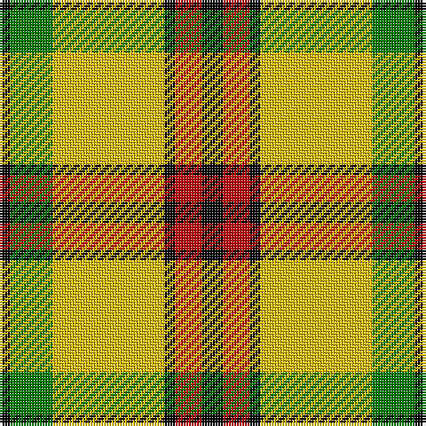

In pattern [KGYKRK](/patterns/kgykrk/).

This was sourced from weddslist.  It is a [6 stripes tartan](/stripes/stripes6/).

Original link http://www.weddslist.com/cgi-bin/tartans/pg.pl?source=sts

## Thread count
K/4 G16 Y42 K4 R10 K/8

## Palette
Each colour and its ΔE from the base-6 reference it is a variant of.

| Colour | Shade | Base | ΔE (OKLab) |
|---|---|---|---|
| G | <code style="background-color:#008000;">#008000</code> `#008000` | G <code style="background-color:#006100;">#006100</code> | 0.10 |
| K | <code style="background-color:#000000;">#000000</code> `#000000` | K <code style="background-color:#000000;">#000000</code> | 0.00 |
| R | <code style="background-color:#C00000;">#C00000</code> `#C00000` | R <code style="background-color:#CC0000;">#CC0000</code> | 0.03 |
| Y | <code style="background-color:#F0C000;">#F0C000</code> `#F0C000` | Y <code style="background-color:#F2BF00;">#F2BF00</code> | 0.00 |

# Sample pattern

## Nearest tartans

The nearest existing variants by ΔTartan distance.

1. [MacDuck (Corporate)](/setts/s6/k4r5k2y21g8k2~g006818-k101010-rc80000-ye8c000~x2/) — ΔT 0.41
1. [MacDuck #2](/setts/s6/k4r5k2y21g8k2~g006818-k101010-rc80000-yd09800~x2/) — ΔT 1.05
1. [Shepherd Piping (Personal)](/setts/s6/k5y2g7ya18g2w2~g604000-k101010-we0e0e0-yf0e490-yad8bc0c~x4/) — ΔT 1.10
1. [Harmer](/setts/s7/y9g4y22k9y9g36r4~g003000-k000000-rc00000-yf0c000~x2/) — ΔT 1.23
1. [MacMillan, Society of Glasgow](/setts/s9/r16k3r16g44k3g8k3y20k4~g008000-k000000-rc00000-yf0c000~x2/) — ΔT 1.35
1. [Jacobite](/setts/s6/y70k30w3g30k3y10~g008000-k000000-we0e0e0-yf0c000/) — ΔT 1.46
1. [Unidentfied (Ligioner Highland Games](/setts/s6/b4g25y10g3y18r4~b441800-g006818-rc80000-yfcb464~x2/) — ΔT 1.47
1. [Jacobite #2](/setts/s6/y70k30w3g30k3y10~g005020-k101010-we0e0e0-ye8c000/) — ΔT 1.47
1. [Billy Apple - Yellow](/setts/s4/g1k8y13r1~g006818-k101010-rc80000-yfccc00~x6/) — ΔT 1.47
1. [Shepherd, Derek (Piping)](/setts/s6/k5y2g7ya18g2w2~g603311-k101010-wffffff-yfee885-yaffec8b~x4/) — ΔT 1.53

## Neighbour map

Every grey dot is one of 15726 variants placed by the first two principal components of the ΔTartan feature space (44% of its variance). Red is this tartan; blue dots are its nearest — click one to open its page.

<svg viewBox="0 0 640 380" role="img" style="max-width:100%;height:auto;border:1px solid #e0e0e0;border-radius:4px;display:block" xmlns="http://www.w3.org/2000/svg"><image href="/nn/cloud.v1.png" width="640" height="380"/><a href="/setts/s6/k4r5k2y21g8k2~g006818-k101010-rc80000-ye8c000~x2/"><circle cx="226.5" cy="177.1" r="4" fill="#3465a4"><title>MacDuck (Corporate)</title></circle></a><a href="/setts/s6/k4r5k2y21g8k2~g006818-k101010-rc80000-yd09800~x2/"><circle cx="245.9" cy="184.9" r="4" fill="#3465a4"><title>MacDuck #2</title></circle></a><a href="/setts/s6/k5y2g7ya18g2w2~g604000-k101010-we0e0e0-yf0e490-yad8bc0c~x4/"><circle cx="206.7" cy="166.2" r="4" fill="#3465a4"><title>Shepherd Piping (Personal)</title></circle></a><a href="/setts/s7/y9g4y22k9y9g36r4~g003000-k000000-rc00000-yf0c000~x2/"><circle cx="194.2" cy="192.3" r="4" fill="#3465a4"><title>Harmer</title></circle></a><a href="/setts/s9/r16k3r16g44k3g8k3y20k4~g008000-k000000-rc00000-yf0c000~x2/"><circle cx="213.4" cy="152.2" r="4" fill="#3465a4"><title>MacMillan, Society of Glasgow</title></circle></a><a href="/setts/s6/y70k30w3g30k3y10~g008000-k000000-we0e0e0-yf0c000/"><circle cx="278.2" cy="149.0" r="4" fill="#3465a4"><title>Jacobite</title></circle></a><a href="/setts/s6/b4g25y10g3y18r4~b441800-g006818-rc80000-yfcb464~x2/"><circle cx="220.9" cy="208.4" r="4" fill="#3465a4"><title>Unidentfied (Ligioner Highland Games</title></circle></a><a href="/setts/s6/y70k30w3g30k3y10~g005020-k101010-we0e0e0-ye8c000/"><circle cx="286.5" cy="151.5" r="4" fill="#3465a4"><title>Jacobite #2</title></circle></a><a href="/setts/s4/g1k8y13r1~g006818-k101010-rc80000-yfccc00~x6/"><circle cx="288.9" cy="192.1" r="4" fill="#3465a4"><title>Billy Apple - Yellow</title></circle></a><a href="/setts/s6/k5y2g7ya18g2w2~g603311-k101010-wffffff-yfee885-yaffec8b~x4/"><circle cx="191.2" cy="156.6" r="4" fill="#3465a4"><title>Shepherd, Derek (Piping)</title></circle></a><circle cx="216.7" cy="174.1" r="5" fill="#c00000"/></svg>

ID: /setts/s6/k4r5k2y21g8k2~g008000-k000000-rc00000-yf0c000~x2/
