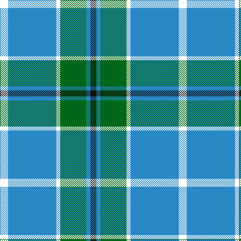

This page is one **sett** — a single exact thread-count. It belongs to the [tartan](/tartans/k4t24k2g13t2ki3/)
(the same proportion at any scale), whose colour order is pattern [KBGKBK](/stripes/kbgkbk/).

Sourced from house-of-tartan.  It is a [6 stripe tartan](/stripes/stripes6/).

Original link http://www.house-of-tartan.scotland.net/house/TartanViewjs.asp?colr=Def&tnam=2208

## Thread count
R/16 B96 W8 G52 B8 K/12

## Palette

Palette: <strong>Tartan Register</strong> <small style="color:#888">(8 of 9 colours)</small>
<table><thead><tr><th>Colour</th><th>Threads</th><th>Shade</th><th>Base</th><th>OKLCh</th></tr></thead><tbody><tr><td>/</td><td style="text-align:right;font-variant-numeric:tabular-nums">16</td><td><code style="background-color:;"></code> <small style="color:#888"></small></td><td> <code style="background-color:;"></code></td><td><small style="color:#888"></small></td></tr><tr><td>B</td><td style="text-align:right;font-variant-numeric:tabular-nums">96</td><td><code style="background-color:#2888C4;">#2888C4</code> <small style="color:#888">#2888C4</small></td><td>B <code style="background-color:#2A418A;">#2A418A</code></td><td><small style="color:#888">oklch(60.1% 0.125 241.5)</small></td></tr><tr><td></td><td style="text-align:right;font-variant-numeric:tabular-nums">8</td><td><code style="background-color:;"></code> <small style="color:#888"></small></td><td> <code style="background-color:;"></code></td><td><small style="color:#888"></small></td></tr><tr><td>G</td><td style="text-align:right;font-variant-numeric:tabular-nums">52</td><td><code style="background-color:#006818;">#006818</code> <small style="color:#888">#006818</small></td><td>G <code style="background-color:#006100;">#006100</code></td><td><small style="color:#888">oklch(45.0% 0.142 145.0)</small></td></tr><tr><td>B</td><td style="text-align:right;font-variant-numeric:tabular-nums">8</td><td><code style="background-color:#2888C4;">#2888C4</code> <small style="color:#888">#2888C4</small></td><td>B <code style="background-color:#2A418A;">#2A418A</code></td><td><small style="color:#888">oklch(60.1% 0.125 241.5)</small></td></tr><tr><td>K/</td><td style="text-align:right;font-variant-numeric:tabular-nums">12</td><td><code style="background-color:#101010;">#101010</code> <small style="color:#888">#101010</small></td><td>K <code style="background-color:#000000;">#000000</code></td><td><small style="color:#888">oklch(17.3% 0.000 89.9)</small></td></tr></tbody></table>

# Sample pattern

## Nearest tartans

The nearest existing variants by ΔTartan distance, with this tartan at the top so the swatches line up against it.

ΔTartan

Tartan

Sett

—

<a href="/ttd/edit/#slug=k4t24k2g13t2ki3~x4">Vance (Family Association) Corporate Family Tartan Tartan Number: 2208. Earliest known date: December 1994 Designed and Copyrighted in the US by Mark W. Vance. Details from Vance Family Association website. See products available Copyright © Blair Urquhart, Comrie, 2015</a> <a class="nn-out" href="/setts/s6/k4t24k2g13t2ki3~x4/" title="open its dictionary page">↗</a>

1.02

<a href="/ttd/edit/#slug=r4db24w2g13db2k3~x4">Vance (Family Association)</a> <a class="nn-out" href="/setts/s6/r4db24w2g13db2k3~x4/" title="open its dictionary page">↗</a>

1.04

<a href="/ttd/edit/#slug=db8g2db10g12k1lb1r1~x4">Nowell/Noel</a> <a class="nn-out" href="/setts/s7/db8g2db10g12k1lb1r1~x4/" title="open its dictionary page">↗</a>

1.10

<a href="/ttd/edit/#slug=r2w7b30dg36ly2~x2">Centennial-King George Lodge No.171</a> <a class="nn-out" href="/setts/s5/r2w7b30dg36ly2~x2/" title="open its dictionary page">↗</a>

1.20

<a href="/ttd/edit/#slug=k8ly2b21w3r2~x4">Oklahoma</a> <a class="nn-out" href="/setts/s5/k8ly2b21w3r2~x4/" title="open its dictionary page">↗</a>

1.20

<a href="/ttd/edit/#slug=g35k3dbi26k4db4w3~x2">Pride of Yorkland (Fashion)</a> <a class="nn-out" href="/setts/s6/g35k3dbi26k4db4w3~x2/" title="open its dictionary page">↗</a>

1.22

<a href="/ttd/edit/#slug=r1g9db9k1db1w1~x6">Irving of Glentulchan</a> <a class="nn-out" href="/setts/s6/r1g9db9k1db1w1~x6/" title="open its dictionary page">↗</a>

1.26

<a href="/ttd/edit/#slug=r3w3db36g36k2r2~x2">Militello (Palermo) Dress (Personal)</a> <a class="nn-out" href="/setts/s6/r3w3db36g36k2r2~x2/" title="open its dictionary page">↗</a>

1.30

<a href="/ttd/edit/#slug=db3g4db20g24k2lb3r1~x2">Nowell/Noel (Name)</a> <a class="nn-out" href="/setts/s7/db3g4db20g24k2lb3r1~x2/" title="open its dictionary page">↗</a>

1.31

<a href="/ttd/edit/#slug=k3t2g13w2t24r3~x4">Vance</a> <a class="nn-out" href="/setts/s6/k3t2g13w2t24r3~x4/" title="open its dictionary page">↗</a>

1.32

<a href="/ttd/edit/#slug=k5g32db32r3db3ly3~x2">Carmichael</a> <a class="nn-out" href="/setts/s6/k5g32db32r3db3ly3~x2/" title="open its dictionary page">↗</a>

## Neighbour map

Every grey dot is one of 14359 variants placed by the first two principal components of the ΔTartan feature space (44% of its variance). Red is this tartan; blue dots are its nearest — click one to open its page.

<svg viewBox="0 0 640 380" role="img" style="max-width:100%;height:auto;border:1px solid #e0e0e0;border-radius:4px;display:block" xmlns="http://www.w3.org/2000/svg"><image href="/nn/cloud.v1.png" width="640" height="380"/><a href="/setts/s6/r4db24w2g13db2k3~x4/"><circle cx="276.8" cy="179.4" r="4" fill="#3465a4"><title>Vance (Family Association)</title></circle></a><a href="/setts/s7/db8g2db10g12k1lb1r1~x4/"><circle cx="264.3" cy="189.1" r="4" fill="#3465a4"><title>Nowell/Noel</title></circle></a><a href="/setts/s5/r2w7b30dg36ly2~x2/"><circle cx="255.3" cy="174.3" r="4" fill="#3465a4"><title>Centennial-King George Lodge No.171</title></circle></a><a href="/setts/s5/k8ly2b21w3r2~x4/"><circle cx="279.1" cy="182.2" r="4" fill="#3465a4"><title>Oklahoma</title></circle></a><a href="/setts/s6/g35k3dbi26k4db4w3~x2/"><circle cx="252.5" cy="188.9" r="4" fill="#3465a4"><title>Pride of Yorkland (Fashion)</title></circle></a><a href="/setts/s6/r1g9db9k1db1w1~x6/"><circle cx="239.0" cy="191.1" r="4" fill="#3465a4"><title>Irving of Glentulchan</title></circle></a><a href="/setts/s6/r3w3db36g36k2r2~x2/"><circle cx="243.6" cy="148.9" r="4" fill="#3465a4"><title>Militello (Palermo) Dress (Personal)</title></circle></a><a href="/setts/s7/db3g4db20g24k2lb3r1~x2/"><circle cx="283.3" cy="146.8" r="4" fill="#3465a4"><title>Nowell/Noel (Name)</title></circle></a><a href="/setts/s6/k3t2g13w2t24r3~x4/"><circle cx="289.6" cy="180.8" r="4" fill="#3465a4"><title>Vance</title></circle></a><a href="/setts/s6/k5g32db32r3db3ly3~x2/"><circle cx="250.6" cy="189.3" r="4" fill="#3465a4"><title>Carmichael</title></circle></a><circle cx="260.7" cy="179.1" r="5" fill="#c00000"/></svg>

ID: /setts/s6/k4t24k2g13t2ki3~x4/
