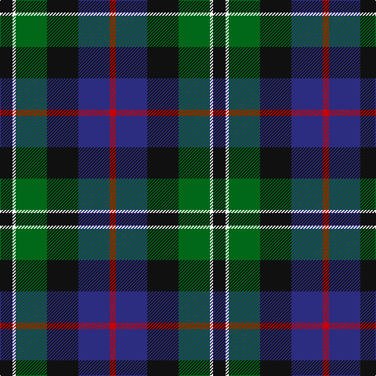

This page is one **sett** — a single exact thread-count. It belongs to the [tartan](/tartans/k4w1g10k10db10r2/)
(the same proportion at any scale), whose colour order is pattern [KWGKBR](/stripes/kwgkbr/).

Sourced from register-of-tartans.  It is a [6 stripe tartan](/stripes/stripes6/).

Original link https://www.tartanregister.gov.uk/tartanDetails.aspx?ref=3548

## Also known as

This cloth is also recorded under:

- Rose Hunting

2 attestations — the source records this cloth was collapsed from (oldest owns this page)

<ul>
<li>01/01/1831 — Rose Hunting (register-of-tartans, <a href="https://www.tartanregister.gov.uk/tartanDetails.aspx?ref=3548">record</a>)</li>
<li>1831 — Rose Htg (Clan) (tartans-authority, <a href="http://www.tartansauthority.com/tartan-ferret/display/1226/">record</a>)</li>
</ul>

## Register references

External register numbers recorded for this tartan.

- Scottish Register of Tartans: [3548](https://www.tartanregister.gov.uk/tartanDetails.aspx?ref=3548)
- Scottish Tartans Authority (ITI): 1226
- Scottish Tartans World Register: 1226

## Thread count
K/16 W4 G40 K40 DB40 R/8

## Palette
Each colour and the base-6 reference it is a variant of.

| Colour | Shade | Base |
|---|---|---|
| DB | <code style="background-color:#2C2C80;">#2C2C80</code> `oklch(35.0% 0.138 276.6)` <small>#2C2C80</small> | B <code style="background-color:#2A418A;">#2A418A</code> |
| G | <code style="background-color:#006818;">#006818</code> `oklch(45.0% 0.142 145.0)` <small>#006818</small> | G <code style="background-color:#006100;">#006100</code> |
| K | <code style="background-color:#101010;">#101010</code> `oklch(17.3% 0.000 89.9)` <small>#101010</small> | K <code style="background-color:#000000;">#000000</code> |
| R | <code style="background-color:#C80000;">#C80000</code> `oklch(52.3% 0.215 29.2)` <small>#C80000</small> | R <code style="background-color:#CC0000;">#CC0000</code> |
| W | <code style="background-color:#FCFCFC;">#FCFCFC</code> `oklch(99.1% 0.000 89.9)` <small>#FCFCFC</small> | W <code style="background-color:#F7F7F7;">#F7F7F7</code> |

# Sample pattern

## Nearest tartans

The nearest existing variants by ΔTartan distance, with this tartan at the top so the swatches line up against it.

ΔTartan

Tartan

Sett

—

<a href="/ttd/edit/#slug=k4w1g10k10db10r2~x4">Rose Hunting</a> <a class="nn-out" href="/setts/s6/k4w1g10k10db10r2~x4/" title="open its dictionary page">↗</a>

0.14

<a href="/ttd/edit/#slug=k4w1g10k10db10r2~x2">Rose Hunting Clan Tartan Tartan Number: 1226. Earliest known date: 1831 First recorded in James Logan's, 'The Scottish Gael' in 1831. See products available Copyright © Blair Urquhart, Comrie, 2015</a> <a class="nn-out" href="/setts/s6/k4w1g10k10db10r2~x2/" title="open its dictionary page">↗</a>

0.66

<a href="/ttd/edit/#slug=k4w1g13k11db11lb3~x4">New York Fire Department Pipe Band</a> <a class="nn-out" href="/setts/s6/k4w1g13k11db11lb3~x4/" title="open its dictionary page">↗</a>

0.74

<a href="/ttd/edit/#slug=r4db24k12g14k4lb3~x2">MacPhail Hunting #2</a> <a class="nn-out" href="/setts/s6/r4db24k12g14k4lb3~x2/" title="open its dictionary page">↗</a>

0.75

<a href="/ttd/edit/#slug=g16lb3g3k10db12r2db3~x2">MacLean, Donald (Personal)</a> <a class="nn-out" href="/setts/s7/g16lb3g3k10db12r2db3~x2/" title="open its dictionary page">↗</a>

0.75

<a href="/ttd/edit/#slug=k2dg12k12r1db12w2~x2">Russell or Mitchell or Hunter or Galbraith</a> <a class="nn-out" href="/setts/s6/k2dg12k12r1db12w2~x2/" title="open its dictionary page">↗</a>

0.78

<a href="/ttd/edit/#slug=k1g8w1k8db8r1~x4">Leslie Hunting</a> <a class="nn-out" href="/setts/s6/k1g8w1k8db8r1~x4/" title="open its dictionary page">↗</a>

0.79

<a href="/ttd/edit/#slug=k18db12k5g4r6g12k2lo4~x2">MacLeish</a> <a class="nn-out" href="/setts/s8/k18db12k5g4r6g12k2lo4~x2/" title="open its dictionary page">↗</a>

0.80

<a href="/ttd/edit/#slug=k2g17k16r2db17w2~x2">Galbraith</a> <a class="nn-out" href="/setts/s6/k2g17k16r2db17w2~x2/" title="open its dictionary page">↗</a>

0.82

<a href="/ttd/edit/#slug=r4k2db24k20g20lo3~x2">Loudoun's Highlanders - 1747 #1 (Mil</a> <a class="nn-out" href="/setts/s6/r4k2db24k20g20lo3~x2/" title="open its dictionary page">↗</a>

0.82

<a href="/ttd/edit/#slug=dg5db2dg9db19dr9ly2~x2">Lyle and Scott</a> <a class="nn-out" href="/setts/s6/dg5db2dg9db19dr9ly2~x2/" title="open its dictionary page">↗</a>

## Neighbour map

Every grey dot is one of 14299 variants placed by the first two principal components of the ΔTartan feature space (44% of its variance). Red is this tartan; blue dots are its nearest — click one to open its page.

<svg viewBox="0 0 640 380" role="img" style="max-width:100%;height:auto;border:1px solid #e0e0e0;border-radius:4px;display:block" xmlns="http://www.w3.org/2000/svg"><image href="/nn/cloud.v1.png" width="640" height="380"/><a href="/setts/s6/k4w1g10k10db10r2~x2/"><circle cx="170.6" cy="225.3" r="4" fill="#3465a4"><title>Rose Hunting Clan Tartan Tartan Number: 1226. Earliest known date: 1831 First recorded in James Logan's, 'The Scottish Gael' in 1831. See products available Copyright © Blair Urquhart, Comrie, 2015</title></circle></a><a href="/setts/s6/k4w1g13k11db11lb3~x4/"><circle cx="153.7" cy="209.1" r="4" fill="#3465a4"><title>New York Fire Department Pipe Band</title></circle></a><a href="/setts/s6/r4db24k12g14k4lb3~x2/"><circle cx="172.5" cy="220.7" r="4" fill="#3465a4"><title>MacPhail Hunting #2</title></circle></a><a href="/setts/s7/g16lb3g3k10db12r2db3~x2/"><circle cx="164.3" cy="215.2" r="4" fill="#3465a4"><title>MacLean, Donald (Personal)</title></circle></a><a href="/setts/s6/k2dg12k12r1db12w2~x2/"><circle cx="180.5" cy="211.1" r="4" fill="#3465a4"><title>Russell or Mitchell or Hunter or Galbraith</title></circle></a><a href="/setts/s6/k1g8w1k8db8r1~x4/"><circle cx="160.6" cy="221.4" r="4" fill="#3465a4"><title>Leslie Hunting</title></circle></a><a href="/setts/s8/k18db12k5g4r6g12k2lo4~x2/"><circle cx="156.5" cy="209.9" r="4" fill="#3465a4"><title>MacLeish</title></circle></a><a href="/setts/s6/k2g17k16r2db17w2~x2/"><circle cx="151.3" cy="213.2" r="4" fill="#3465a4"><title>Galbraith</title></circle></a><a href="/setts/s6/r4k2db24k20g20lo3~x2/"><circle cx="173.5" cy="210.6" r="4" fill="#3465a4"><title>Loudoun's Highlanders - 1747 #1 (Mil</title></circle></a><a href="/setts/s6/dg5db2dg9db19dr9ly2~x2/"><circle cx="202.9" cy="221.7" r="4" fill="#3465a4"><title>Lyle and Scott</title></circle></a><circle cx="166.4" cy="223.2" r="5" fill="#c00000"/></svg>

ID: /setts/s6/k4w1g10k10db10r2~x4/
