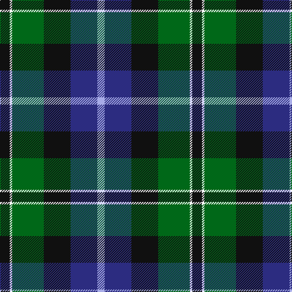

**Bands:** [KWGKBW](/stripes/kwgkbw/) · **Stripes:** [K W G K DB LB](/stripes/stripes6/) K W G K DB LB

This was sourced from register-of-tartans.  It is a [6 band tartan](/bands/bands6/).

Original link https://www.tartanregister.gov.uk/tartanDetails.aspx?ref=3121

## Attestations

This cloth appears in 2 source records; the oldest owns this page.

- 01/01/1963 — New York Fire Department Pipe Band (register-of-tartans, [record](https://www.tartanregister.gov.uk/tartanDetails.aspx?ref=3121))
- Feb 1964 — New York Fire Dept. (Corporate) (tartans-authority, [record](http://www.tartansauthority.com/tartan-ferret/display/60/))

## Register references

External register numbers recorded for this tartan.

- Scottish Register of Tartans: [3121](https://www.tartanregister.gov.uk/tartanDetails.aspx?ref=3121)
- Scottish Tartans Authority (ITI): 60
- Scottish Tartans World Register: 60

## Thread count
K/16 W4 G52 K44 DB44 LP/12

## Palette
Each colour and its ΔE from the base-6 reference it is a variant of.

| Colour | Shade | Base | ΔE (OKLab) |
|---|---|---|---|
| DB | <code style="background-color:#2C2C80;">#2C2C80</code> `#2C2C80` | B <code style="background-color:#2A418A;">#2A418A</code> | 0.06 |
| G | <code style="background-color:#006818;">#006818</code> `#006818` | G <code style="background-color:#006100;">#006100</code> | 0.02 |
| K | <code style="background-color:#101010;">#101010</code> `#101010` | K <code style="background-color:#000000;">#000000</code> | 0.17 |
| LP | <code style="background-color:#A8ACE8;">#A8ACE8</code> `#A8ACE8` | W <code style="background-color:#F7F7F7;">#F7F7F7</code> | 0.23 |
| W | <code style="background-color:#F8F8F8;">#F8F8F8</code> `#F8F8F8` | W <code style="background-color:#F7F7F7;">#F7F7F7</code> | 0.00 |

# Sample pattern

## Nearest tartans

The nearest existing variants by ΔTartan distance.

1. [Rose Hunting](/setts/s6/k4w1g10k10db10r2~x4/) — ΔT 0.66
1. [Rose Hunting Clan Tartan Tartan Number: 1226. Earliest known date: 1831 First recorded in James Logan's, 'The Scottish Gael' in 1831. See products available Copyright © Blair Urquhart, Comrie, 2015](/setts/s6/k4w1g10k10db10r2~x2/) — ΔT 0.73
1. [Russell or Mitchell or Hunter or Galbraith](/setts/s6/k2dg12k12r1db12w2~x2/) — ΔT 0.82
1. [Galbraith](/setts/s6/k2g17k16r2db17w2~x2/) — ΔT 0.90
1. [MacWilliam](/setts/s6/o2g12k10r1db16r2~x2/) — ΔT 0.90
1. [Loudoun's Highlanders - 1747 #1 (Mil](/setts/s6/r4k2db24k20g20lo3~x2/) — ΔT 0.92
1. [Smith, Sir William (?)](/setts/s6/ly3k1g20k20db18t3~x2/) — ΔT 0.93
1. [MacFadzean/MacPhedran](/setts/s7/g3db12w1k12g13r2g2~x4/) — ΔT 0.93
1. [New York, Firemen's Pipe Band](/setts/s6/k14w3g42k36db40t10/) — ΔT 0.96
1. [Bhatti (Name)](/setts/s5/k7lb3g18db18w2~x2/) — ΔT 0.97

## Neighbour map

Every grey dot is one of 14313 variants placed by the first two principal components of the ΔTartan feature space (44% of its variance). Red is this tartan; blue dots are its nearest — click one to open its page.

<svg viewBox="0 0 640 380" role="img" style="max-width:100%;height:auto;border:1px solid #e0e0e0;border-radius:4px;display:block" xmlns="http://www.w3.org/2000/svg"><image href="/nn/cloud.v1.png" width="640" height="380"/><a href="/setts/s6/k4w1g10k10db10r2~x4/"><circle cx="166.2" cy="223.1" r="4" fill="#3465a4"><title>Rose Hunting</title></circle></a><a href="/setts/s6/k4w1g10k10db10r2~x2/"><circle cx="170.4" cy="225.3" r="4" fill="#3465a4"><title>Rose Hunting Clan Tartan Tartan Number: 1226. Earliest known date: 1831 First recorded in James Logan's, 'The Scottish Gael' in 1831. See products available Copyright © Blair Urquhart, Comrie, 2015</title></circle></a><a href="/setts/s6/k2dg12k12r1db12w2~x2/"><circle cx="180.3" cy="211.0" r="4" fill="#3465a4"><title>Russell or Mitchell or Hunter or Galbraith</title></circle></a><a href="/setts/s6/k2g17k16r2db17w2~x2/"><circle cx="151.1" cy="213.2" r="4" fill="#3465a4"><title>Galbraith</title></circle></a><a href="/setts/s6/o2g12k10r1db16r2~x2/"><circle cx="170.3" cy="179.4" r="4" fill="#3465a4"><title>MacWilliam</title></circle></a><a href="/setts/s6/r4k2db24k20g20lo3~x2/"><circle cx="173.2" cy="210.5" r="4" fill="#3465a4"><title>Loudoun's Highlanders - 1747 #1 (Mil</title></circle></a><a href="/setts/s6/ly3k1g20k20db18t3~x2/"><circle cx="179.7" cy="184.0" r="4" fill="#3465a4"><title>Smith, Sir William (?)</title></circle></a><a href="/setts/s7/g3db12w1k12g13r2g2~x4/"><circle cx="193.8" cy="187.3" r="4" fill="#3465a4"><title>MacFadzean/MacPhedran</title></circle></a><a href="/setts/s6/k14w3g42k36db40t10/"><circle cx="132.6" cy="198.7" r="4" fill="#3465a4"><title>New York, Firemen's Pipe Band</title></circle></a><a href="/setts/s5/k7lb3g18db18w2~x2/"><circle cx="167.8" cy="220.5" r="4" fill="#3465a4"><title>Bhatti (Name)</title></circle></a><circle cx="153.5" cy="209.1" r="5" fill="#c00000"/></svg>

ID: /setts/s6/k4w1g13k11db11lb3~x4/
