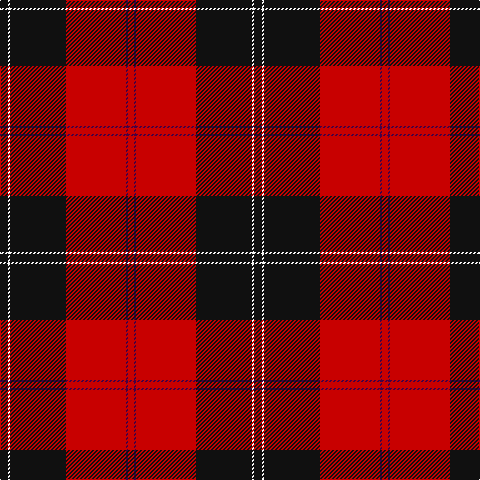

In pattern [KWKRBR](/patterns/kwkrbr/).

This was sourced from register-of-tartans.  It is a [6 stripes tartan](/stripes/stripes6/).

Original link https://www.tartanregister.gov.uk/tartanDetails.aspx?ref=3453

## Attestations

This cloth appears in 2 source records; the oldest owns this page.

- 01/01/1842 — Ramsay (Red) (register-of-tartans, [record](https://www.tartanregister.gov.uk/tartanDetails.aspx?ref=3453))
- 1842 — Ramsay, Red (Clan) (tartans-authority, [record](http://www.tartansauthority.com/tartan-ferret/display/1238/))

## Thread count
K/8 W2 K56 R60 DP2 R/6

## Palette
Each colour and its ΔE from the base-6 reference it is a variant of.

| Colour | Shade | Base | ΔE (OKLab) |
|---|---|---|---|
| DP | <code style="background-color:#440044;">#440044</code> `#440044` | B <code style="background-color:#2A418A;">#2A418A</code> | 0.18 |
| K | <code style="background-color:#101010;">#101010</code> `#101010` | K <code style="background-color:#000000;">#000000</code> | 0.17 |
| R | <code style="background-color:#C80000;">#C80000</code> `#C80000` | R <code style="background-color:#CC0000;">#CC0000</code> | 0.01 |
| W | <code style="background-color:#F8F8F8;">#F8F8F8</code> `#F8F8F8` | W <code style="background-color:#F7F7F7;">#F7F7F7</code> | 0.00 |

# Sample pattern

## Nearest tartans

The nearest existing variants by ΔTartan distance.

1. [Cunningham (VS) Clan Tartan Tartan Number: 1200. Earliest known date: 1842 The origin of the name comes from the district of Cunningham in Ayrshire. Alexander de Cunningham was created 1st Earl of Glencairn in 1488. The family is now widespread throughout Scotland. Cunningham was one of the names adopted by the MacGregors when their own was proscribed. There is a similarity with the MacGregor tartan but the true origin is unknown as the claims of antiquity made in the Vestiarium Scoticum, where the Cunningham tartan was first recorded, are unreliable. See products available Copyright © Blair Urquhart, Comrie, 2015](/setts/s7/k3r1k30r28b1r1w3x2~b2c2c80-k101010-rc80000-we0e0e0/) — ΔT 0.63
1. [Cunningham #3](/setts/s7/k3r1k30r28b1r1w3x2~b2c4084-k101010-rdc0000-we0e0e0/) — ΔT 0.71
1. [Ramsay of Dalhousie](/setts/s6/k4w2k28r30k1r3x2~k101010-rdc0000-we0e0e0/) — ΔT 0.94
1. [Ramsay](/setts/s6/k4w2k28r30b1r3x2~b00004c-k000000-rc80000-wd0d0d0/) — ΔT 1.06
1. [Mens Bigi](/setts/s8/y4k17r1k4r2k4r33w3x2~k101010-r901c38-wfcfcfc-yd87c00/) — ΔT 1.06
1. [Ramsay](/setts/s6/k4w2k28r30b1r3x2~b300030-k000000-rc00000-we0e0e0/) — ΔT 1.06
1. [Cunningham](/setts/s7/k3r1k30r28k1r1w3x2~k101010-rdc0000-we0e0e0/) — ΔT 1.08
1. [Ramsay](/setts/s6/k4y2k28r30b1r3x2~b6e5058-k000000-raa0000-yaaaaaa/) — ΔT 1.09
1. [Ramsay](/setts/s6/k4y2k28r30b1r3~b6e5058-k000000-raa0000-yaaaaaa/) — ΔT 1.09
1. [Ramsay Red Clan Tartan Tartan Number: 1238. Earliest known date: 1842 Ramsay was one of the names adopted by members of the Clan MacGregor when their own was proscribed. It is not surprising then that an early MacGregor sett was used as a basis for the Ramsay tartan. It is possible that the tartan was in existance long before the earliest recorded date given. See products available Copyright © Blair Urquhart, Comrie, 2015](/setts/s6/r5ra2r30k28w2k4x2~k101010-rc80000-raa00048-we0e0e0/) — ΔT 1.11

## Neighbour map

Every grey dot is one of 15726 variants placed by the first two principal components of the ΔTartan feature space (44% of its variance). Red is this tartan; blue dots are its nearest — click one to open its page.

<svg viewBox="0 0 640 380" role="img" style="max-width:100%;height:auto;border:1px solid #e0e0e0;border-radius:4px;display:block" xmlns="http://www.w3.org/2000/svg"><image href="/nn/cloud.v1.png" width="640" height="380"/><a href="/setts/s7/k3r1k30r28b1r1w3x2~b2c2c80-k101010-rc80000-we0e0e0/"><circle cx="354.5" cy="127.3" r="4" fill="#3465a4"><title>Cunningham (VS) Clan Tartan Tartan Number: 1200. Earliest known date: 1842 The origin of the name comes from the district of Cunningham in Ayrshire. Alexander de Cunningham was created 1st Earl of Glencairn in 1488. The family is now widespread throughout Scotland. Cunningham was one of the names adopted by the MacGregors when their own was proscribed. There is a similarity with the MacGregor tartan but the true origin is unknown as the claims of antiquity made in the Vestiarium Scoticum, where the Cunningham tartan was first recorded, are unreliable. See products available Copyright © Blair Urquhart, Comrie, 2015</title></circle></a><a href="/setts/s7/k3r1k30r28b1r1w3x2~b2c4084-k101010-rdc0000-we0e0e0/"><circle cx="349.2" cy="123.4" r="4" fill="#3465a4"><title>Cunningham #3</title></circle></a><a href="/setts/s6/k4w2k28r30k1r3x2~k101010-rdc0000-we0e0e0/"><circle cx="370.2" cy="157.5" r="4" fill="#3465a4"><title>Ramsay of Dalhousie</title></circle></a><a href="/setts/s6/k4w2k28r30b1r3x2~b00004c-k000000-rc80000-wd0d0d0/"><circle cx="336.9" cy="142.8" r="4" fill="#3465a4"><title>Ramsay</title></circle></a><a href="/setts/s8/y4k17r1k4r2k4r33w3x2~k101010-r901c38-wfcfcfc-yd87c00/"><circle cx="363.9" cy="125.6" r="4" fill="#3465a4"><title>Mens Bigi</title></circle></a><a href="/setts/s6/k4w2k28r30b1r3x2~b300030-k000000-rc00000-we0e0e0/"><circle cx="338.0" cy="143.7" r="4" fill="#3465a4"><title>Ramsay</title></circle></a><a href="/setts/s7/k3r1k30r28k1r1w3x2~k101010-rdc0000-we0e0e0/"><circle cx="376.3" cy="140.0" r="4" fill="#3465a4"><title>Cunningham</title></circle></a><a href="/setts/s6/k4y2k28r30b1r3x2~b6e5058-k000000-raa0000-yaaaaaa/"><circle cx="344.5" cy="148.5" r="4" fill="#3465a4"><title>Ramsay</title></circle></a><a href="/setts/s6/k4y2k28r30b1r3~b6e5058-k000000-raa0000-yaaaaaa/"><circle cx="344.5" cy="148.5" r="4" fill="#3465a4"><title>Ramsay</title></circle></a><a href="/setts/s6/r5ra2r30k28w2k4x2~k101010-rc80000-raa00048-we0e0e0/"><circle cx="325.0" cy="173.8" r="4" fill="#3465a4"><title>Ramsay Red Clan Tartan Tartan Number: 1238. Earliest known date: 1842 Ramsay was one of the names adopted by members of the Clan MacGregor when their own was proscribed. It is not surprising then that an early MacGregor sett was used as a basis for the Ramsay tartan. It is possible that the tartan was in existance long before the earliest recorded date given. See products available Copyright © Blair Urquhart, Comrie, 2015</title></circle></a><circle cx="367.1" cy="145.6" r="5" fill="#c00000"/></svg>

ID: /setts/s6/k4w1k28r30b1r3x2~b440044-k101010-rc80000-wf8f8f8/
