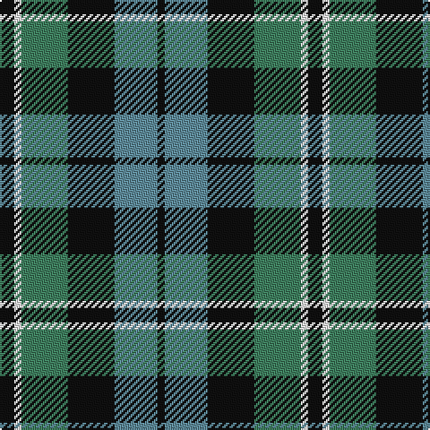

**Bands:** [KBKGWK](/stripes/kbkgwk/) · **Stripes:** [K T K G W K](/stripes/stripes6/) K T K G W K

This was sourced from register-of-tartans.  It is a [6 band tartan](/bands/bands6/).

Original link https://www.tartanregister.gov.uk/tartanDetails.aspx?ref=2914

## Attestations

This cloth appears in 2 source records; the oldest owns this page.

- 01/01/1847 — Melville (register-of-tartans, [record](https://www.tartanregister.gov.uk/tartanDetails.aspx?ref=2914))
- pre 1847 — Melville (Clan) (tartans-authority, [record](http://www.tartansauthority.com/tartan-ferret/display/6328/))

## Register references

External register numbers recorded for this tartan.

- Scottish Register of Tartans: [2914](https://www.tartanregister.gov.uk/tartanDetails.aspx?ref=2914)
- Scottish Tartans Authority (ITI): 6328

## Thread count
K/8 W4 G26 K26 B24 K/4

## Palette
Each colour and its ΔE from the base-6 reference it is a variant of.

| Colour | Shade | Base | ΔE (OKLab) |
|---|---|---|---|
| B | <code style="background-color:#608C9C;">#608C9C</code> `#608C9C` | B <code style="background-color:#2A418A;">#2A418A</code> | 0.23 |
| G | <code style="background-color:#408060;">#408060</code> `#408060` | G <code style="background-color:#006100;">#006100</code> | 0.14 |
| K | <code style="background-color:#101010;">#101010</code> `#101010` | K <code style="background-color:#000000;">#000000</code> | 0.17 |
| W | <code style="background-color:#FCFCFC;">#FCFCFC</code> `#FCFCFC` | W <code style="background-color:#F7F7F7;">#F7F7F7</code> | 0.01 |

# Sample pattern

## Nearest tartans

The nearest existing variants by ΔTartan distance.

1. [Triad Highland Games Proposed](/setts/s7/r1g8k8r1k8t8r1~x4/) — ΔT 0.74
1. [Wellington, or Waterloo](/setts/s6/t3g6k6t4r1t1~x2/) — ΔT 0.74
1. [Waterloo](/setts/s6/y3dg6k6y4r1y1~x2/) — ΔT 0.77
1. [Daks, Navy](/setts/s8/r5g12db4db4db22g18db4r5/) — ΔT 0.89
1. [Herd/Hurd](/setts/s6/db3g12k13w2db13w3~x2/) — ΔT 0.90
1. [Wellington, or Waterloo](/setts/s6/t3g12k14t11r3t3~x2/) — ΔT 0.92
1. [Murray](/setts/s6/db2k2db12k8g11r2~x2/) — ΔT 0.93
1. [MacTavish / Thom(p)son, hunting](/setts/s6/t4o28g6t12k12t3~x2/) — ΔT 0.95
1. [Wellington or Waterloo](/setts/s6/t3dg12k14t11r3t3~x2/) — ΔT 0.97
1. [MacArthur of Milton, hunting](/setts/s6/g14db2g2k8p9k2~x2/) — ΔT 0.99

## Neighbour map

Every grey dot is one of 14299 variants placed by the first two principal components of the ΔTartan feature space (44% of its variance). Red is this tartan; blue dots are its nearest — click one to open its page.

<svg viewBox="0 0 640 380" role="img" style="max-width:100%;height:auto;border:1px solid #e0e0e0;border-radius:4px;display:block" xmlns="http://www.w3.org/2000/svg"><image href="/nn/cloud.v1.png" width="640" height="380"/><a href="/setts/s7/r1g8k8r1k8t8r1~x4/"><circle cx="195.0" cy="225.4" r="4" fill="#3465a4"><title>Triad Highland Games Proposed</title></circle></a><a href="/setts/s6/t3g6k6t4r1t1~x2/"><circle cx="128.6" cy="243.8" r="4" fill="#3465a4"><title>Wellington, or Waterloo</title></circle></a><a href="/setts/s6/y3dg6k6y4r1y1~x2/"><circle cx="157.5" cy="254.1" r="4" fill="#3465a4"><title>Waterloo</title></circle></a><a href="/setts/s8/r5g12db4db4db22g18db4r5/"><circle cx="175.2" cy="231.2" r="4" fill="#3465a4"><title>Daks, Navy</title></circle></a><a href="/setts/s6/db3g12k13w2db13w3~x2/"><circle cx="126.3" cy="236.3" r="4" fill="#3465a4"><title>Herd/Hurd</title></circle></a><a href="/setts/s6/t3g12k14t11r3t3~x2/"><circle cx="115.7" cy="248.1" r="4" fill="#3465a4"><title>Wellington, or Waterloo</title></circle></a><a href="/setts/s6/db2k2db12k8g11r2~x2/"><circle cx="152.4" cy="240.0" r="4" fill="#3465a4"><title>Murray</title></circle></a><a href="/setts/s6/t4o28g6t12k12t3~x2/"><circle cx="202.5" cy="212.7" r="4" fill="#3465a4"><title>MacTavish / Thom(p)son, hunting</title></circle></a><a href="/setts/s6/t3dg12k14t11r3t3~x2/"><circle cx="149.6" cy="264.1" r="4" fill="#3465a4"><title>Wellington or Waterloo</title></circle></a><a href="/setts/s6/g14db2g2k8p9k2~x2/"><circle cx="177.9" cy="224.5" r="4" fill="#3465a4"><title>MacArthur of Milton, hunting</title></circle></a><circle cx="166.6" cy="238.0" r="5" fill="#c00000"/></svg>

ID: /setts/s6/k4w2g13k13t12k2~x2/
