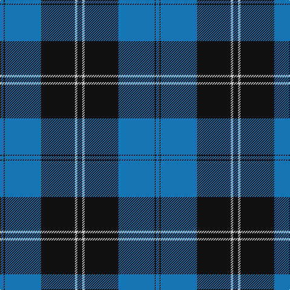

In pattern [BKBKWK](/patterns/bkbkwk/).

This was sourced from register-of-tartans.  It is a [6 stripes tartan](/stripes/stripes6/).

Original link https://www.tartanregister.gov.uk/tartanDetails.aspx?ref=3454

## Attestations

This cloth appears in 2 source records; the oldest owns this page.

- 01/01/1950 — Ramsay Blue Hunting (register-of-tartans, [record](https://www.tartanregister.gov.uk/tartanDetails.aspx?ref=3454))
- pre 1950 — Ramsay, Blue Htg (Clan) (tartans-authority, [record](http://www.tartansauthority.com/tartan-ferret/display/259/))

## Register references

External register numbers recorded for this tartan.

- Scottish Register of Tartans: [3454](https://www.tartanregister.gov.uk/tartanDetails.aspx?ref=3454)
- Scottish Tartans Authority (ITI): 259
- Scottish Tartans World Register: 259

## Thread count
B/6 K2 B60 K56 N4 K/8

## Palette
Each colour and its ΔE from the base-6 reference it is a variant of.

| Colour | Shade | Base | ΔE (OKLab) |
|---|---|---|---|
| B | <code style="background-color:#1474B4;">#1474B4</code> `#1474B4` | B <code style="background-color:#2A418A;">#2A418A</code> | 0.15 |
| K | <code style="background-color:#101010;">#101010</code> `#101010` | K <code style="background-color:#000000;">#000000</code> | 0.17 |
| N | <code style="background-color:#C0C0C0;">#C0C0C0</code> `#C0C0C0` | W <code style="background-color:#F7F7F7;">#F7F7F7</code> | 0.17 |

# Sample pattern

## Nearest tartans

The nearest existing variants by ΔTartan distance.

1. [Oakleigh (Corporate)](/setts/s6/b4k1b20k20y1k4~b1474b4-k101010-ye8c000~x4/) — ΔT 0.70
1. [St Andrews, Earl of](/setts/s6/b52k28w5k3w2k10~b304080-k000030-we0e0e0/) — ΔT 1.15
1. [Bro-Spirit of Northmen (Corporate)](/setts/s5/r3k1b27k27w3~b1474b4-k101010-r880000-we0e0e0~x2/) — ΔT 1.22
1. [Sorbie (Name)](/setts/s6/r1b1k17b17k1w1~b1474b4-k101010-rc80000-wfcfcfc~x4/) — ΔT 1.26
1. [Intergen (Corporate)](/setts/s6/k4y3k30y33r1y4~k101010-rc8002c-y48a4c0~x2/) — ΔT 1.37
1. [Roxburgh, Green (District)](/setts/s8/b23w1b1w1b8g22r1b3~b1c0070-g006818-rc80000-wf8f8f8~x4/) — ΔT 1.37
1. [MacRobart](/setts/s6/b72k21g16ba3g17ba3~b304080-ba5480b0-g008000-k000000~x2/) — ΔT 1.40
1. [Ramsay](/setts/s6/k4w2k28b30k1b3~b304080-k000000-we0e0e0~x2/) — ΔT 1.46
1. [Micron](/setts/s6/k30b40y3b5w2b6~b1474b4-k101010-wfcfcfc-ye8c000~x2/) — ΔT 1.48
1. [Lynn (Personal)](/setts/s8/b18w1k3w1b9w1k45b4~b2474e8-k101010-we0e0e0~x2/) — ΔT 1.48

## Neighbour map

Every grey dot is one of 15726 variants placed by the first two principal components of the ΔTartan feature space (44% of its variance). Red is this tartan; blue dots are its nearest — click one to open its page.

<svg viewBox="0 0 640 380" role="img" style="max-width:100%;height:auto;border:1px solid #e0e0e0;border-radius:4px;display:block" xmlns="http://www.w3.org/2000/svg"><image href="/nn/cloud.v1.png" width="640" height="380"/><a href="/setts/s6/b4k1b20k20y1k4~b1474b4-k101010-ye8c000~x4/"><circle cx="349.7" cy="201.4" r="4" fill="#3465a4"><title>Oakleigh (Corporate)</title></circle></a><a href="/setts/s6/b52k28w5k3w2k10~b304080-k000030-we0e0e0/"><circle cx="365.8" cy="188.7" r="4" fill="#3465a4"><title>St Andrews, Earl of</title></circle></a><a href="/setts/s5/r3k1b27k27w3~b1474b4-k101010-r880000-we0e0e0~x2/"><circle cx="300.5" cy="175.1" r="4" fill="#3465a4"><title>Bro-Spirit of Northmen (Corporate)</title></circle></a><a href="/setts/s6/r1b1k17b17k1w1~b1474b4-k101010-rc80000-wfcfcfc~x4/"><circle cx="312.5" cy="173.7" r="4" fill="#3465a4"><title>Sorbie (Name)</title></circle></a><a href="/setts/s6/k4y3k30y33r1y4~k101010-rc8002c-y48a4c0~x2/"><circle cx="320.1" cy="149.8" r="4" fill="#3465a4"><title>Intergen (Corporate)</title></circle></a><a href="/setts/s8/b23w1b1w1b8g22r1b3~b1c0070-g006818-rc80000-wf8f8f8~x4/"><circle cx="371.7" cy="158.1" r="4" fill="#3465a4"><title>Roxburgh, Green (District)</title></circle></a><a href="/setts/s6/b72k21g16ba3g17ba3~b304080-ba5480b0-g008000-k000000~x2/"><circle cx="324.5" cy="172.4" r="4" fill="#3465a4"><title>MacRobart</title></circle></a><a href="/setts/s6/k4w2k28b30k1b3~b304080-k000000-we0e0e0~x2/"><circle cx="361.1" cy="181.1" r="4" fill="#3465a4"><title>Ramsay</title></circle></a><a href="/setts/s6/k30b40y3b5w2b6~b1474b4-k101010-wfcfcfc-ye8c000~x2/"><circle cx="352.3" cy="177.1" r="4" fill="#3465a4"><title>Micron</title></circle></a><a href="/setts/s8/b18w1k3w1b9w1k45b4~b2474e8-k101010-we0e0e0~x2/"><circle cx="412.2" cy="132.7" r="4" fill="#3465a4"><title>Lynn (Personal)</title></circle></a><circle cx="362.8" cy="179.3" r="5" fill="#c00000"/></svg>

ID: /setts/s6/k4w2k28b30k1b3~b1474b4-k101010-wc0c0c0~x2/
