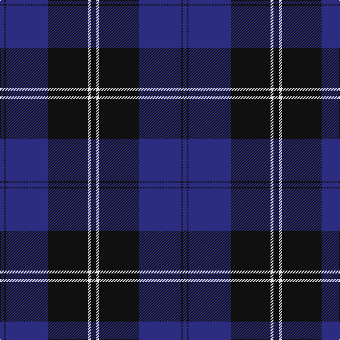

In pattern [BKBKWK](/patterns/bkbkwk/).

This was sourced from house-of-tartan.  It is a [6 stripes tartan](/stripes/stripes6/).

Original link http://www.house-of-tartan.scotland.net/house/TartanViewjs.asp?colr=Def&tnam=259

## Attestations

This cloth appears in 2 source records; the oldest owns this page.

- undated — Ramsay Blue Clan Tartan Tartan Number: 259. Earliest known date: 1930 This sample comes from the MacGregor-Hastie collection which forms the basis of the cloth archive of the Scottish Tartans Society. Some of the samples, including this one, were unmarked. One can assume that the sample dates between 1930 and 1950. See products available Copyright © Blair Urquhart, Comrie, 2015 (house-of-tartan, [record](http://www.house-of-tartan.scotland.net/house/TartanViewjs.asp?colr=Def&tnam=259))
- undated — Ramsay Blue New Blue Clan Tartan Tartan Number: 25999. Earliest known date: This is a copy of the Ramsay Blue saved without changes, only suppose to suggest the brighter Ramsay New Blue polyvis tartan fabric for customers. See products available Copyright © Blair Urquhart, Comrie, 2015 (house-of-tartan, [record](http://www.house-of-tartan.scotland.net/house/TartanViewjs.asp?colr=Def&tnam=25999))

## Thread count
DB/6 K2 DB60 K56 LN4 K/8

## Palette
Each colour and its ΔE from the base-6 reference it is a variant of.

| Colour | Shade | Base | ΔE (OKLab) |
|---|---|---|---|
| DB | <code style="background-color:#2C2C80;">#2C2C80</code> `#2C2C80` | B <code style="background-color:#2A418A;">#2A418A</code> | 0.06 |
| K | <code style="background-color:#101010;">#101010</code> `#101010` | K <code style="background-color:#000000;">#000000</code> | 0.17 |
| LN | <code style="background-color:#E0E0E0;">#E0E0E0</code> `#E0E0E0` | W <code style="background-color:#F7F7F7;">#F7F7F7</code> | 0.07 |

# Sample pattern

## Nearest tartans

The nearest existing variants by ΔTartan distance.

1. [Lyndon Prep (School)](/setts/s6/b4w1b18k18y1k4~b1c0070-k101010-w98c8e8-ye8c000~x4/) — ΔT 1.29
1. [Angus District Tartan Tartan Number: 1179. Earliest known date: pre 1906 It is not clear whether Angus tartan was intended as a District or a Family tartan and as a consequence it has been used as both. It is now firmly established as a tartan for all those people having a connection with the area. The name means 'The Only One', possibly refering to the Angus King of Dalriada in western Scotland in the ninth century. The name is associated with Clan MacInnes, who also claim descent from the Dalriada Scots. The Earldom of Angus was held by the Stewarts and Douglases and is now vested in the Dukedom of Hamilton. See products available Copyright © Blair Urquhart, Comrie, 2015](/setts/s9/k3r1k32b28r1b2r1b2r3~b2c2c80-k101010-rc80000~x2/) — ΔT 1.30
1. [Koot Wedding (Personal)](/setts/s6/b48k32r1k8r3w3~b2c2c80-k101010-rc80000-wfcfcfc~x2/) — ΔT 1.36
1. [Home or Hume (Vestiarium Scoticum)](/setts/s8/k28r1k2r1k8b24g2b3~b2c4084-g005020-k101010-rdc0000~x2/) — ΔT 1.38
1. [Edzell, U.S. Navy](/setts/s6/b104ba16w8ba66r3ba16~b000050-ba304080-rc00000-we0e0e0/) — ΔT 1.41
1. [Koot Wedding (Personal)](/setts/s6/b48k32r1k8r3w3~b1b3357-k101010-rcc0000-wffffff~x2/) — ΔT 1.44
1. [Home or Hume Clan Tartan Tartan Number: 127. Earliest known date: 1842 D.W.Stewart says, "The tartan of the ancient and notable family of Home, though differing in colour, has the same scheme as the Grey Douglas. Both first appear in the Vestiarium Scoticum." Border 'Clans' are mentioned in an Act of the Scottish Parliament in 1587, but no evidence of a Clan tartan exists before the earliest date given here. See products available Copyright © Blair Urquhart, Comrie, 2015](/setts/s8/k28r1k2r1k8b24g2b3~b2c2c80-g006818-k101010-rc80000~x2/) — ΔT 1.48
1. [Pride of Kinross](/setts/s8/k20b2k6b2k4b27w2b8~b2c2c80-k101010-wfcfcfc~x2/) — ΔT 1.49
1. [Pride of Kinross](/setts/s8/k20b2k6b2k4b27w2b8~b2c2c80-k101010-wffffff~x2/) — ΔT 1.49
1. [St Andrews, Earl of](/setts/s6/b52k28w5k3w2k10~b304080-k000030-we0e0e0/) — ΔT 1.53

## Neighbour map

Every grey dot is one of 15726 variants placed by the first two principal components of the ΔTartan feature space (44% of its variance). Red is this tartan; blue dots are its nearest — click one to open its page.

<svg viewBox="0 0 640 380" role="img" style="max-width:100%;height:auto;border:1px solid #e0e0e0;border-radius:4px;display:block" xmlns="http://www.w3.org/2000/svg"><image href="/nn/cloud.v1.png" width="640" height="380"/><a href="/setts/s6/b4w1b18k18y1k4~b1c0070-k101010-w98c8e8-ye8c000~x4/"><circle cx="365.4" cy="214.1" r="4" fill="#3465a4"><title>Lyndon Prep (School)</title></circle></a><a href="/setts/s9/k3r1k32b28r1b2r1b2r3~b2c2c80-k101010-rc80000~x2/"><circle cx="417.3" cy="159.2" r="4" fill="#3465a4"><title>Angus District Tartan Tartan Number: 1179. Earliest known date: pre 1906 It is not clear whether Angus tartan was intended as a District or a Family tartan and as a consequence it has been used as both. It is now firmly established as a tartan for all those people having a connection with the area. The name means 'The Only One', possibly refering to the Angus King of Dalriada in western Scotland in the ninth century. The name is associated with Clan MacInnes, who also claim descent from the Dalriada Scots. The Earldom of Angus was held by the Stewarts and Douglases and is now vested in the Dukedom of Hamilton. See products available Copyright © Blair Urquhart, Comrie, 2015</title></circle></a><a href="/setts/s6/b48k32r1k8r3w3~b2c2c80-k101010-rc80000-wfcfcfc~x2/"><circle cx="387.7" cy="153.7" r="4" fill="#3465a4"><title>Koot Wedding (Personal)</title></circle></a><a href="/setts/s8/k28r1k2r1k8b24g2b3~b2c4084-g005020-k101010-rdc0000~x2/"><circle cx="422.1" cy="172.4" r="4" fill="#3465a4"><title>Home or Hume (Vestiarium Scoticum)</title></circle></a><a href="/setts/s6/b104ba16w8ba66r3ba16~b000050-ba304080-rc00000-we0e0e0/"><circle cx="384.0" cy="181.3" r="4" fill="#3465a4"><title>Edzell, U.S. Navy</title></circle></a><a href="/setts/s6/b48k32r1k8r3w3~b1b3357-k101010-rcc0000-wffffff~x2/"><circle cx="402.1" cy="162.1" r="4" fill="#3465a4"><title>Koot Wedding (Personal)</title></circle></a><a href="/setts/s8/k28r1k2r1k8b24g2b3~b2c2c80-g006818-k101010-rc80000~x2/"><circle cx="433.5" cy="177.1" r="4" fill="#3465a4"><title>Home or Hume Clan Tartan Tartan Number: 127. Earliest known date: 1842 D.W.Stewart says, &quot;The tartan of the ancient and notable family of Home, though differing in colour, has the same scheme as the Grey Douglas. Both first appear in the Vestiarium Scoticum.&quot; Border 'Clans' are mentioned in an Act of the Scottish Parliament in 1587, but no evidence of a Clan tartan exists before the earliest date given here. See products available Copyright © Blair Urquhart, Comrie, 2015</title></circle></a><a href="/setts/s8/k20b2k6b2k4b27w2b8~b2c2c80-k101010-wfcfcfc~x2/"><circle cx="388.1" cy="219.6" r="4" fill="#3465a4"><title>Pride of Kinross</title></circle></a><a href="/setts/s8/k20b2k6b2k4b27w2b8~b2c2c80-k101010-wffffff~x2/"><circle cx="387.2" cy="219.2" r="4" fill="#3465a4"><title>Pride of Kinross</title></circle></a><a href="/setts/s6/b52k28w5k3w2k10~b304080-k000030-we0e0e0/"><circle cx="365.8" cy="188.7" r="4" fill="#3465a4"><title>St Andrews, Earl of</title></circle></a><circle cx="412.9" cy="198.8" r="5" fill="#c00000"/></svg>

ID: /setts/s6/k4w2k28b30k1b3~b2c2c80-k101010-we0e0e0~x2/
