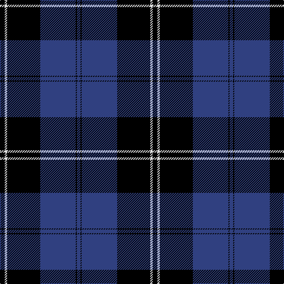

In pattern [BKBKWK](/stripes/bkbkwk/).

This was sourced from weddslist.  It is a [6 stripe tartan](/stripes/stripes6/).

Original link http://www.weddslist.com/cgi-bin/tartans/pg.pl?source=sts

## Also known as

This cloth is also recorded under:

- Ramsay Blue
- Ramsay Blue New Blue

## Attestations

This cloth appears in 3 source records; the oldest owns this page.

- undated — Ramsay (weddslist, [record](http://www.weddslist.com/cgi-bin/tartans/pg.pl?source=sts))
- undated — Ramsay Blue Clan Tartan Tartan Number: 259. Earliest known date: 1930 This sample comes from the MacGregor-Hastie collection which forms the basis of the cloth archive of the Scottish Tartans Society. Some of the samples, including this one, were unmarked. One can assume that the sample dates between 1930 and 1950. See products available Copyright © Blair Urquhart, Comrie, 2015 (house-of-tartan, [record](http://www.house-of-tartan.scotland.net/house/TartanViewjs.asp?colr=Def&tnam=259))
- undated — Ramsay Blue New Blue Clan Tartan Tartan Number: 25999. Earliest known date: This is a copy of the Ramsay Blue saved without changes, only suppose to suggest the brighter Ramsay New Blue polyvis tartan fabric for customers. See products available Copyright © Blair Urquhart, Comrie, 2015 (house-of-tartan, [record](http://www.house-of-tartan.scotland.net/house/TartanViewjs.asp?colr=Def&tnam=25999))

## Thread count
K/8 LN4 K56 B60 K2 B/6

## Palette
Each colour and the base-6 reference it is a variant of.

| Colour | Shade | Base |
|---|---|---|
| B | <code style="background-color:#304080;">#304080</code> `oklch(39.4% 0.109 270.2)` <small>#304080</small> | B <code style="background-color:#2A418A;">#2A418A</code> |
| K | <code style="background-color:#000000;">#000000</code> `oklch(0.0% 0.000 0.0)` <small>#000000</small> | K <code style="background-color:#000000;">#000000</code> |
| LN | <code style="background-color:#E0E0E0;">#E0E0E0</code> `oklch(90.7% 0.000 89.9)` <small>#E0E0E0</small> | W <code style="background-color:#F7F7F7;">#F7F7F7</code> |

# Sample pattern

## Nearest tartans

The nearest existing variants by ΔTartan distance.

1. [Home, or Hume](/setts/s8/k28r1k2r1k8db24g2db3~x2/) — ΔT 1.28
1. [Angus](/setts/s9/k3r1k32db28r1db2r1db2r3~x2/) — ΔT 1.28
1. [Ramsay Blue Hunting](/setts/s6/k4lb2k28b30k1b3~x2/) — ΔT 1.47
1. [St Andrews, Earl of](/setts/s6/db52k28w5k3w2k10/) — ΔT 1.50
1. [Oakleigh (Corporate)](/setts/s6/k4ly1k20b20k1b4~x4/) — ΔT 1.57
1. [Dunlop](/setts/s8/k3r1k30w1db28r1db1w3~x2/) — ΔT 1.74
1. [TACC](/setts/s7/n34k7n12k40n3k4lt3~x2/) — ΔT 1.76
1. [Lynn (Personal)](/setts/s8/b18w1k3w1b9w1k45b4~x2/) — ΔT 1.81
1. [Jon's Theme (Fashion)](/setts/s6/k1lo2k3db12k18w1~x2/) — ΔT 1.82
1. [Jon's Theme](/setts/s6/k1ly2k3n12k18w1~x2/) — ΔT 1.85

## Neighbour map

Every grey dot is one of 14299 variants placed by the first two principal components of the ΔTartan feature space (44% of its variance). Red is this tartan; blue dots are its nearest — click one to open its page.

<svg viewBox="0 0 640 380" role="img" style="max-width:100%;height:auto;border:1px solid #e0e0e0;border-radius:4px;display:block" xmlns="http://www.w3.org/2000/svg"><image href="/nn/cloud.v1.png" width="640" height="380"/><a href="/setts/s8/k28r1k2r1k8db24g2db3~x2/"><circle cx="368.5" cy="152.6" r="4" fill="#3465a4"><title>Home, or Hume</title></circle></a><a href="/setts/s9/k3r1k32db28r1db2r1db2r3~x2/"><circle cx="365.7" cy="139.3" r="4" fill="#3465a4"><title>Angus</title></circle></a><a href="/setts/s6/k4lb2k28b30k1b3~x2/"><circle cx="366.3" cy="178.0" r="4" fill="#3465a4"><title>Ramsay Blue Hunting</title></circle></a><a href="/setts/s6/db52k28w5k3w2k10/"><circle cx="369.2" cy="188.6" r="4" fill="#3465a4"><title>St Andrews, Earl of</title></circle></a><a href="/setts/s6/k4ly1k20b20k1b4~x4/"><circle cx="353.1" cy="199.9" r="4" fill="#3465a4"><title>Oakleigh (Corporate)</title></circle></a><a href="/setts/s8/k3r1k30w1db28r1db1w3~x2/"><circle cx="359.5" cy="139.2" r="4" fill="#3465a4"><title>Dunlop</title></circle></a><a href="/setts/s7/n34k7n12k40n3k4lt3~x2/"><circle cx="314.9" cy="198.7" r="4" fill="#3465a4"><title>TACC</title></circle></a><a href="/setts/s8/b18w1k3w1b9w1k45b4~x2/"><circle cx="415.6" cy="129.7" r="4" fill="#3465a4"><title>Lynn (Personal)</title></circle></a><a href="/setts/s6/k1lo2k3db12k18w1~x2/"><circle cx="374.2" cy="194.0" r="4" fill="#3465a4"><title>Jon's Theme (Fashion)</title></circle></a><a href="/setts/s6/k1ly2k3n12k18w1~x2/"><circle cx="366.4" cy="186.6" r="4" fill="#3465a4"><title>Jon's Theme</title></circle></a><circle cx="364.6" cy="178.8" r="5" fill="#c00000"/></svg>

ID: /setts/s6/k4w2k28db30k1db3~x2/
