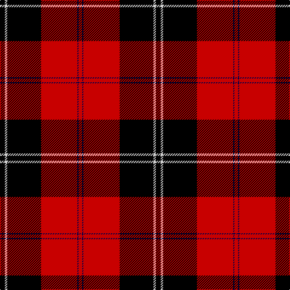

In pattern [KWKRBR](/patterns/kwkrbr/).

This was sourced from weddslist.  It is a [6 stripes tartan](/stripes/stripes6/).

Original link http://www.weddslist.com/cgi-bin/tartans/pg.pl?source=rb

## Thread count
K/8 N4 K56 R60 DB2 R/6

## Palette
Each colour and its ΔE from the base-6 reference it is a variant of.

| Colour | Shade | Base | ΔE (OKLab) |
|---|---|---|---|
| DB | <code style="background-color:#00004C;">#00004C</code> `#00004C` | B <code style="background-color:#2A418A;">#2A418A</code> | 0.21 |
| K | <code style="background-color:#000000;">#000000</code> `#000000` | K <code style="background-color:#000000;">#000000</code> | 0.00 |
| N | <code style="background-color:#D0D0D0;">#D0D0D0</code> `#D0D0D0` | W <code style="background-color:#F7F7F7;">#F7F7F7</code> | 0.12 |
| R | <code style="background-color:#C80000;">#C80000</code> `#C80000` | R <code style="background-color:#CC0000;">#CC0000</code> | 0.01 |

# Sample pattern

## Nearest tartans

The nearest existing variants by ΔTartan distance.

1. [Ramsay](/setts/s6/k4w2k28r30b1r3~b300030-k000000-rc00000-we0e0e0~x2/) — ΔT 0.07
1. [Ramsay](/setts/s6/k4y2k28r30b1r3~b6e5058-k000000-raa0000-yaaaaaa~x2/) — ΔT 0.43
1. [Ramsay](/setts/s6/k4y2k28r30b1r3~b6e5058-k000000-raa0000-yaaaaaa/) — ΔT 0.43
1. [Cunningham](/setts/s7/k3r1k30r28b1r1w3~b00004c-k000000-rc80000-wd0d0d0~x2/) — ΔT 0.58
1. [Cunningham](/setts/s7/k3r1k30r28b1r1w3~b304080-k000000-rc00000-we0e0e0~x2/) — ΔT 0.60
1. [Cunningham](/setts/s7/k3r1k30r28b1r1y3~b000052-k000000-raa0000-yaaaaaa~x2/) — ΔT 0.79
1. [Ramsay of Dalhousie](/setts/s6/k4w2k28r30k1r3~k000000-rc00000-we0e0e0~x2/) — ΔT 0.85
1. [Cunningham D](/setts/s7/k3r1k30r28k1r1w3~k000000-rc80000-wd0d0d0~x2/) — ΔT 1.03
1. [Cunningham](/setts/s7/k3r1k30r28k1r1w3~k000000-rc00000-we0e0e0~x2/) — ΔT 1.04
1. [Ramsay (Red)](/setts/s6/k4w1k28r30b1r3~b440044-k101010-rc80000-wf8f8f8~x2/) — ΔT 1.06

## Neighbour map

Every grey dot is one of 15726 variants placed by the first two principal components of the ΔTartan feature space (44% of its variance). Red is this tartan; blue dots are its nearest — click one to open its page.

<svg viewBox="0 0 640 380" role="img" style="max-width:100%;height:auto;border:1px solid #e0e0e0;border-radius:4px;display:block" xmlns="http://www.w3.org/2000/svg"><image href="/nn/cloud.v1.png" width="640" height="380"/><a href="/setts/s6/k4w2k28r30b1r3~b300030-k000000-rc00000-we0e0e0~x2/"><circle cx="338.0" cy="143.7" r="4" fill="#3465a4"><title>Ramsay</title></circle></a><a href="/setts/s6/k4y2k28r30b1r3~b6e5058-k000000-raa0000-yaaaaaa~x2/"><circle cx="344.5" cy="148.5" r="4" fill="#3465a4"><title>Ramsay</title></circle></a><a href="/setts/s6/k4y2k28r30b1r3~b6e5058-k000000-raa0000-yaaaaaa/"><circle cx="344.5" cy="148.5" r="4" fill="#3465a4"><title>Ramsay</title></circle></a><a href="/setts/s7/k3r1k30r28b1r1w3~b00004c-k000000-rc80000-wd0d0d0~x2/"><circle cx="339.3" cy="125.7" r="4" fill="#3465a4"><title>Cunningham</title></circle></a><a href="/setts/s7/k3r1k30r28b1r1w3~b304080-k000000-rc00000-we0e0e0~x2/"><circle cx="339.4" cy="126.2" r="4" fill="#3465a4"><title>Cunningham</title></circle></a><a href="/setts/s7/k3r1k30r28b1r1y3~b000052-k000000-raa0000-yaaaaaa~x2/"><circle cx="346.7" cy="131.5" r="4" fill="#3465a4"><title>Cunningham</title></circle></a><a href="/setts/s6/k4w2k28r30k1r3~k000000-rc00000-we0e0e0~x2/"><circle cx="359.7" cy="160.3" r="4" fill="#3465a4"><title>Ramsay of Dalhousie</title></circle></a><a href="/setts/s7/k3r1k30r28k1r1w3~k000000-rc80000-wd0d0d0~x2/"><circle cx="366.5" cy="142.3" r="4" fill="#3465a4"><title>Cunningham D</title></circle></a><a href="/setts/s7/k3r1k30r28k1r1w3~k000000-rc00000-we0e0e0~x2/"><circle cx="366.7" cy="143.0" r="4" fill="#3465a4"><title>Cunningham</title></circle></a><a href="/setts/s6/k4w1k28r30b1r3~b440044-k101010-rc80000-wf8f8f8~x2/"><circle cx="367.1" cy="145.6" r="4" fill="#3465a4"><title>Ramsay (Red)</title></circle></a><circle cx="336.9" cy="142.8" r="5" fill="#c00000"/></svg>

ID: /setts/s6/k4w2k28r30b1r3~b00004c-k000000-rc80000-wd0d0d0~x2/
