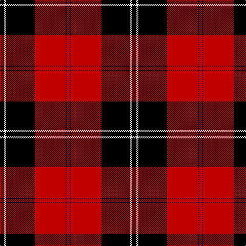

In pattern [KWKRBR](/stripes/kwkrbr/).

This was sourced from weddslist.  It is a [6 stripe tartan](/stripes/stripes6/).

Original link http://www.weddslist.com/cgi-bin/tartans/pg.pl?source=sts

## Thread count
K/8 LN4 K56 R60 DP2 R/6

## Palette
Each colour and the base-6 reference it is a variant of.

| Colour | Shade | Base |
|---|---|---|
| DP | <code style="background-color:#300030;">#300030</code> `oklch(21.7% 0.100 328.4)` <small>#300030</small> | B <code style="background-color:#2A418A;">#2A418A</code> |
| K | <code style="background-color:#000000;">#000000</code> `oklch(0.0% 0.000 0.0)` <small>#000000</small> | K <code style="background-color:#000000;">#000000</code> |
| LN | <code style="background-color:#E0E0E0;">#E0E0E0</code> `oklch(90.7% 0.000 89.9)` <small>#E0E0E0</small> | W <code style="background-color:#F7F7F7;">#F7F7F7</code> |
| R | <code style="background-color:#C00000;">#C00000</code> `oklch(50.7% 0.208 29.2)` <small>#C00000</small> | R <code style="background-color:#CC0000;">#CC0000</code> |

# Sample pattern

## Nearest tartans

The nearest existing variants by ΔTartan distance, with this tartan at the top so the swatches line up against it.

ΔTartan

Tartan

Sett

—

<a href="/ttd/edit/#slug=k4w2k28r30dp1r3~x2">Ramsay</a> <a class="nn-out" href="/setts/s6/k4w2k28r30dp1r3~x2/" title="open its dictionary page">↗</a>

0.07

<a href="/ttd/edit/#slug=k4lb2k28r30db1r3~x2">Ramsay</a> <a class="nn-out" href="/setts/s6/k4lb2k28r30db1r3~x2/" title="open its dictionary page">↗</a>

0.36

<a href="/ttd/edit/#slug=k4lr2k28r30n1r3~x2">Ramsay</a> <a class="nn-out" href="/setts/s6/k4lr2k28r30n1r3~x2/" title="open its dictionary page">↗</a>

0.57

<a href="/ttd/edit/#slug=k3r1k30r28db1r1lb3~x2">Cunningham</a> <a class="nn-out" href="/setts/s7/k3r1k30r28db1r1lb3~x2/" title="open its dictionary page">↗</a>

0.75

<a href="/ttd/edit/#slug=k3r1k30r28db1r1lr3~x2">Cunningham</a> <a class="nn-out" href="/setts/s7/k3r1k30r28db1r1lr3~x2/" title="open its dictionary page">↗</a>

1.02

<a href="/ttd/edit/#slug=k3r1k30r28k1r1lb3~x2">Cunningham D</a> <a class="nn-out" href="/setts/s7/k3r1k30r28k1r1lb3~x2/" title="open its dictionary page">↗</a>

1.06

<a href="/ttd/edit/#slug=k4w1k28r30dp1r3~x2">Ramsay (Red)</a> <a class="nn-out" href="/setts/s6/k4w1k28r30dp1r3~x2/" title="open its dictionary page">↗</a>

1.12

<a href="/ttd/edit/#slug=k3r1k30r28db1r1w3~x2">Cunningham #3</a> <a class="nn-out" href="/setts/s7/k3r1k30r28db1r1w3~x2/" title="open its dictionary page">↗</a>

1.13

<a href="/ttd/edit/#slug=k3r1k30r28k1r1lr3~x2">Cunningham D</a> <a class="nn-out" href="/setts/s7/k3r1k30r28k1r1lr3~x2/" title="open its dictionary page">↗</a>

1.14

<a href="/ttd/edit/#slug=r4k12w1k12r4k4r24g1r4~x2">Wemyss</a> <a class="nn-out" href="/setts/s9/r4k12w1k12r4k4r24g1r4~x2/" title="open its dictionary page">↗</a>

1.15

<a href="/ttd/edit/#slug=r4k12lr1k12r4k4r24dg1r4~x2">Wemyss</a> <a class="nn-out" href="/setts/s9/r4k12lr1k12r4k4r24dg1r4~x2/" title="open its dictionary page">↗</a>

## Neighbour map

Every grey dot is one of 14299 variants placed by the first two principal components of the ΔTartan feature space (44% of its variance). Red is this tartan; blue dots are its nearest — click one to open its page.

<svg viewBox="0 0 640 380" role="img" style="max-width:100%;height:auto;border:1px solid #e0e0e0;border-radius:4px;display:block" xmlns="http://www.w3.org/2000/svg"><image href="/nn/cloud.v1.png" width="640" height="380"/><a href="/setts/s6/k4lb2k28r30db1r3~x2/"><circle cx="338.1" cy="136.2" r="4" fill="#3465a4"><title>Ramsay</title></circle></a><a href="/setts/s6/k4lr2k28r30n1r3~x2/"><circle cx="345.8" cy="143.0" r="4" fill="#3465a4"><title>Ramsay</title></circle></a><a href="/setts/s7/k3r1k30r28db1r1lb3~x2/"><circle cx="340.7" cy="119.5" r="4" fill="#3465a4"><title>Cunningham</title></circle></a><a href="/setts/s7/k3r1k30r28db1r1lr3~x2/"><circle cx="348.4" cy="126.5" r="4" fill="#3465a4"><title>Cunningham</title></circle></a><a href="/setts/s7/k3r1k30r28k1r1lb3~x2/"><circle cx="367.9" cy="135.1" r="4" fill="#3465a4"><title>Cunningham D</title></circle></a><a href="/setts/s6/k4w1k28r30dp1r3~x2/"><circle cx="367.7" cy="140.7" r="4" fill="#3465a4"><title>Ramsay (Red)</title></circle></a><a href="/setts/s7/k3r1k30r28db1r1w3~x2/"><circle cx="350.0" cy="117.7" r="4" fill="#3465a4"><title>Cunningham #3</title></circle></a><a href="/setts/s7/k3r1k30r28k1r1lr3~x2/"><circle cx="375.5" cy="142.1" r="4" fill="#3465a4"><title>Cunningham D</title></circle></a><a href="/setts/s9/r4k12w1k12r4k4r24g1r4~x2/"><circle cx="341.5" cy="136.9" r="4" fill="#3465a4"><title>Wemyss</title></circle></a><a href="/setts/s9/r4k12lr1k12r4k4r24dg1r4~x2/"><circle cx="348.9" cy="143.3" r="4" fill="#3465a4"><title>Wemyss</title></circle></a><circle cx="339.2" cy="137.2" r="5" fill="#c00000"/></svg>

ID: /setts/s6/k4w2k28r30dp1r3~x2/
