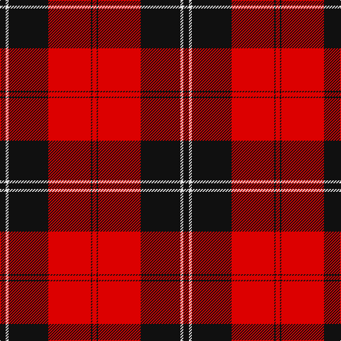

This page is one **sett** — a single exact thread-count. It belongs to the [tartan](/tartans/k4ln2k28r30k1r3/)
(the same proportion at any scale), whose colour order is pattern [KWKRKR](/stripes/kwkrkr/).

Sourced from register-of-tartans.  It is a [6 stripe tartan](/stripes/stripes6/).

Original link https://www.tartanregister.gov.uk/tartanDetails.aspx?ref=3455

2 attestations — the source records this cloth was collapsed from (oldest owns this page)

<ul>
<li>undated — Ramsay of Dalhousie (register-of-tartans, <a href="https://www.tartanregister.gov.uk/tartanDetails.aspx?ref=3455">record</a>)</li>
<li>undated — Ramsay of Dalhousie (weddslist, <a href="http://www.weddslist.com/cgi-bin/tartans/pg.pl?source=sts">record</a>)</li>
</ul>

## Register references

External register numbers recorded for this tartan.

- Scottish Register of Tartans: [3455](https://www.tartanregister.gov.uk/tartanDetails.aspx?ref=3455)
- Scottish Tartans World Register: 1235

## Thread count
K/8 LN4 K56 R60 K2 R/6

## Palette
Each colour and the base-6 reference it is a variant of.

| Colour | Shade | Base |
|---|---|---|
| K | <code style="background-color:#101010;">#101010</code> `oklch(17.3% 0.000 89.9)` <small>#101010</small> | K <code style="background-color:#000000;">#000000</code> |
| LN | <code style="background-color:#E0E0E0;">#E0E0E0</code> `oklch(90.7% 0.000 89.9)` <small>#E0E0E0</small> | W <code style="background-color:#F7F7F7;">#F7F7F7</code> |
| R | <code style="background-color:#DC0000;">#DC0000</code> `oklch(56.2% 0.230 29.2)` <small>#DC0000</small> | R <code style="background-color:#CC0000;">#CC0000</code> |

# Sample pattern

## Nearest tartans

The nearest existing variants by ΔTartan distance, with this tartan at the top so the swatches line up against it.

ΔTartan

Tartan

Sett

—

<a href="/ttd/edit/#slug=k4w2k28r30k1r3~x2">Ramsay of Dalhousie</a> <a class="nn-out" href="/setts/s6/k4w2k28r30k1r3~x2/" title="open its dictionary page">↗</a>

0.61

<a href="/ttd/edit/#slug=k3r1k30r28k1r1w3~x2">Cunningham</a> <a class="nn-out" href="/setts/s7/k3r1k30r28k1r1w3~x2/" title="open its dictionary page">↗</a>

0.90

<a href="/ttd/edit/#slug=k22w1k12r43w1~x2">Knights Templar Htg (Corporate)</a> <a class="nn-out" href="/setts/s5/k22w1k12r43w1~x2/" title="open its dictionary page">↗</a>

0.94

<a href="/ttd/edit/#slug=k4w1k28r30dp1r3~x2">Ramsay (Red)</a> <a class="nn-out" href="/setts/s6/k4w1k28r30dp1r3~x2/" title="open its dictionary page">↗</a>

0.94

<a href="/ttd/edit/#slug=r1k3lb2k28r30k1r2lb1~x2">Las Vegas Fire Fighters</a> <a class="nn-out" href="/setts/s8/r1k3lb2k28r30k1r2lb1~x2/" title="open its dictionary page">↗</a>

0.99

<a href="/ttd/edit/#slug=r20k2r2k15w1~x2">Masai Shuka 15 (Artefact)</a> <a class="nn-out" href="/setts/s5/r20k2r2k15w1~x2/" title="open its dictionary page">↗</a>

1.05

<a href="/ttd/edit/#slug=k3r1k30r28db1r1w3~x2">Cunningham #3</a> <a class="nn-out" href="/setts/s7/k3r1k30r28db1r1w3~x2/" title="open its dictionary page">↗</a>

1.08

<a href="/ttd/edit/#slug=w6k2w2k31r41k2r2k4~x2">University of Nebraska Alumni Association</a> <a class="nn-out" href="/setts/s8/w6k2w2k31r41k2r2k4~x2/" title="open its dictionary page">↗</a>

1.10

<a href="/ttd/edit/#slug=r16k57r36k2r4r2">Rosser (Welsh Name)</a> <a class="nn-out" href="/setts/s6/r16k57r36k2r4r2/" title="open its dictionary page">↗</a>

1.10

<a href="/ttd/edit/#slug=k6r1k24r28k1r4~x2">Aragon (Erskine)</a> <a class="nn-out" href="/setts/s6/k6r1k24r28k1r4~x2/" title="open its dictionary page">↗</a>

1.15

<a href="/ttd/edit/#slug=r42k2w2k18w2k5~x2">Forget Family (Red)</a> <a class="nn-out" href="/setts/s6/r42k2w2k18w2k5~x2/" title="open its dictionary page">↗</a>

## Neighbour map

Every grey dot is one of 14299 variants placed by the first two principal components of the ΔTartan feature space (44% of its variance). Red is this tartan; blue dots are its nearest — click one to open its page.

<svg viewBox="0 0 640 380" role="img" style="max-width:100%;height:auto;border:1px solid #e0e0e0;border-radius:4px;display:block" xmlns="http://www.w3.org/2000/svg"><image href="/nn/cloud.v1.png" width="640" height="380"/><a href="/setts/s7/k3r1k30r28k1r1w3~x2/"><circle cx="377.1" cy="133.3" r="4" fill="#3465a4"><title>Cunningham</title></circle></a><a href="/setts/s5/k22w1k12r43w1~x2/"><circle cx="410.0" cy="156.2" r="4" fill="#3465a4"><title>Knights Templar Htg (Corporate)</title></circle></a><a href="/setts/s6/k4w1k28r30dp1r3~x2/"><circle cx="367.7" cy="140.7" r="4" fill="#3465a4"><title>Ramsay (Red)</title></circle></a><a href="/setts/s8/r1k3lb2k28r30k1r2lb1~x2/"><circle cx="382.6" cy="127.4" r="4" fill="#3465a4"><title>Las Vegas Fire Fighters</title></circle></a><a href="/setts/s5/r20k2r2k15w1~x2/"><circle cx="386.4" cy="183.9" r="4" fill="#3465a4"><title>Masai Shuka 15 (Artefact)</title></circle></a><a href="/setts/s7/k3r1k30r28db1r1w3~x2/"><circle cx="350.0" cy="117.7" r="4" fill="#3465a4"><title>Cunningham #3</title></circle></a><a href="/setts/s8/w6k2w2k31r41k2r2k4~x2/"><circle cx="335.8" cy="137.6" r="4" fill="#3465a4"><title>University of Nebraska Alumni Association</title></circle></a><a href="/setts/s6/r16k57r36k2r4r2/"><circle cx="362.5" cy="166.3" r="4" fill="#3465a4"><title>Rosser (Welsh Name)</title></circle></a><a href="/setts/s6/k6r1k24r28k1r4~x2/"><circle cx="416.7" cy="183.0" r="4" fill="#3465a4"><title>Aragon (Erskine)</title></circle></a><a href="/setts/s6/r42k2w2k18w2k5~x2/"><circle cx="401.4" cy="150.9" r="4" fill="#3465a4"><title>Forget Family (Red)</title></circle></a><circle cx="370.8" cy="150.7" r="5" fill="#c00000"/></svg>

ID: /setts/s6/k4w2k28r30k1r3~x2/
