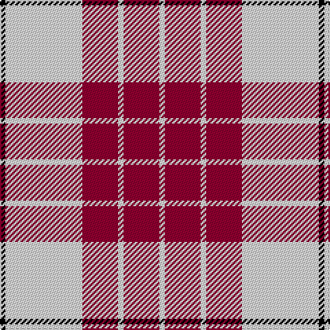

In pattern [KWRWRW](/patterns/kwrwrw/).

This was sourced from weddslist.  It is a [6 stripes tartan](/stripes/stripes6/).

Original link http://www.weddslist.com/cgi-bin/tartans/pg.pl?source=sts

## Thread count
K/4 LN56 DR26 LN4 DR26 LN/4

## Palette
Each colour and its ΔE from the base-6 reference it is a variant of.

| Colour | Shade | Base | ΔE (OKLab) |
|---|---|---|---|
| DR | <code style="background-color:#900030;">#900030</code> `#900030` | R <code style="background-color:#CC0000;">#CC0000</code> | 0.14 |
| K | <code style="background-color:#000000;">#000000</code> `#000000` | K <code style="background-color:#000000;">#000000</code> | 0.00 |
| LN | <code style="background-color:#E0E0E0;">#E0E0E0</code> `#E0E0E0` | W <code style="background-color:#F7F7F7;">#F7F7F7</code> | 0.07 |

# Sample pattern

## Nearest tartans

The nearest existing variants by ΔTartan distance.

1. [Buchanan #5](/setts/s6/k4w56r26w4r26w4-k101010-r960028-we0e0e0/) — ΔT 0.20
1. [Erskine, Burgundy (Dance)](/setts/s6/r12w4r58w58r4w12-r800028-wfcfcfc/) — ΔT 0.96
1. [Erskine Dress Burgandy Clan Tartan Tartan Number: 1972. Earliest known date: 1971 A popular Dress tartan for Scottish Highland Dancing. See products available Copyright © Blair Urquhart, Comrie, 2015](/setts/s6/r10w4r50w50r4w10-r901c38-we0e0e0/) — ΔT 0.98
1. [MacPherson Dress Burgundy (Dance)](/setts/s7/w8k4w50r42w6r16y6-k101010-r880000-we0e0e0-ye8c000/) — ΔT 1.20
1. [Gavin (Personal)](/setts/s7/w52b4w6b30b52ba4b6-b680028-ba4c0000-wfcfcfc/) — ΔT 1.25
1. [Cunningham Dress Burgundy (Dance)](/setts/s7/w10r4w68r68k4r4y8-k101010-r800028-wf8f8f8-ye8c000/) — ΔT 1.33
1. [Arduaine, Red (Dance)](/setts/s7/w10k4w60r48w6r16b6-b003c64-k101010-rc8002c-wf0e0c8/) — ΔT 1.34
1. [Malaysian Unknown (Artefact)](/setts/s5/w90r4g18w4r60-g006818-r880000-we8ccb8/) — ΔT 1.34
1. [MacPherson, Burgundy dress](/setts/s7/w8k4w50r42w6r16y6-k000000-rc00000-we0e0e0-yf0c000/) — ΔT 1.37
1. [Erskine, (Red)](/setts/s6/r12w4r58w58r4w12-rc00000-we0e0e0/) — ΔT 1.41

## Neighbour map

Every grey dot is one of 15726 variants placed by the first two principal components of the ΔTartan feature space (44% of its variance). Red is this tartan; blue dots are its nearest — click one to open its page.

<svg viewBox="0 0 640 380" role="img" style="max-width:100%;height:auto;border:1px solid #e0e0e0;border-radius:4px;display:block" xmlns="http://www.w3.org/2000/svg"><image href="/nn/cloud.v1.png" width="640" height="380"/><a href="/setts/s6/k4w56r26w4r26w4-k101010-r960028-we0e0e0/"><circle cx="323.9" cy="174.9" r="4" fill="#3465a4"><title>Buchanan #5</title></circle></a><a href="/setts/s6/r12w4r58w58r4w12-r800028-wfcfcfc/"><circle cx="333.9" cy="183.8" r="4" fill="#3465a4"><title>Erskine, Burgundy (Dance)</title></circle></a><a href="/setts/s6/r10w4r50w50r4w10-r901c38-we0e0e0/"><circle cx="342.7" cy="196.2" r="4" fill="#3465a4"><title>Erskine Dress Burgandy Clan Tartan Tartan Number: 1972. Earliest known date: 1971 A popular Dress tartan for Scottish Highland Dancing. See products available Copyright © Blair Urquhart, Comrie, 2015</title></circle></a><a href="/setts/s7/w8k4w50r42w6r16y6-k101010-r880000-we0e0e0-ye8c000/"><circle cx="265.0" cy="156.7" r="4" fill="#3465a4"><title>MacPherson Dress Burgundy (Dance)</title></circle></a><a href="/setts/s7/w52b4w6b30b52ba4b6-b680028-ba4c0000-wfcfcfc/"><circle cx="305.2" cy="155.8" r="4" fill="#3465a4"><title>Gavin (Personal)</title></circle></a><a href="/setts/s7/w10r4w68r68k4r4y8-k101010-r800028-wf8f8f8-ye8c000/"><circle cx="280.3" cy="125.0" r="4" fill="#3465a4"><title>Cunningham Dress Burgundy (Dance)</title></circle></a><a href="/setts/s7/w10k4w60r48w6r16b6-b003c64-k101010-rc8002c-wf0e0c8/"><circle cx="297.4" cy="145.0" r="4" fill="#3465a4"><title>Arduaine, Red (Dance)</title></circle></a><a href="/setts/s5/w90r4g18w4r60-g006818-r880000-we8ccb8/"><circle cx="336.3" cy="167.3" r="4" fill="#3465a4"><title>Malaysian Unknown (Artefact)</title></circle></a><a href="/setts/s7/w8k4w50r42w6r16y6-k000000-rc00000-we0e0e0-yf0c000/"><circle cx="272.9" cy="154.6" r="4" fill="#3465a4"><title>MacPherson, Burgundy dress</title></circle></a><a href="/setts/s6/r12w4r58w58r4w12-rc00000-we0e0e0/"><circle cx="359.5" cy="188.9" r="4" fill="#3465a4"><title>Erskine, (Red)</title></circle></a><circle cx="320.4" cy="174.2" r="5" fill="#c00000"/></svg>

ID: /setts/s6/k4w56r26w4r26w4-k000000-r900030-we0e0e0/
