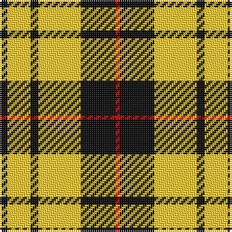

In pattern [KYKYKR](/patterns/kykykr/).

This was sourced from register-of-tartans.  It is a [6 stripes tartan](/stripes/stripes6/).

Original link https://www.tartanregister.gov.uk/tartanDetails.aspx?ref=10512

## Thread count
K/4 Y12 K4 Y22 K18 R/2

## Palette
Each colour and its ΔE from the base-6 reference it is a variant of.

| Colour | Shade | Base | ΔE (OKLab) |
|---|---|---|---|
| K | <code style="background-color:#101010;">#101010</code> `#101010` | K <code style="background-color:#000000;">#000000</code> | 0.17 |
| R | <code style="background-color:#FF0000;">#FF0000</code> `#FF0000` | R <code style="background-color:#C80000;">#C80000</code> | 0.11 |
| Y | <code style="background-color:#FFCC33;">#FFCC33</code> `#FFCC33` | Y <code style="background-color:#E8C000;">#E8C000</code> | 0.05 |

# Sample pattern

ID: /setts/s6/k4y12k4y22k18r2-k101010-rff0000-yffcc33/
