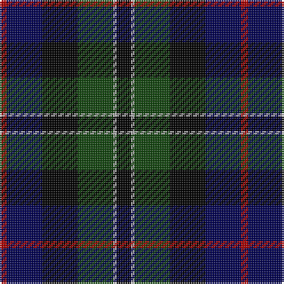

In pattern [KYGKBR](/patterns/kygkbr/).

This was sourced from weddslist.  It is a [6 stripes tartan](/stripes/stripes6/).

Original link http://www.weddslist.com/cgi-bin/tartans/pg.pl?source=tinsel

## Attestations

This cloth appears in 2 source records; the oldest owns this page.

- undated — Rose Hunting (weddslist, [record](http://www.weddslist.com/cgi-bin/tartans/pg.pl?source=tinsel))
- undated — Rose Hunting (weddslist, [record](http://www.weddslist.com/cgi-bin/tartans/pg.pl?source=x))

## Thread count
DR/4 DB20 K20 DG20 N2 K/8

## Palette
Each colour and its ΔE from the base-6 reference it is a variant of.

| Colour | Shade | Base | ΔE (OKLab) |
|---|---|---|---|
| DB | <code style="background-color:#000052;">#000052</code> `#000052` | B <code style="background-color:#2A418A;">#2A418A</code> | 0.20 |
| DG | <code style="background-color:#11450D;">#11450D</code> `#11450D` | G <code style="background-color:#006100;">#006100</code> | 0.09 |
| DR | <code style="background-color:#AA0000;">#AA0000</code> `#AA0000` | R <code style="background-color:#CC0000;">#CC0000</code> | 0.07 |
| K | <code style="background-color:#000000;">#000000</code> `#000000` | K <code style="background-color:#000000;">#000000</code> | 0.00 |
| N | <code style="background-color:#AAAAAA;">#AAAAAA</code> `#AAAAAA` | Y <code style="background-color:#F2BF00;">#F2BF00</code> | 0.19 |

# Sample pattern

## Nearest tartans

The nearest existing variants by ΔTartan distance.

1. [Rose Hunting](/setts/s6/g4w1g10k10b10r2~b00004c-g004c00-k000000-rc80000-wd0d0d0/) — ΔT 0.65
1. [Mitchell](/setts/s6/k2g12k12r1b12y2~b000052-g11450d-k000000-raa0000-yaaaaaa~x2/) — ΔT 0.66
1. [Mitchell](/setts/s6/k2g12k12r1b12y2~b000052-g11450d-k000000-raa0000-yaaaaaa/) — ΔT 0.66
1. [Leslie Hunting](/setts/s6/r2b8k8y1g8k1~b000052-g11450d-k000000-raa0000-yaaaaaa~x2/) — ΔT 0.71
1. [Leslie Hunting](/setts/s6/r2b8k8y1g8k1~b000052-g11450d-k000000-raa0000-yaaaaaa/) — ΔT 0.71
1. [Brodie Hunting](/setts/s7/r2b8g8k8y1k8r2~b000052-g11450d-k000000-raa0000-yaaaa00~x2/) — ΔT 0.80
1. [Brodie Hunting](/setts/s7/r2b8g8k8y1k8r2~b000052-g11450d-k000000-raa0000-yaaaa00/) — ΔT 0.80
1. [Campbell of Cawdor](/setts/s7/b2k1g8k8ba8k1r2~b4367ae-ba000052-g11450d-k000000-raa0000~x2/) — ΔT 0.83
1. [Campbell of Cawdor](/setts/s7/b2k1g8k8ba8k1r2~b4367ae-ba000052-g11450d-k000000-raa0000/) — ΔT 0.83
1. [Mitchell](/setts/s6/k2g12k12r1b12w2~b00004c-g004c00-k000000-rc80000-wd0d0d0/) — ΔT 0.85

## Neighbour map

Every grey dot is one of 15726 variants placed by the first two principal components of the ΔTartan feature space (44% of its variance). Red is this tartan; blue dots are its nearest — click one to open its page.

<svg viewBox="0 0 640 380" role="img" style="max-width:100%;height:auto;border:1px solid #e0e0e0;border-radius:4px;display:block" xmlns="http://www.w3.org/2000/svg"><image href="/nn/cloud.v1.png" width="640" height="380"/><a href="/setts/s6/g4w1g10k10b10r2~b00004c-g004c00-k000000-rc80000-wd0d0d0/"><circle cx="153.3" cy="221.9" r="4" fill="#3465a4"><title>Rose Hunting</title></circle></a><a href="/setts/s6/k2g12k12r1b12y2~b000052-g11450d-k000000-raa0000-yaaaaaa~x2/"><circle cx="166.4" cy="207.6" r="4" fill="#3465a4"><title>Mitchell</title></circle></a><a href="/setts/s6/k2g12k12r1b12y2~b000052-g11450d-k000000-raa0000-yaaaaaa/"><circle cx="166.4" cy="207.6" r="4" fill="#3465a4"><title>Mitchell</title></circle></a><a href="/setts/s6/r2b8k8y1g8k1~b000052-g11450d-k000000-raa0000-yaaaaaa~x2/"><circle cx="135.2" cy="222.9" r="4" fill="#3465a4"><title>Leslie Hunting</title></circle></a><a href="/setts/s6/r2b8k8y1g8k1~b000052-g11450d-k000000-raa0000-yaaaaaa/"><circle cx="135.2" cy="222.9" r="4" fill="#3465a4"><title>Leslie Hunting</title></circle></a><a href="/setts/s7/r2b8g8k8y1k8r2~b000052-g11450d-k000000-raa0000-yaaaa00~x2/"><circle cx="162.1" cy="228.8" r="4" fill="#3465a4"><title>Brodie Hunting</title></circle></a><a href="/setts/s7/r2b8g8k8y1k8r2~b000052-g11450d-k000000-raa0000-yaaaa00/"><circle cx="162.1" cy="228.8" r="4" fill="#3465a4"><title>Brodie Hunting</title></circle></a><a href="/setts/s7/b2k1g8k8ba8k1r2~b4367ae-ba000052-g11450d-k000000-raa0000~x2/"><circle cx="139.9" cy="214.6" r="4" fill="#3465a4"><title>Campbell of Cawdor</title></circle></a><a href="/setts/s7/b2k1g8k8ba8k1r2~b4367ae-ba000052-g11450d-k000000-raa0000/"><circle cx="139.9" cy="214.6" r="4" fill="#3465a4"><title>Campbell of Cawdor</title></circle></a><a href="/setts/s6/k2g12k12r1b12w2~b00004c-g004c00-k000000-rc80000-wd0d0d0/"><circle cx="154.5" cy="203.0" r="4" fill="#3465a4"><title>Mitchell</title></circle></a><circle cx="165.5" cy="227.2" r="5" fill="#c00000"/></svg>

ID: /setts/s6/k4y1g10k10b10r2~b000052-g11450d-k000000-raa0000-yaaaaaa~x2/
