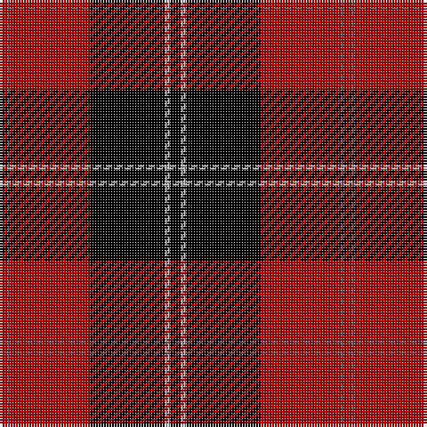

In pattern [KYKRBR](/patterns/kykrbr/).

This was sourced from weddslist.  It is a [6 stripes tartan](/stripes/stripes6/).

Original link http://www.weddslist.com/cgi-bin/tartans/pg.pl?source=x

## Thread count
DR/3 N1 DR30 K28 Na2 K/4

## Palette
Each colour and its ΔE from the base-6 reference it is a variant of.

| Colour | Shade | Base | ΔE (OKLab) |
|---|---|---|---|
| DR | <code style="background-color:#AA0000;">#AA0000</code> `#AA0000` | R <code style="background-color:#C80000;">#C80000</code> | 0.06 |
| K | <code style="background-color:#000000;">#000000</code> `#000000` | K <code style="background-color:#000000;">#000000</code> | 0.00 |
| N | <code style="background-color:#6E5058;">#6E5058</code> `#6E5058` | B <code style="background-color:#2C4084;">#2C4084</code> | 0.14 |
| Na | <code style="background-color:#AAAAAA;">#AAAAAA</code> `#AAAAAA` | Y <code style="background-color:#E8C000;">#E8C000</code> | 0.19 |

# Sample pattern

## Nearest tartans

The nearest existing variants by ΔTartan distance.

1. [Ramsay](/setts/s6/k8y4k56r60b2r6-b6e5058-k000000-raa0000-yaaaaaa/) — ΔT 0.00
1. [Ramsay](/setts/s6/k8w4k56r60b2r6-b300030-k000000-rc00000-we0e0e0/) — ΔT 0.36
1. [Ramsay](/setts/s6/k8w4k56r60b2r6-b00004c-k000000-rc80000-wd0d0d0/) — ΔT 0.42
1. [Cunningham](/setts/s7/k6r2k60r56b2r2y6-b000052-k000000-raa0000-yaaaaaa/) — ΔT 0.59
1. [Cunningham](/setts/s7/k6r2k60r56b2r2w6-b304080-k000000-rc00000-we0e0e0/) — ΔT 0.65
1. [Cunningham](/setts/s7/k6r2k60r56b2r2w6-b00004c-k000000-rc80000-wd0d0d0/) — ΔT 0.66
1. [Ramsay of Dalhousie](/setts/s6/k8w4k56r60k2r6-k000000-rc00000-we0e0e0/) — ΔT 0.92
1. [Cunningham D](/setts/s7/k6r2k60r56k2r2y6-k000000-raa0000-yaaaaaa/) — ΔT 1.03
1. [Cunningham](/setts/s7/k6r2k60r56k2r2w6-k000000-rc00000-we0e0e0/) — ΔT 1.06
1. [Cunningham D](/setts/s7/k6r2k60r56k2r2w6-k000000-rc80000-wd0d0d0/) — ΔT 1.07

## Neighbour map

Every grey dot is one of 15726 variants placed by the first two principal components of the ΔTartan feature space (44% of its variance). Red is this tartan; blue dots are its nearest — click one to open its page.

<svg viewBox="0 0 640 380" role="img" style="max-width:100%;height:auto;border:1px solid #e0e0e0;border-radius:4px;display:block" xmlns="http://www.w3.org/2000/svg"><image href="/nn/cloud.v1.png" width="640" height="380"/><a href="/setts/s6/k8y4k56r60b2r6-b6e5058-k000000-raa0000-yaaaaaa/"><circle cx="344.2" cy="144.2" r="4" fill="#3465a4"><title>Ramsay</title></circle></a><a href="/setts/s6/k8w4k56r60b2r6-b300030-k000000-rc00000-we0e0e0/"><circle cx="337.9" cy="139.2" r="4" fill="#3465a4"><title>Ramsay</title></circle></a><a href="/setts/s6/k8w4k56r60b2r6-b00004c-k000000-rc80000-wd0d0d0/"><circle cx="336.8" cy="138.3" r="4" fill="#3465a4"><title>Ramsay</title></circle></a><a href="/setts/s7/k6r2k60r56b2r2y6-b000052-k000000-raa0000-yaaaaaa/"><circle cx="346.0" cy="127.4" r="4" fill="#3465a4"><title>Cunningham</title></circle></a><a href="/setts/s7/k6r2k60r56b2r2w6-b304080-k000000-rc00000-we0e0e0/"><circle cx="338.8" cy="121.8" r="4" fill="#3465a4"><title>Cunningham</title></circle></a><a href="/setts/s7/k6r2k60r56b2r2w6-b00004c-k000000-rc80000-wd0d0d0/"><circle cx="338.7" cy="121.3" r="4" fill="#3465a4"><title>Cunningham</title></circle></a><a href="/setts/s6/k8w4k56r60k2r6-k000000-rc00000-we0e0e0/"><circle cx="360.1" cy="155.2" r="4" fill="#3465a4"><title>Ramsay of Dalhousie</title></circle></a><a href="/setts/s7/k6r2k60r56k2r2y6-k000000-raa0000-yaaaaaa/"><circle cx="373.7" cy="143.2" r="4" fill="#3465a4"><title>Cunningham D</title></circle></a><a href="/setts/s7/k6r2k60r56k2r2w6-k000000-rc00000-we0e0e0/"><circle cx="366.7" cy="138.0" r="4" fill="#3465a4"><title>Cunningham</title></circle></a><a href="/setts/s7/k6r2k60r56k2r2w6-k000000-rc80000-wd0d0d0/"><circle cx="366.5" cy="137.2" r="4" fill="#3465a4"><title>Cunningham D</title></circle></a><circle cx="344.2" cy="144.2" r="5" fill="#c00000"/></svg>

ID: /setts/s6/k4y2k28r30b1r3-b6e5058-k000000-raa0000-yaaaaaa/
