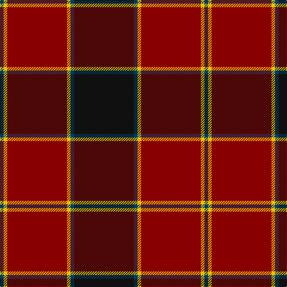

In pattern [BYRYBK](/patterns/byrybk/).

This was sourced from register-of-tartans.  It is a [6 stripes tartan](/stripes/stripes6/).

Original link https://www.tartanregister.gov.uk/tartanDetails.aspx?ref=1785

## Thread count
DB/6 Y6 DR100 Y6 DB6 K/100

## Palette
Each colour and its ΔE from the base-6 reference it is a variant of.

| Colour | Shade | Base | ΔE (OKLab) |
|---|---|---|---|
| DB | <code style="background-color:#003C64;">#003C64</code> `#003C64` | B <code style="background-color:#2A418A;">#2A418A</code> | 0.08 |
| DR | <code style="background-color:#880000;">#880000</code> `#880000` | R <code style="background-color:#CC0000;">#CC0000</code> | 0.15 |
| K | <code style="background-color:#101010;">#101010</code> `#101010` | K <code style="background-color:#000000;">#000000</code> | 0.17 |
| Y | <code style="background-color:#E8C000;">#E8C000</code> `#E8C000` | Y <code style="background-color:#F2BF00;">#F2BF00</code> | 0.02 |

# Sample pattern

## Nearest tartans

The nearest existing variants by ΔTartan distance.

1. [Dunbar (District)](/setts/s6/k8r49k8w3k20y3x2~k101010-r880000-wc0c0c0-yd09800/) — ΔT 0.99
1. [Swedish Para Whisky Club (Corporate](/setts/s6/b2g14w3b13y1b2x4~b680028-g003820-w98c8e8-yc4bc68/) — ΔT 1.18
1. [Gallmore (Fashion)](/setts/s9/r3k14ra3k14b3ra32k2ra6k2x2~b58788c-k101010-r888888-ra980000/) — ΔT 1.22
1. [Carson Red (Personal)](/setts/s8/b19r2b3r2b3k43r22g3x2~b446c84-g006818-k101010-rc80000/) — ΔT 1.30
1. [Americana - 1978 #2 (Fashion)](/setts/s7/b2r2b28k11r27w2r2x2~b1c1c50-k101010-rc80000-we0e0e0/) — ΔT 1.32
1. [Plummer Family Personal Tartan Tartan Number: 2778. Earliest known date: 2001 From a D C Dalgliesh swatch in 2001 via Phil Smith June 2004. See products available Copyright © Blair Urquhart, Comrie, 2015](/setts/s6/r30k8g30b4r3b2x2~b1860a8-g005028-k101010-rc80000/) — ΔT 1.32
1. [Fraser VS](/setts/s6/r1b6r1g6r12y1x2~b000052-g11450d-raa0000-yaaaaaa/) — ΔT 1.33
1. [MacAlister of Skye (Clan?)](/setts/s9/r4k5y1r26w1k30y1k1y4x2~k101010-r880000-wc0c0c0-yd09800/) — ΔT 1.33
1. [Hungerford RFC (Corporate)](/setts/s4/k50b3y3r50x2~b003c64-k101010-r880000-ye8c000/) — ΔT 1.34
1. [Maciver of Strathendry Castle Dress (Personal)](/setts/s9/w1k3r3k24r3k3r24k3y1x2~k101010-r800028-wffffff-yffff00/) — ΔT 1.35

## Neighbour map

Every grey dot is one of 15726 variants placed by the first two principal components of the ΔTartan feature space (44% of its variance). Red is this tartan; blue dots are its nearest — click one to open its page.

<svg viewBox="0 0 640 380" role="img" style="max-width:100%;height:auto;border:1px solid #e0e0e0;border-radius:4px;display:block" xmlns="http://www.w3.org/2000/svg"><image href="/nn/cloud.v1.png" width="640" height="380"/><a href="/setts/s6/k8r49k8w3k20y3x2~k101010-r880000-wc0c0c0-yd09800/"><circle cx="371.0" cy="184.4" r="4" fill="#3465a4"><title>Dunbar (District)</title></circle></a><a href="/setts/s6/b2g14w3b13y1b2x4~b680028-g003820-w98c8e8-yc4bc68/"><circle cx="311.1" cy="198.8" r="4" fill="#3465a4"><title>Swedish Para Whisky Club (Corporate</title></circle></a><a href="/setts/s9/r3k14ra3k14b3ra32k2ra6k2x2~b58788c-k101010-r888888-ra980000/"><circle cx="356.9" cy="168.4" r="4" fill="#3465a4"><title>Gallmore (Fashion)</title></circle></a><a href="/setts/s8/b19r2b3r2b3k43r22g3x2~b446c84-g006818-k101010-rc80000/"><circle cx="282.8" cy="147.8" r="4" fill="#3465a4"><title>Carson Red (Personal)</title></circle></a><a href="/setts/s7/b2r2b28k11r27w2r2x2~b1c1c50-k101010-rc80000-we0e0e0/"><circle cx="269.1" cy="169.7" r="4" fill="#3465a4"><title>Americana - 1978 #2 (Fashion)</title></circle></a><a href="/setts/s6/r30k8g30b4r3b2x2~b1860a8-g005028-k101010-rc80000/"><circle cx="279.4" cy="187.3" r="4" fill="#3465a4"><title>Plummer Family Personal Tartan Tartan Number: 2778. Earliest known date: 2001 From a D C Dalgliesh swatch in 2001 via Phil Smith June 2004. See products available Copyright © Blair Urquhart, Comrie, 2015</title></circle></a><a href="/setts/s6/r1b6r1g6r12y1x2~b000052-g11450d-raa0000-yaaaaaa/"><circle cx="297.8" cy="198.4" r="4" fill="#3465a4"><title>Fraser VS</title></circle></a><a href="/setts/s9/r4k5y1r26w1k30y1k1y4x2~k101010-r880000-wc0c0c0-yd09800/"><circle cx="363.7" cy="128.0" r="4" fill="#3465a4"><title>MacAlister of Skye (Clan?)</title></circle></a><a href="/setts/s4/k50b3y3r50x2~b003c64-k101010-r880000-ye8c000/"><circle cx="355.0" cy="221.0" r="4" fill="#3465a4"><title>Hungerford RFC (Corporate)</title></circle></a><a href="/setts/s9/w1k3r3k24r3k3r24k3y1x2~k101010-r800028-wffffff-yffff00/"><circle cx="385.0" cy="147.3" r="4" fill="#3465a4"><title>Maciver of Strathendry Castle Dress (Personal)</title></circle></a><circle cx="327.4" cy="175.3" r="5" fill="#c00000"/></svg>

ID: /setts/s6/k50b3y3r50y3b3x2~b003c64-k101010-r880000-ye8c000/
