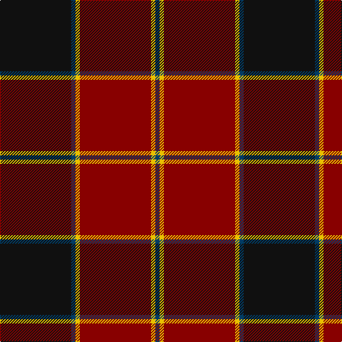

In pattern [BYRYBK](/stripes/byrybk/).

This was sourced from register-of-tartans.  It is a [6 stripe tartan](/stripes/stripes6/).

Original link https://www.tartanregister.gov.uk/tartanDetails.aspx?ref=1785

## Also known as

This cloth is also recorded under:

- Hungerford RFC Personal

## Register references

External register numbers recorded for this tartan.

- Scottish Register of Tartans: [1785](https://www.tartanregister.gov.uk/tartanDetails.aspx?ref=1785)
- Scottish Tartans Authority (ITI): 6863

## Thread count
K/100 DB6 Y6 DR100 Y6 DB/6

## Palette
Each colour and the base-6 reference it is a variant of.

| Colour | Shade | Base |
|---|---|---|
| DB | <code style="background-color:#003C64;">#003C64</code> `oklch(34.5% 0.089 246.0)` <small>#003C64</small> | B <code style="background-color:#2A418A;">#2A418A</code> |
| DR | <code style="background-color:#880000;">#880000</code> `oklch(39.4% 0.162 29.2)` <small>#880000</small> | R <code style="background-color:#CC0000;">#CC0000</code> |
| K | <code style="background-color:#101010;">#101010</code> `oklch(17.3% 0.000 89.9)` <small>#101010</small> | K <code style="background-color:#000000;">#000000</code> |
| Y | <code style="background-color:#E8C000;">#E8C000</code> `oklch(81.9% 0.168 93.7)` <small>#E8C000</small> | Y <code style="background-color:#F2BF00;">#F2BF00</code> |

# Sample pattern

## Nearest tartans

The nearest existing variants by ΔTartan distance, with this tartan at the top so the swatches line up against it.

ΔTartan

Tartan

Sett

—

<a href="/ttd/edit/#slug=k50dt3ly3r50~x2">Hungerford RFC</a> <a class="nn-out" href="/setts/s6/k50dt3ly3r50~x2/" title="open its dictionary page">↗</a>

0.98

<a href="/ttd/edit/#slug=k8r49k8lb3k20lo3~x2">Dunbar (District)</a> <a class="nn-out" href="/setts/s6/k8r49k8lb3k20lo3~x2/" title="open its dictionary page">↗</a>

1.19

<a href="/ttd/edit/#slug=dr2dg14lb3dr13ly1dr2~x4">Swedish Para Whisky Club (Corporate</a> <a class="nn-out" href="/setts/s6/dr2dg14lb3dr13ly1dr2~x4/" title="open its dictionary page">↗</a>

1.22

<a href="/ttd/edit/#slug=o3k14r3k14t3r32k2r6k2~x2">Gallmore (Fashion)</a> <a class="nn-out" href="/setts/s9/o3k14r3k14t3r32k2r6k2~x2/" title="open its dictionary page">↗</a>

1.30

<a href="/ttd/edit/#slug=n19r2n3r2n3k43r22g3~x2">Carson Red (Personal)</a> <a class="nn-out" href="/setts/s8/n19r2n3r2n3k43r22g3~x2/" title="open its dictionary page">↗</a>

1.32

<a href="/ttd/edit/#slug=db2r2db28k11r27w2r2~x2">Americana - 1978 #2 (Fashion)</a> <a class="nn-out" href="/setts/s7/db2r2db28k11r27w2r2~x2/" title="open its dictionary page">↗</a>

1.33

<a href="/ttd/edit/#slug=r4k5lo1r26lb1k30lo1k1lo4~x2">MacAlister of Skye (Clan?)</a> <a class="nn-out" href="/setts/s9/r4k5lo1r26lb1k30lo1k1lo4~x2/" title="open its dictionary page">↗</a>

1.33

<a href="/ttd/edit/#slug=r30k8dg30b4r3b2~x2">Plummer Family Personal Tartan Tartan Number: 2778. Earliest known date: 2001 From a D C Dalgliesh swatch in 2001 via Phil Smith June 2004. See products available Copyright © Blair Urquhart, Comrie, 2015</a> <a class="nn-out" href="/setts/s6/r30k8dg30b4r3b2~x2/" title="open its dictionary page">↗</a>

1.33

<a href="/ttd/edit/#slug=r1db6r1dg6r12lr1~x2">Fraser VS</a> <a class="nn-out" href="/setts/s6/r1db6r1dg6r12lr1~x2/" title="open its dictionary page">↗</a>

1.34

<a href="/ttd/edit/#slug=k50dt3ly3r50~x2">Hungerford RFC (Corporate)</a> <a class="nn-out" href="/setts/s4/k50dt3ly3r50~x2/" title="open its dictionary page">↗</a>

1.35

<a href="/ttd/edit/#slug=w1k3r3k24r3k3r24k3ly1~x2">Maciver of Strathendry Castle Dress (Personal)</a> <a class="nn-out" href="/setts/s9/w1k3r3k24r3k3r24k3ly1~x2/" title="open its dictionary page">↗</a>

## Neighbour map

Every grey dot is one of 14299 variants placed by the first two principal components of the ΔTartan feature space (44% of its variance). Red is this tartan; blue dots are its nearest — click one to open its page.

<svg viewBox="0 0 640 380" role="img" style="max-width:100%;height:auto;border:1px solid #e0e0e0;border-radius:4px;display:block" xmlns="http://www.w3.org/2000/svg"><image href="/nn/cloud.v1.png" width="640" height="380"/><a href="/setts/s6/k8r49k8lb3k20lo3~x2/"><circle cx="371.7" cy="182.9" r="4" fill="#3465a4"><title>Dunbar (District)</title></circle></a><a href="/setts/s6/dr2dg14lb3dr13ly1dr2~x4/"><circle cx="312.8" cy="199.0" r="4" fill="#3465a4"><title>Swedish Para Whisky Club (Corporate</title></circle></a><a href="/setts/s9/o3k14r3k14t3r32k2r6k2~x2/"><circle cx="357.6" cy="168.3" r="4" fill="#3465a4"><title>Gallmore (Fashion)</title></circle></a><a href="/setts/s8/n19r2n3r2n3k43r22g3~x2/"><circle cx="284.9" cy="147.7" r="4" fill="#3465a4"><title>Carson Red (Personal)</title></circle></a><a href="/setts/s7/db2r2db28k11r27w2r2~x2/"><circle cx="270.5" cy="168.0" r="4" fill="#3465a4"><title>Americana - 1978 #2 (Fashion)</title></circle></a><a href="/setts/s9/r4k5lo1r26lb1k30lo1k1lo4~x2/"><circle cx="365.0" cy="127.2" r="4" fill="#3465a4"><title>MacAlister of Skye (Clan?)</title></circle></a><a href="/setts/s6/r30k8dg30b4r3b2~x2/"><circle cx="280.6" cy="187.6" r="4" fill="#3465a4"><title>Plummer Family Personal Tartan Tartan Number: 2778. Earliest known date: 2001 From a D C Dalgliesh swatch in 2001 via Phil Smith June 2004. See products available Copyright © Blair Urquhart, Comrie, 2015</title></circle></a><a href="/setts/s6/r1db6r1dg6r12lr1~x2/"><circle cx="298.9" cy="196.9" r="4" fill="#3465a4"><title>Fraser VS</title></circle></a><a href="/setts/s4/k50dt3ly3r50~x2/"><circle cx="355.9" cy="221.0" r="4" fill="#3465a4"><title>Hungerford RFC (Corporate)</title></circle></a><a href="/setts/s9/w1k3r3k24r3k3r24k3ly1~x2/"><circle cx="386.2" cy="147.2" r="4" fill="#3465a4"><title>Maciver of Strathendry Castle Dress (Personal)</title></circle></a><circle cx="328.8" cy="175.0" r="5" fill="#c00000"/></svg>

ID: /setts/s6/k50dt3ly3r50~x2/
