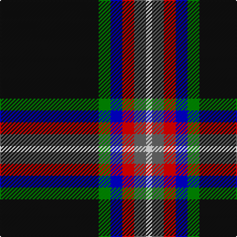

In pattern [KGBRBW](/patterns/kgbrbw/).

This was sourced from register-of-tartans.  It is a [6 stripes tartan](/stripes/stripes6/).

Original link https://www.tartanregister.gov.uk/tartanDetails.aspx?ref=10288

## Thread count
K/100 G12 B12 R12 N12 W/6

## Palette
Each colour and its ΔE from the base-6 reference it is a variant of.

| Colour | Shade | Base | ΔE (OKLab) |
|---|---|---|---|
| B | <code style="background-color:#0000CD;">#0000CD</code> `#0000CD` | B <code style="background-color:#2A418A;">#2A418A</code> | 0.14 |
| G | <code style="background-color:#008B00;">#008B00</code> `#008B00` | G <code style="background-color:#006100;">#006100</code> | 0.13 |
| K | <code style="background-color:#101010;">#101010</code> `#101010` | K <code style="background-color:#000000;">#000000</code> | 0.17 |
| N | <code style="background-color:#666666;">#666666</code> `#666666` | B <code style="background-color:#2A418A;">#2A418A</code> | 0.17 |
| R | <code style="background-color:#FF0000;">#FF0000</code> `#FF0000` | R <code style="background-color:#CC0000;">#CC0000</code> | 0.11 |
| W | <code style="background-color:#FFFFFF;">#FFFFFF</code> `#FFFFFF` | W <code style="background-color:#F7F7F7;">#F7F7F7</code> | 0.02 |

# Sample pattern

## Nearest tartans

The nearest existing variants by ΔTartan distance.

1. [Victory](/setts/s9/k2r3k36b2k5b7y3w5ya2x2~b666666-k101010-re3170d-w82cffd-yffe600-ya86c67c/) — ΔT 0.98
1. [Pavelka Ltd](/setts/s8/g3k48g5w3g3ga2gb5wa3x2~g604000-ga006818-gb048888-k101010-wfcfcfc-wa98c8e8/) — ΔT 1.17
1. [Tainsh (2016)](/setts/s6/k62r9w7wa6y3g6x2~g008b00-k000000-ra00000-wfcfcfc-wa00fcfc-yffff00/) — ΔT 1.21
1. [Pavelka Limited](/setts/s8/w3g5ga2y3wa3y5k48wa3x2~g048888-ga00643c-k101010-w00fcfc-waf8f8f8-ya08858/) — ΔT 1.26
1. [Stott (Personal)](/setts/s9/w2k25b2g6y2r6b2k25w2x2~b284c64-g285828-k101010-r9c2430-wececec-ydcb824/) — ΔT 1.27
1. [Coalfields Regeneration Trust, The](/setts/s7/k2r1y1g8k15g2b1x4~b780078-g789484-k101010-ra00000-ye8c000/) — ΔT 1.29
1. [Friends of Nordegg (Corporate)](/setts/s5/k50b6r6ra6w3x2~b2c2c80-k101010-rc80000-ra888888-we0e0e0/) — ΔT 1.34
1. [Coalfields Regeneration Trust, The](/setts/s7/k2r1y1g8k15g2b1x2~b780078-g408060-k101010-rc8002c-yfccc00/) — ΔT 1.37
1. [Iron Horse](/setts/s11/k16b4w3k2ba1wa1r1k2w3b4k12x4~b5c5c5c-ba2c2c80-k101010-rff0000-wc0c0c0-wae0e0e0/) — ΔT 1.39
1. [Genet, Edmond Charles 'Citizen' (Personal)](/setts/s7/r4k9g9ka40r2ka2w2x2~g285800-k101010-ka000028-rdc0000-wf8f8f8/) — ΔT 1.45

## Neighbour map

Every grey dot is one of 15726 variants placed by the first two principal components of the ΔTartan feature space (44% of its variance). Red is this tartan; blue dots are its nearest — click one to open its page.

<svg viewBox="0 0 640 380" role="img" style="max-width:100%;height:auto;border:1px solid #e0e0e0;border-radius:4px;display:block" xmlns="http://www.w3.org/2000/svg"><image href="/nn/cloud.v1.png" width="640" height="380"/><a href="/setts/s9/k2r3k36b2k5b7y3w5ya2x2~b666666-k101010-re3170d-w82cffd-yffe600-ya86c67c/"><circle cx="343.5" cy="104.7" r="4" fill="#3465a4"><title>Victory</title></circle></a><a href="/setts/s8/g3k48g5w3g3ga2gb5wa3x2~g604000-ga006818-gb048888-k101010-wfcfcfc-wa98c8e8/"><circle cx="385.1" cy="99.4" r="4" fill="#3465a4"><title>Pavelka Ltd</title></circle></a><a href="/setts/s6/k62r9w7wa6y3g6x2~g008b00-k000000-ra00000-wfcfcfc-wa00fcfc-yffff00/"><circle cx="340.1" cy="121.0" r="4" fill="#3465a4"><title>Tainsh (2016)</title></circle></a><a href="/setts/s8/w3g5ga2y3wa3y5k48wa3x2~g048888-ga00643c-k101010-w00fcfc-waf8f8f8-ya08858/"><circle cx="360.1" cy="89.1" r="4" fill="#3465a4"><title>Pavelka Limited</title></circle></a><a href="/setts/s9/w2k25b2g6y2r6b2k25w2x2~b284c64-g285828-k101010-r9c2430-wececec-ydcb824/"><circle cx="358.8" cy="143.1" r="4" fill="#3465a4"><title>Stott (Personal)</title></circle></a><a href="/setts/s7/k2r1y1g8k15g2b1x4~b780078-g789484-k101010-ra00000-ye8c000/"><circle cx="308.2" cy="151.9" r="4" fill="#3465a4"><title>Coalfields Regeneration Trust, The</title></circle></a><a href="/setts/s5/k50b6r6ra6w3x2~b2c2c80-k101010-rc80000-ra888888-we0e0e0/"><circle cx="416.8" cy="168.1" r="4" fill="#3465a4"><title>Friends of Nordegg (Corporate)</title></circle></a><a href="/setts/s7/k2r1y1g8k15g2b1x2~b780078-g408060-k101010-rc8002c-yfccc00/"><circle cx="317.6" cy="158.5" r="4" fill="#3465a4"><title>Coalfields Regeneration Trust, The</title></circle></a><a href="/setts/s11/k16b4w3k2ba1wa1r1k2w3b4k12x4~b5c5c5c-ba2c2c80-k101010-rff0000-wc0c0c0-wae0e0e0/"><circle cx="320.6" cy="124.7" r="4" fill="#3465a4"><title>Iron Horse</title></circle></a><a href="/setts/s7/r4k9g9ka40r2ka2w2x2~g285800-k101010-ka000028-rdc0000-wf8f8f8/"><circle cx="355.5" cy="146.9" r="4" fill="#3465a4"><title>Genet, Edmond Charles 'Citizen' (Personal)</title></circle></a><circle cx="337.7" cy="134.0" r="5" fill="#c00000"/></svg>

ID: /setts/s6/k50g6b6r6ba6w3x2~b0000cd-ba666666-g008b00-k101010-rff0000-wffffff/
