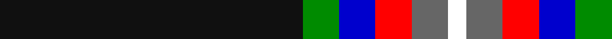

**Bands:** [KGBRBW](/stripes/kgbrbw/) · **Stripes:** [K G DB R N W](/stripes/stripes6/) K G DB R N W

This was sourced from register-of-tartans.  It is a [6 band tartan](/bands/bands6/).

Original link https://www.tartanregister.gov.uk/tartanDetails.aspx?ref=10288

## Register references

External register numbers recorded for this tartan.

- Scottish Register of Tartans: [10288](https://www.tartanregister.gov.uk/tartanDetails.aspx?ref=10288)

## Thread count
K/100 G12 B12 R12 N12 W/6

## Palette
Each colour and its ΔE from the base-6 reference it is a variant of.

| Colour | Shade | Base | ΔE (OKLab) |
|---|---|---|---|
| B | <code style="background-color:#0000CD;">#0000CD</code> `#0000CD` | B <code style="background-color:#2A418A;">#2A418A</code> | 0.14 |
| G | <code style="background-color:#008B00;">#008B00</code> `#008B00` | G <code style="background-color:#006100;">#006100</code> | 0.13 |
| K | <code style="background-color:#101010;">#101010</code> `#101010` | K <code style="background-color:#000000;">#000000</code> | 0.17 |
| N | <code style="background-color:#666666;">#666666</code> `#666666` | B <code style="background-color:#2A418A;">#2A418A</code> | 0.17 |
| R | <code style="background-color:#FF0000;">#FF0000</code> `#FF0000` | R <code style="background-color:#CC0000;">#CC0000</code> | 0.11 |
| W | <code style="background-color:#FFFFFF;">#FFFFFF</code> `#FFFFFF` | W <code style="background-color:#F7F7F7;">#F7F7F7</code> | 0.02 |

# Sample pattern

## Nearest tartans

The nearest existing variants by ΔTartan distance.

1. [Victory](/setts/s9/k2r3k36n2k5n7ly3lt5lg2~x2/) — ΔT 0.98
1. [Pavelka Ltd](/setts/s8/dy3k48dy5w3dy3g2g5lb3~x2/) — ΔT 1.17
1. [Tainsh (2016)](/setts/s6/k62r9w7lt6ly3g6~x2/) — ΔT 1.21
1. [Pavelka Limited](/setts/s8/w3k48lo5w3lo3g2g5lt3~x2/) — ΔT 1.26
1. [Stott (Personal)](/setts/s9/w2k25dt2dg6ly2r6dt2k25w2~x2/) — ΔT 1.27
1. [Coalfields Regeneration Trust, The](/setts/s7/k2r1ly1y8k15y2dp1~x4/) — ΔT 1.29
1. [Friends of Nordegg (Corporate)](/setts/s5/k50db6r6o6w3~x2/) — ΔT 1.34
1. [Coalfields Regeneration Trust, The](/setts/s7/k2r1ly1g8k15g2dp1~x2/) — ΔT 1.37
1. [Iron Horse](/setts/s11/k16n4lb3k2db1w1r1k2lb3n4k12~x4/) — ΔT 1.39
1. [Genet, Edmond Charles 'Citizen' (Personal)](/setts/s7/r4k9dg9k40r2k2w2~x2/) — ΔT 1.45

## Neighbour map

Every grey dot is one of 14299 variants placed by the first two principal components of the ΔTartan feature space (44% of its variance). Red is this tartan; blue dots are its nearest — click one to open its page.

<svg viewBox="0 0 640 380" role="img" style="max-width:100%;height:auto;border:1px solid #e0e0e0;border-radius:4px;display:block" xmlns="http://www.w3.org/2000/svg"><image href="/nn/cloud.v1.png" width="640" height="380"/><a href="/setts/s9/k2r3k36n2k5n7ly3lt5lg2~x2/"><circle cx="346.0" cy="101.7" r="4" fill="#3465a4"><title>Victory</title></circle></a><a href="/setts/s8/dy3k48dy5w3dy3g2g5lb3~x2/"><circle cx="387.7" cy="98.0" r="4" fill="#3465a4"><title>Pavelka Ltd</title></circle></a><a href="/setts/s6/k62r9w7lt6ly3g6~x2/"><circle cx="343.0" cy="116.1" r="4" fill="#3465a4"><title>Tainsh (2016)</title></circle></a><a href="/setts/s8/w3k48lo5w3lo3g2g5lt3~x2/"><circle cx="362.9" cy="85.6" r="4" fill="#3465a4"><title>Pavelka Limited</title></circle></a><a href="/setts/s9/w2k25dt2dg6ly2r6dt2k25w2~x2/"><circle cx="361.0" cy="141.5" r="4" fill="#3465a4"><title>Stott (Personal)</title></circle></a><a href="/setts/s7/k2r1ly1y8k15y2dp1~x4/"><circle cx="310.7" cy="149.4" r="4" fill="#3465a4"><title>Coalfields Regeneration Trust, The</title></circle></a><a href="/setts/s5/k50db6r6o6w3~x2/"><circle cx="418.8" cy="164.7" r="4" fill="#3465a4"><title>Friends of Nordegg (Corporate)</title></circle></a><a href="/setts/s7/k2r1ly1g8k15g2dp1~x2/"><circle cx="320.3" cy="157.4" r="4" fill="#3465a4"><title>Coalfields Regeneration Trust, The</title></circle></a><a href="/setts/s11/k16n4lb3k2db1w1r1k2lb3n4k12~x4/"><circle cx="323.1" cy="122.8" r="4" fill="#3465a4"><title>Iron Horse</title></circle></a><a href="/setts/s7/r4k9dg9k40r2k2w2~x2/"><circle cx="358.5" cy="146.8" r="4" fill="#3465a4"><title>Genet, Edmond Charles 'Citizen' (Personal)</title></circle></a><circle cx="340.3" cy="131.4" r="5" fill="#c00000"/></svg>

ID: /setts/s6/k50g6db6r6n6w3~x2/
