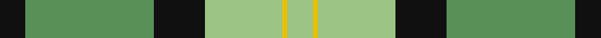

This page is one **sett** — a single exact thread-count. It belongs to the [tartan](/tartans/k5lg25k10lga15y1lga5/)
(the same proportion at any scale), whose colour order is pattern [KGKYYY](/stripes/kgkyyy/).

Sourced from tartans-authority.  It is a [6 stripe tartan](/stripes/stripes6/).

Original link http://www.tartansauthority.com/tartan-ferret/display/10204/

## Thread count
K/10 LG50 K20 LGa30 Y2 LGa/10

## Palette
Each colour and the base-6 reference it is a variant of.

| Colour | Shade | Base |
|---|---|---|
| K | <code style="background-color:#101010;">#101010</code> `oklch(17.3% 0.000 89.9)` <small>#101010</small> | K <code style="background-color:#000000;">#000000</code> |
| LG | <code style="background-color:#589058;">#589058</code> `oklch(60.0% 0.102 144.2)` <small>#589058</small> | G <code style="background-color:#006100;">#006100</code> |
| LGa | <code style="background-color:#9CC484;">#9CC484</code> `oklch(77.5% 0.097 134.2)` <small>#9CC484</small> | Y <code style="background-color:#F2BF00;">#F2BF00</code> |
| Y | <code style="background-color:#E8C000;">#E8C000</code> `oklch(81.9% 0.168 93.7)` <small>#E8C000</small> | Y <code style="background-color:#F2BF00;">#F2BF00</code> |

# Sample pattern

## Nearest tartans

The nearest existing variants by ΔTartan distance, with this tartan at the top so the swatches line up against it.

ΔTartan

Tartan

Sett

—

<a href="/ttd/edit/#slug=k5g25k10lg15ly1lg5~x2">Delaware Fine Spirits Guild (Corp)</a> <a class="nn-out" href="/setts/s6/k5g25k10lg15ly1lg5~x2/" title="open its dictionary page">↗</a>

1.10

<a href="/ttd/edit/#slug=k10g25k10lg15w1lg5~x2">Delaware Fine Spirits Guild</a> <a class="nn-out" href="/setts/s6/k10g25k10lg15w1lg5~x2/" title="open its dictionary page">↗</a>

1.32

<a href="/ttd/edit/#slug=ly30g30r1db16~x2">Barber Family (Personal)</a> <a class="nn-out" href="/setts/s4/ly30g30r1db16~x2/" title="open its dictionary page">↗</a>

1.38

<a href="/ttd/edit/#slug=g18w55o19g20w2g20k5">Michigan State University</a> <a class="nn-out" href="/setts/s7/g18w55o19g20w2g20k5/" title="open its dictionary page">↗</a>

1.38

<a href="/ttd/edit/#slug=g2dy10g11ly4dy1w18g2dy1~x2">Aviemore Check</a> <a class="nn-out" href="/setts/s8/g2dy10g11ly4dy1w18g2dy1~x2/" title="open its dictionary page">↗</a>

1.51

<a href="/ttd/edit/#slug=lo16k7w1g7k1ly3~x4">Hamilton of Brandon (Fashion)</a> <a class="nn-out" href="/setts/s6/lo16k7w1g7k1ly3~x4/" title="open its dictionary page">↗</a>

1.53

<a href="/ttd/edit/#slug=g25k8y10r1y3~x4">Herbage</a> <a class="nn-out" href="/setts/s5/g25k8y10r1y3~x4/" title="open its dictionary page">↗</a>

1.55

<a href="/ttd/edit/#slug=g22w14r7ly1~x2">Loch Lomond</a> <a class="nn-out" href="/setts/s4/g22w14r7ly1~x2/" title="open its dictionary page">↗</a>

1.58

<a href="/ttd/edit/#slug=lg31k18dg13r3dg13k1ly3~x2">Big Sur MacLaren (Personal)</a> <a class="nn-out" href="/setts/s7/lg31k18dg13r3dg13k1ly3~x2/" title="open its dictionary page">↗</a>

1.59

<a href="/ttd/edit/#slug=g5k2g28k10o26db4g4~x2">John Telfar, Dunbar hunting</a> <a class="nn-out" href="/setts/s7/g5k2g28k10o26db4g4~x2/" title="open its dictionary page">↗</a>

1.59

<a href="/ttd/edit/#slug=db8ly1dg5ly12r1dg2~x6">McCabe (2016)</a> <a class="nn-out" href="/setts/s6/db8ly1dg5ly12r1dg2~x6/" title="open its dictionary page">↗</a>

## Neighbour map

Every grey dot is one of 14299 variants placed by the first two principal components of the ΔTartan feature space (44% of its variance). Red is this tartan; blue dots are its nearest — click one to open its page.

<svg viewBox="0 0 640 380" role="img" style="max-width:100%;height:auto;border:1px solid #e0e0e0;border-radius:4px;display:block" xmlns="http://www.w3.org/2000/svg"><image href="/nn/cloud.v1.png" width="640" height="380"/><a href="/setts/s6/k10g25k10lg15w1lg5~x2/"><circle cx="186.3" cy="178.6" r="4" fill="#3465a4"><title>Delaware Fine Spirits Guild</title></circle></a><a href="/setts/s4/ly30g30r1db16~x2/"><circle cx="214.5" cy="189.2" r="4" fill="#3465a4"><title>Barber Family (Personal)</title></circle></a><a href="/setts/s7/g18w55o19g20w2g20k5/"><circle cx="218.9" cy="145.0" r="4" fill="#3465a4"><title>Michigan State University</title></circle></a><a href="/setts/s8/g2dy10g11ly4dy1w18g2dy1~x2/"><circle cx="188.0" cy="146.7" r="4" fill="#3465a4"><title>Aviemore Check</title></circle></a><a href="/setts/s6/lo16k7w1g7k1ly3~x4/"><circle cx="216.0" cy="162.8" r="4" fill="#3465a4"><title>Hamilton of Brandon (Fashion)</title></circle></a><a href="/setts/s5/g25k8y10r1y3~x4/"><circle cx="301.9" cy="181.5" r="4" fill="#3465a4"><title>Herbage</title></circle></a><a href="/setts/s4/g22w14r7ly1~x2/"><circle cx="268.0" cy="193.9" r="4" fill="#3465a4"><title>Loch Lomond</title></circle></a><a href="/setts/s7/lg31k18dg13r3dg13k1ly3~x2/"><circle cx="198.4" cy="139.6" r="4" fill="#3465a4"><title>Big Sur MacLaren (Personal)</title></circle></a><a href="/setts/s7/g5k2g28k10o26db4g4~x2/"><circle cx="253.5" cy="190.9" r="4" fill="#3465a4"><title>John Telfar, Dunbar hunting</title></circle></a><a href="/setts/s6/db8ly1dg5ly12r1dg2~x6/"><circle cx="188.2" cy="175.0" r="4" fill="#3465a4"><title>McCabe (2016)</title></circle></a><circle cx="225.1" cy="172.6" r="5" fill="#c00000"/></svg>

ID: /setts/s6/k5g25k10lg15ly1lg5~x2/
