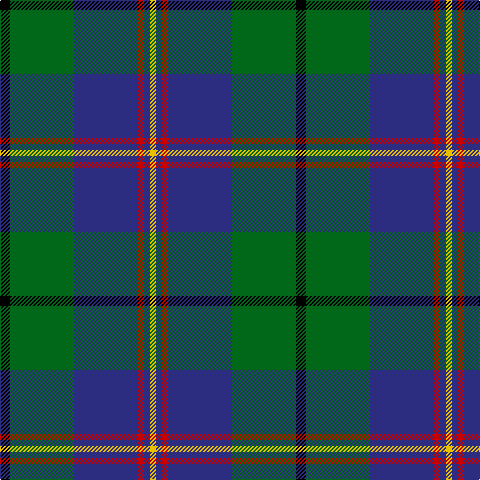

**Bands:** [KGBRBY](/stripes/kgbrby/) · **Stripes:** [K G DB R DB LY](/stripes/stripes6/) K G DB R DB LY

This was sourced from register-of-tartans.  It is a [6 band tartan](/bands/bands6/).

Original link https://www.tartanregister.gov.uk/tartanDetails.aspx?ref=565

## Attestations

This cloth appears in 2 source records; the oldest owns this page.

- 01/01/1907 — Carmichael (register-of-tartans, [record](https://www.tartanregister.gov.uk/tartanDetails.aspx?ref=565))
- 1907 — Carmichael 1907 (Clan) (tartans-authority, [record](http://www.tartansauthority.com/tartan-ferret/display/1078/))

## Register references

External register numbers recorded for this tartan.

- Scottish Register of Tartans: [565](https://www.tartanregister.gov.uk/tartanDetails.aspx?ref=565)
- Scottish Tartans Authority (ITI): 1078
- Scottish Tartans World Register: 1078

## Variants

Other setts woven to the same stripe pattern.

- [Carmichael](/setts/s6/k3g36db28r2db2ly3~x2/)

## Thread count
K/10 G64 DB64 R6 DB6 Y/6

## Palette
Each colour and its ΔE from the base-6 reference it is a variant of.

| Colour | Shade | Base | ΔE (OKLab) |
|---|---|---|---|
| DB | <code style="background-color:#2C2C80;">#2C2C80</code> `#2C2C80` | B <code style="background-color:#2A418A;">#2A418A</code> | 0.06 |
| G | <code style="background-color:#006818;">#006818</code> `#006818` | G <code style="background-color:#006100;">#006100</code> | 0.02 |
| K | <code style="background-color:#000000;">#000000</code> `#000000` | K <code style="background-color:#000000;">#000000</code> | 0.00 |
| R | <code style="background-color:#C80000;">#C80000</code> `#C80000` | R <code style="background-color:#CC0000;">#CC0000</code> | 0.01 |
| Y | <code style="background-color:#E8C000;">#E8C000</code> `#E8C000` | Y <code style="background-color:#F2BF00;">#F2BF00</code> | 0.02 |

# Sample pattern

## Nearest tartans

The nearest existing variants by ΔTartan distance.

1. [Pride of Yorkland (Fashion)](/setts/s6/g35k3db26k4db4w3~x2/) — ΔT 0.50
1. [Turnbull Hunting (1983) #2](/setts/s5/k2ly1g10db10w1~x6/) — ΔT 0.76
1. [Wishart Htg (Clan)](/setts/s7/k7db4dg31db3ly2db27lb4~x2/) — ΔT 0.77
1. [Irving of Glentulchan](/setts/s6/r1g9db9k1db1w1~x6/) — ΔT 0.77
1. [Douglas, Green (Wilsons)](/setts/s5/k1db1g8db8w1~x4/) — ΔT 0.78
1. [Highlander Highland Laddie](/setts/s5/k7r3g30db28lb3~x2/) — ΔT 0.81
1. [Turnbull Hunting (Name)](/setts/s5/r2ly1g10db10w1~x6/) — ΔT 0.85
1. [Heckenberg Htg (Personal)](/setts/s7/db3g13t1r3t1db10ly1~x2/) — ΔT 0.88
1. [Leslie, Hebridean](/setts/s6/k6g15w2db22r2k4~x2/) — ΔT 0.89
1. [Vance (Family Association)](/setts/s6/r4db24w2g13db2k3~x4/) — ΔT 0.89

## Neighbour map

Every grey dot is one of 14313 variants placed by the first two principal components of the ΔTartan feature space (44% of its variance). Red is this tartan; blue dots are its nearest — click one to open its page.

<svg viewBox="0 0 640 380" role="img" style="max-width:100%;height:auto;border:1px solid #e0e0e0;border-radius:4px;display:block" xmlns="http://www.w3.org/2000/svg"><image href="/nn/cloud.v1.png" width="640" height="380"/><a href="/setts/s6/g35k3db26k4db4w3~x2/"><circle cx="252.7" cy="188.1" r="4" fill="#3465a4"><title>Pride of Yorkland (Fashion)</title></circle></a><a href="/setts/s5/k2ly1g10db10w1~x6/"><circle cx="215.5" cy="204.6" r="4" fill="#3465a4"><title>Turnbull Hunting (1983) #2</title></circle></a><a href="/setts/s7/k7db4dg31db3ly2db27lb4~x2/"><circle cx="246.8" cy="169.1" r="4" fill="#3465a4"><title>Wishart Htg (Clan)</title></circle></a><a href="/setts/s6/r1g9db9k1db1w1~x6/"><circle cx="239.4" cy="190.3" r="4" fill="#3465a4"><title>Irving of Glentulchan</title></circle></a><a href="/setts/s5/k1db1g8db8w1~x4/"><circle cx="219.1" cy="217.1" r="4" fill="#3465a4"><title>Douglas, Green (Wilsons)</title></circle></a><a href="/setts/s5/k7r3g30db28lb3~x2/"><circle cx="222.2" cy="213.8" r="4" fill="#3465a4"><title>Highlander Highland Laddie</title></circle></a><a href="/setts/s5/r2ly1g10db10w1~x6/"><circle cx="220.9" cy="202.5" r="4" fill="#3465a4"><title>Turnbull Hunting (Name)</title></circle></a><a href="/setts/s7/db3g13t1r3t1db10ly1~x2/"><circle cx="236.5" cy="178.7" r="4" fill="#3465a4"><title>Heckenberg Htg (Personal)</title></circle></a><a href="/setts/s6/k6g15w2db22r2k4~x2/"><circle cx="214.4" cy="197.6" r="4" fill="#3465a4"><title>Leslie, Hebridean</title></circle></a><a href="/setts/s6/r4db24w2g13db2k3~x4/"><circle cx="277.4" cy="178.7" r="4" fill="#3465a4"><title>Vance (Family Association)</title></circle></a><circle cx="250.8" cy="188.5" r="5" fill="#c00000"/></svg>

ID: /setts/s6/k5g32db32r3db3ly3~x2/
