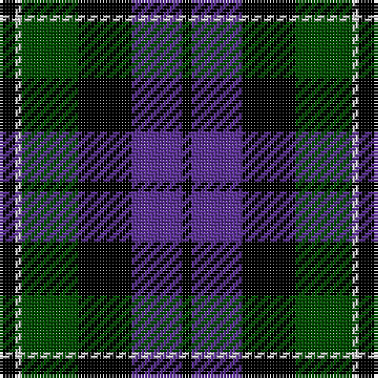

This page is one **sett** — a single exact thread-count. It belongs to the [tartan](/tartans/k5n2g18k17p16k3/)
(the same proportion at any scale), whose colour order is pattern [KBKGWK](/stripes/kbkgwk/).

Sourced from weddslist.  It is a [6 stripe tartan](/stripes/stripes6/).

Original link http://www.weddslist.com/cgi-bin/tartans/pg.pl?source=rb

## Thread count
K/5 N2 G18 K17 P16 K/3

## Palette
Each colour and the base-6 reference it is a variant of.

| Colour | Shade | Base |
|---|---|---|
| G | <code style="background-color:#004C00;">#004C00</code> `oklch(36.1% 0.123 142.5)` <small>#004C00</small> | G <code style="background-color:#006100;">#006100</code> |
| K | <code style="background-color:#000000;">#000000</code> `oklch(0.0% 0.000 0.0)` <small>#000000</small> | K <code style="background-color:#000000;">#000000</code> |
| N | <code style="background-color:#D0D0D0;">#D0D0D0</code> `oklch(85.8% 0.000 89.9)` <small>#D0D0D0</small> | W <code style="background-color:#F7F7F7;">#F7F7F7</code> |
| P | <code style="background-color:#5A3094;">#5A3094</code> `oklch(41.8% 0.156 298.7)` <small>#5A3094</small> | B <code style="background-color:#2A418A;">#2A418A</code> |

# Sample pattern

## Nearest tartans

The nearest existing variants by ΔTartan distance, with this tartan at the top so the swatches line up against it.

ΔTartan

Tartan

Sett

—

<a href="/ttd/edit/#slug=k5lb2dg18k17dp16k3">Melville</a> <a class="nn-out" href="/setts/s6/k5lb2dg18k17dp16k3/" title="open its dictionary page">↗</a>

0.58

<a href="/ttd/edit/#slug=dg21lb2dg4k17dp14k3">Graham W</a> <a class="nn-out" href="/setts/s6/dg21lb2dg4k17dp14k3/" title="open its dictionary page">↗</a>

0.73

<a href="/ttd/edit/#slug=k5lr2dg18k17n16k3~x2">Melville</a> <a class="nn-out" href="/setts/s6/k5lr2dg18k17n16k3~x2/" title="open its dictionary page">↗</a>

0.73

<a href="/ttd/edit/#slug=k5lr2dg18k17n16k3">Melville</a> <a class="nn-out" href="/setts/s6/k5lr2dg18k17n16k3/" title="open its dictionary page">↗</a>

0.78

<a href="/ttd/edit/#slug=db6k1db6k8r1g8k2~x2">Fletcher</a> <a class="nn-out" href="/setts/s7/db6k1db6k8r1g8k2~x2/" title="open its dictionary page">↗</a>

0.84

<a href="/ttd/edit/#slug=db48k6db10k46ly4k22g43">Mowat</a> <a class="nn-out" href="/setts/s7/db48k6db10k46ly4k22g43/" title="open its dictionary page">↗</a>

0.90

<a href="/ttd/edit/#slug=db6k1db6k8r1dg8r2">Fletcher C</a> <a class="nn-out" href="/setts/s7/db6k1db6k8r1dg8r2/" title="open its dictionary page">↗</a>

0.93

<a href="/ttd/edit/#slug=db6k1db6k8r1g8r2~x2">Fletcher of Dunans</a> <a class="nn-out" href="/setts/s7/db6k1db6k8r1g8r2~x2/" title="open its dictionary page">↗</a>

0.96

<a href="/ttd/edit/#slug=dt4g18dt3k17dt18dp4~x2">Scottish Airports</a> <a class="nn-out" href="/setts/s6/dt4g18dt3k17dt18dp4~x2/" title="open its dictionary page">↗</a>

1.04

<a href="/ttd/edit/#slug=dg8lb2dg1k12db12k1~x2">Graham of Menteith</a> <a class="nn-out" href="/setts/s6/dg8lb2dg1k12db12k1~x2/" title="open its dictionary page">↗</a>

1.04

<a href="/ttd/edit/#slug=k3dg14k14dg2db14r3">Morrison</a> <a class="nn-out" href="/setts/s6/k3dg14k14dg2db14r3/" title="open its dictionary page">↗</a>

## Neighbour map

Every grey dot is one of 14299 variants placed by the first two principal components of the ΔTartan feature space (44% of its variance). Red is this tartan; blue dots are its nearest — click one to open its page.

<svg viewBox="0 0 640 380" role="img" style="max-width:100%;height:auto;border:1px solid #e0e0e0;border-radius:4px;display:block" xmlns="http://www.w3.org/2000/svg"><image href="/nn/cloud.v1.png" width="640" height="380"/><a href="/setts/s6/dg21lb2dg4k17dp14k3/"><circle cx="200.8" cy="222.2" r="4" fill="#3465a4"><title>Graham W</title></circle></a><a href="/setts/s6/k5lr2dg18k17n16k3~x2/"><circle cx="195.4" cy="234.6" r="4" fill="#3465a4"><title>Melville</title></circle></a><a href="/setts/s6/k5lr2dg18k17n16k3/"><circle cx="195.4" cy="234.6" r="4" fill="#3465a4"><title>Melville</title></circle></a><a href="/setts/s7/db6k1db6k8r1g8k2~x2/"><circle cx="158.3" cy="232.2" r="4" fill="#3465a4"><title>Fletcher</title></circle></a><a href="/setts/s7/db48k6db10k46ly4k22g43/"><circle cx="192.7" cy="210.3" r="4" fill="#3465a4"><title>Mowat</title></circle></a><a href="/setts/s7/db6k1db6k8r1dg8r2/"><circle cx="168.2" cy="243.1" r="4" fill="#3465a4"><title>Fletcher C</title></circle></a><a href="/setts/s7/db6k1db6k8r1g8r2~x2/"><circle cx="147.3" cy="227.6" r="4" fill="#3465a4"><title>Fletcher of Dunans</title></circle></a><a href="/setts/s6/dt4g18dt3k17dt18dp4~x2/"><circle cx="162.3" cy="252.7" r="4" fill="#3465a4"><title>Scottish Airports</title></circle></a><a href="/setts/s6/dg8lb2dg1k12db12k1~x2/"><circle cx="190.6" cy="216.9" r="4" fill="#3465a4"><title>Graham of Menteith</title></circle></a><a href="/setts/s6/k3dg14k14dg2db14r3/"><circle cx="164.2" cy="252.7" r="4" fill="#3465a4"><title>Morrison</title></circle></a><circle cx="187.5" cy="231.6" r="5" fill="#c00000"/></svg>

ID: /setts/s6/k5lb2dg18k17dp16k3/
