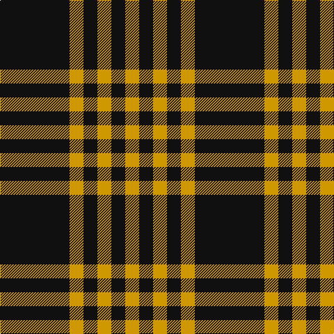

This page is one **sett** — a single exact thread-count. It belongs to the [tartan](/tartans/k5dy1k1dy1/)
(the same proportion at any scale), whose colour order is pattern [KYKYKY](/stripes/kykyky/).

Sourced from register-of-tartans.  It is a [6 stripe tartan](/stripes/stripes6/).

Original link https://www.tartanregister.gov.uk/tartanDetails.aspx?ref=1917

## Register references

External register numbers recorded for this tartan.

- Scottish Register of Tartans: [1917](https://www.tartanregister.gov.uk/tartanDetails.aspx?ref=1917)
- Scottish Tartans Authority (ITI): 1276
- Scottish Tartans World Register: 1276

## Thread count
K/100 DY20 K20 DY20 K20 DY/20

## Palette
Each colour and the base-6 reference it is a variant of.

| Colour | Shade | Base |
|---|---|---|
| DY | <code style="background-color:#D09800;">#D09800</code> `oklch(71.4% 0.147 82.1)` <small>#D09800</small> | Y <code style="background-color:#F2BF00;">#F2BF00</code> |
| K | <code style="background-color:#101010;">#101010</code> `oklch(17.3% 0.000 89.9)` <small>#101010</small> | K <code style="background-color:#000000;">#000000</code> |

# Sample pattern

## Nearest tartans

The nearest existing variants by ΔTartan distance, with this tartan at the top so the swatches line up against it.

ΔTartan

Tartan

Sett

—

<a href="/ttd/edit/#slug=k5lo1k1lo1~x20">Justus #2 (Personal)</a> <a class="nn-out" href="/setts/s6/k5lo1k1lo1~x20/" title="open its dictionary page">↗</a>

1.05

<a href="/setts/s4/k5lo1k1~x20/">Justus #2 (Personal)</a>

1.62

<a href="/setts/s4/k5ly1k1~x12/">Justus</a>

1.63

<a href="/ttd/edit/#slug=ly7k4ly4k39r4~x2">Welsh National #3</a> <a class="nn-out" href="/setts/s5/ly7k4ly4k39r4~x2/" title="open its dictionary page">↗</a>

1.79

<a href="/ttd/edit/#slug=k21w2k5w9k13g2~x4">New Zealand District Tartan Tartan Number: 3250. Earliest known date: 2000 Designed as a District sett by Timely Marketing Promotions, Christchurch, New Zealand See products available Copyright © Blair Urquhart, Comrie, 2015</a> <a class="nn-out" href="/setts/s6/k21w2k5w9k13g2~x4/" title="open its dictionary page">↗</a>

1.79

<a href="/ttd/edit/#slug=k2lb5k1lb1k10r1k1~x4">Lundy Reform</a> <a class="nn-out" href="/setts/s7/k2lb5k1lb1k10r1k1~x4/" title="open its dictionary page">↗</a>

1.81

<a href="/ttd/edit/#slug=ly9k4ly4k45r4~x2">Gwynn (Name)</a> <a class="nn-out" href="/setts/s5/ly9k4ly4k45r4~x2/" title="open its dictionary page">↗</a>

1.82

<a href="/ttd/edit/#slug=k46dy7k8w20~x2">Lords of Skye (Fashion?)</a> <a class="nn-out" href="/setts/s4/k46dy7k8w20~x2/" title="open its dictionary page">↗</a>

1.86

<a href="/ttd/edit/#slug=y8k3y17k13y6k3y4~x2">Scott Black and Grey</a> <a class="nn-out" href="/setts/s7/y8k3y17k13y6k3y4~x2/" title="open its dictionary page">↗</a>

1.88

<a href="/ttd/edit/#slug=o8k3o17k13o6k3o4~x2">Scott Black &amp; Grey (Corporate)</a> <a class="nn-out" href="/setts/s7/o8k3o17k13o6k3o4~x2/" title="open its dictionary page">↗</a>

1.91

<a href="/ttd/edit/#slug=k3lo1k8lo9k1lo1k1lo1k2~x4">Justus Black &amp; Gold (Angus) (Persona</a> <a class="nn-out" href="/setts/s9/k3lo1k8lo9k1lo1k1lo1k2~x4/" title="open its dictionary page">↗</a>

## Neighbour map

Every grey dot is one of 14299 variants placed by the first two principal components of the ΔTartan feature space (44% of its variance). Red is this tartan; blue dots are its nearest — click one to open its page.

<svg viewBox="0 0 640 380" role="img" style="max-width:100%;height:auto;border:1px solid #e0e0e0;border-radius:4px;display:block" xmlns="http://www.w3.org/2000/svg"><image href="/nn/cloud.v1.png" width="640" height="380"/><a href="/setts/s4/k5lo1k1~x20/"><circle cx="443.5" cy="283.6" r="4" fill="#3465a4"><title>Justus #2 (Personal)</title></circle></a><a href="/setts/s4/k5ly1k1~x12/"><circle cx="426.4" cy="281.5" r="4" fill="#3465a4"><title>Justus</title></circle></a><a href="/setts/s5/ly7k4ly4k39r4~x2/"><circle cx="445.0" cy="207.2" r="4" fill="#3465a4"><title>Welsh National #3</title></circle></a><a href="/setts/s6/k21w2k5w9k13g2~x4/"><circle cx="415.8" cy="227.2" r="4" fill="#3465a4"><title>New Zealand District Tartan Tartan Number: 3250. Earliest known date: 2000 Designed as a District sett by Timely Marketing Promotions, Christchurch, New Zealand See products available Copyright © Blair Urquhart, Comrie, 2015</title></circle></a><a href="/setts/s7/k2lb5k1lb1k10r1k1~x4/"><circle cx="377.0" cy="195.3" r="4" fill="#3465a4"><title>Lundy Reform</title></circle></a><a href="/setts/s5/ly9k4ly4k45r4~x2/"><circle cx="453.3" cy="201.2" r="4" fill="#3465a4"><title>Gwynn (Name)</title></circle></a><a href="/setts/s4/k46dy7k8w20~x2/"><circle cx="335.8" cy="249.6" r="4" fill="#3465a4"><title>Lords of Skye (Fashion?)</title></circle></a><a href="/setts/s7/y8k3y17k13y6k3y4~x2/"><circle cx="362.7" cy="273.5" r="4" fill="#3465a4"><title>Scott Black and Grey</title></circle></a><a href="/setts/s7/o8k3o17k13o6k3o4~x2/"><circle cx="356.0" cy="269.5" r="4" fill="#3465a4"><title>Scott Black &amp; Grey (Corporate)</title></circle></a><a href="/setts/s9/k3lo1k8lo9k1lo1k1lo1k2~x4/"><circle cx="346.4" cy="206.8" r="4" fill="#3465a4"><title>Justus Black &amp; Gold (Angus) (Persona</title></circle></a><circle cx="399.8" cy="259.0" r="5" fill="#c00000"/></svg>

ID: /setts/s6/k5lo1k1lo1~x20/
