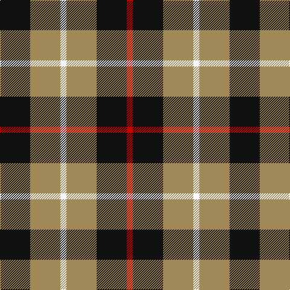

**Bands:** [KYWYKR](/stripes/kywykr/) · **Stripes:** [K LO W LO K R](/stripes/stripes6/) K LO W LO K R

This was sourced from register-of-tartans.  It is a [6 band tartan](/bands/bands6/).

Original link https://www.tartanregister.gov.uk/tartanDetails.aspx?ref=556

## Attestations

This cloth appears in 2 source records; the oldest owns this page.

- 01/01/2006 — Canyon County Idaho Sheriff (register-of-tartans, [record](https://www.tartanregister.gov.uk/tartanDetails.aspx?ref=556))
- 2006 January — Canyon County Idaho Sheriff (Corp) (tartans-authority, [record](http://www.tartansauthority.com/tartan-ferret/display/6829/))

## Register references

External register numbers recorded for this tartan.

- Scottish Register of Tartans: [556](https://www.tartanregister.gov.uk/tartanDetails.aspx?ref=556)
- Scottish Tartans Authority (ITI): 6829

## Thread count
K/50 LT50 W10 LT50 K50 R/10

## Palette
Each colour and its ΔE from the base-6 reference it is a variant of.

| Colour | Shade | Base | ΔE (OKLab) |
|---|---|---|---|
| K | <code style="background-color:#101010;">#101010</code> `#101010` | K <code style="background-color:#000000;">#000000</code> | 0.17 |
| LG | <code style="background-color:#C4BC68;">#C4BC68</code> `#C4BC68` | Y <code style="background-color:#F2BF00;">#F2BF00</code> | 0.08 |
| LT | <code style="background-color:#A08858;">#A08858</code> `#A08858` | Y <code style="background-color:#F2BF00;">#F2BF00</code> | 0.21 |
| R | <code style="background-color:#C80000;">#C80000</code> `#C80000` | R <code style="background-color:#CC0000;">#CC0000</code> | 0.01 |
| W | <code style="background-color:#F8F8F8;">#F8F8F8</code> `#F8F8F8` | W <code style="background-color:#F7F7F7;">#F7F7F7</code> | 0.00 |

# Sample pattern

## Nearest tartans

The nearest existing variants by ΔTartan distance.

1. [Longford County, Crest Range](/setts/s6/w7k6lo15k16k8w3~x2/) — ΔT 1.19
1. [MacDona](/setts/s7/r35g52db18g17r12g17k18/) — ΔT 1.31
1. [Wilson's No.113](/setts/s6/g3dp3w1dp3g3r1~x4/) — ΔT 1.33
1. [Johore Regiment](/setts/s8/db20k5db18lo26k6~x2/) — ΔT 1.37
1. [New York State Police Pipe Band](/setts/s5/o5dp3o18k16ly3~x4/) — ΔT 1.38
1. [Jahore](/setts/s5/db20k5db18ly26k6~x2/) — ΔT 1.40
1. [Unnamed (Hip Flask)](/setts/s8/dg14o5dg14w5k2o5k2w9~x4/) — ΔT 1.40
1. [Thompson, Dress (Clan)](/setts/s4/r3o16k16lb3~x4/) — ΔT 1.42
1. [Delroeux, John Michael (Personal)](/setts/s4/db3dg6ly1r3~x10/) — ΔT 1.47
1. [Oban Grey](/setts/s5/k4w3k4y9r1~x4/) — ΔT 1.48

## Neighbour map

Every grey dot is one of 14299 variants placed by the first two principal components of the ΔTartan feature space (44% of its variance). Red is this tartan; blue dots are its nearest — click one to open its page.

<svg viewBox="0 0 640 380" role="img" style="max-width:100%;height:auto;border:1px solid #e0e0e0;border-radius:4px;display:block" xmlns="http://www.w3.org/2000/svg"><image href="/nn/cloud.v1.png" width="640" height="380"/><a href="/setts/s6/w7k6lo15k16k8w3~x2/"><circle cx="218.0" cy="261.0" r="4" fill="#3465a4"><title>Longford County, Crest Range</title></circle></a><a href="/setts/s7/r35g52db18g17r12g17k18/"><circle cx="182.0" cy="253.9" r="4" fill="#3465a4"><title>MacDona</title></circle></a><a href="/setts/s6/g3dp3w1dp3g3r1~x4/"><circle cx="148.9" cy="296.7" r="4" fill="#3465a4"><title>Wilson's No.113</title></circle></a><a href="/setts/s8/db20k5db18lo26k6~x2/"><circle cx="196.0" cy="251.8" r="4" fill="#3465a4"><title>Johore Regiment</title></circle></a><a href="/setts/s5/o5dp3o18k16ly3~x4/"><circle cx="235.5" cy="233.9" r="4" fill="#3465a4"><title>New York State Police Pipe Band</title></circle></a><a href="/setts/s5/db20k5db18ly26k6~x2/"><circle cx="206.4" cy="264.7" r="4" fill="#3465a4"><title>Jahore</title></circle></a><a href="/setts/s8/dg14o5dg14w5k2o5k2w9~x4/"><circle cx="189.2" cy="211.9" r="4" fill="#3465a4"><title>Unnamed (Hip Flask)</title></circle></a><a href="/setts/s4/r3o16k16lb3~x4/"><circle cx="192.7" cy="253.0" r="4" fill="#3465a4"><title>Thompson, Dress (Clan)</title></circle></a><a href="/setts/s4/db3dg6ly1r3~x10/"><circle cx="171.0" cy="256.6" r="4" fill="#3465a4"><title>Delroeux, John Michael (Personal)</title></circle></a><a href="/setts/s5/k4w3k4y9r1~x4/"><circle cx="187.5" cy="223.6" r="4" fill="#3465a4"><title>Oban Grey</title></circle></a><circle cx="187.3" cy="253.9" r="5" fill="#c00000"/></svg>

ID: /setts/s6/k5lo5w1lo5k5r1~x10/
